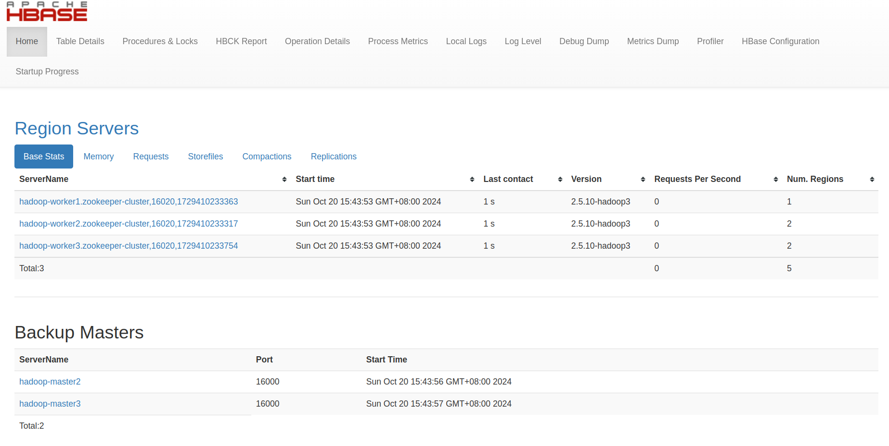

# HBase系统架构

## 架构概述

HBase是一个分布式、可扩展的NoSQL数据库，建立在HDFS之上，提供面向列的实时读写能力。

  
   
HBase系统架构图

HBase系统主要由以下几个核心组件构成：
- Client：客户端，负责发送请求
- ZooKeeper：协调服务，管理集群状态
- Master：主服务器，负责管理和协调整个集群
- RegionServer：区域服务器，负责数据存储和处理

## 核心组件详解

### Client

客户端是发出HBase操作请求的对象，包括但不限于：
- Java API代码
- HBase Shell命令行工具
- REST/Thrift API等接口

客户端主要职责：
- 通过ZooKeeper定位Region位置
- 直接与RegionServer通信进行数据读写
- 与Master通信进行DDL操作（创建、删除、修改表等）

### ZooKeeper

ZooKeeper在HBase中扮演协调服务的角色，主要职责：
- 存储HBase集群的元数据信息
- 监控RegionServer的状态
- 提供Master选举机制
- 存储Region寻址信息
- 协调集群配置信息

### Master

Master是HBase集群的管理者，负责管理和协调整个系统。

  
  
Master Web UI

Master主要职责：
- 监控所有RegionServer的状态
- 处理RegionServer故障转移
- 管理元数据的变更（表的创建、删除、修改等）
- 处理Region的分配或移除
- 在空闲时进行数据的负载均衡
- 通过ZooKeeper发布自己的位置给客户端

> Master专注于管理功能，不直接参与数据读写操作，主要负责元数据管理和资源分配。

### RegionServer

RegionServer是实际存储HBase数据并处理客户端读写请求的服务器。

  
  
RegionServer结构图

RegionServer主要职责：
- 处理分配给它的Region
- 负责存储和管理HBase的实际数据
- 刷新内存缓存(MemStore)到HDFS(HFile)
- 维护预写日志(Write-Ahead Log)
- 执行数据压缩
- 处理Region分裂和合并

#### RegionServer内部组件

RegionServer内部包含多个关键组件：

1. **Region**：数据的基本存储单元，对应表的一个数据分片
2. **Store**：对应一个列族的存储，每个Region包含多个Store
3. **MemStore**：内存存储，数据写入时首先进入MemStore
4. **HFile(StoreFile)**：磁盘存储格式，当MemStore满时数据刷新到HFile
5. **Write-Ahead Log(WAL)**：预写日志，保证数据写入的可靠性

## HBase读写流程

### 写入流程

1. Client通过ZooKeeper找到数据对应的RegionServer
2. 数据首先写入WAL日志
3. 数据写入对应的MemStore
4. 当MemStore达到阈值时，数据刷写到HFile

### 读取流程

1. Client通过ZooKeeper找到数据对应的RegionServer
2. 客户端发送读请求到RegionServer
3. RegionServer先查找MemStore，再查找BlockCache，最后查找HFile
4. 返回结果给客户端
