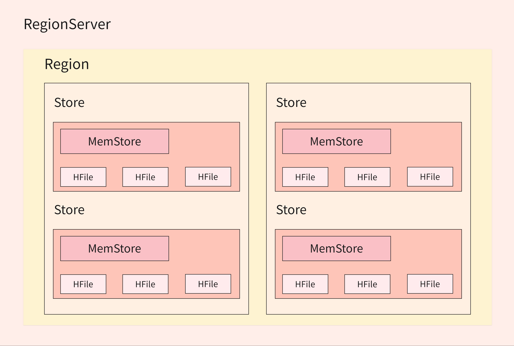
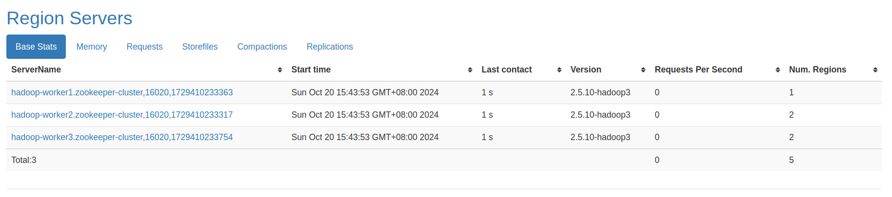
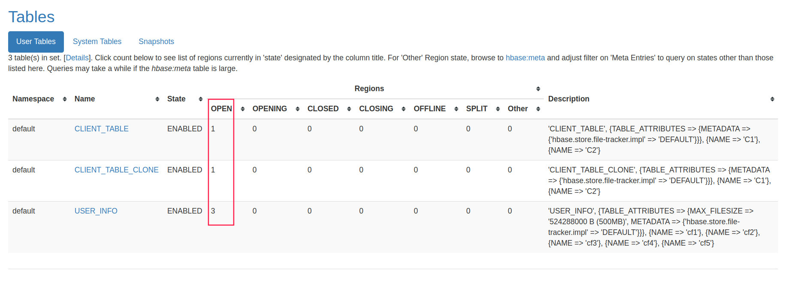
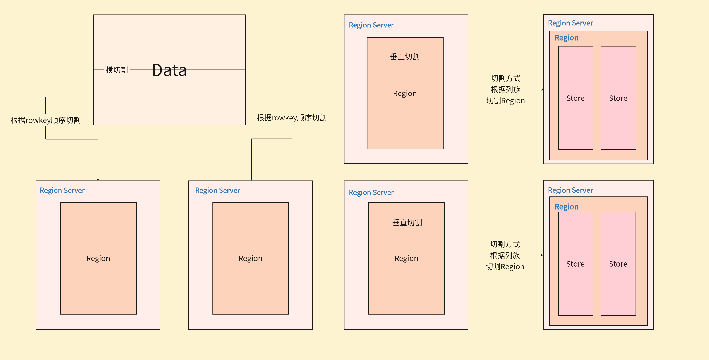

# HBase逻辑结构模型

## 整体架构概述

HBase是建立在Hadoop之上的分布式、面向列的数据库系统，提供了可靠的数据存储和快速随机访问能力。

### 进程角色

HBase系统由以下几个关键进程组成：

- **Client**：客户端，包括Java应用程序、HBase Shell等（也可通过Flink、MapReduce、Spark等访问）
- **HMaster**：主要负责表的管理操作（创建表、删除表、Region分配），不负责具体的数据操作
- **HRegionServer**：负责数据的管理、操作（增删改查）及接收客户端请求

### 数据模型层次结构

HBase的数据模型是层层递进的结构，从宏观到微观依次为：

  
   
RegionServer结构

#### Region

- Region是HBase中数据分布的基本单位
- 一张表被分为多个Region，每个Region保存一定rowkey范围的数据
- Region中的数据按照rowkey的字典序排列
- Region根据rowkey进行横向切割

  

- 每张表的Region数量：

  

#### Store

- 每个Region按列族垂直切分为多个Store
- 每个列族对应一个Store
- Store负责存储列族的数据

  
  
Region按列族垂直切分

#### MemStore

- MemStore是Store的内存缓冲组件
- 每个列族(Store)有一个MemStore
- 所有写入HBase的数据首先写入MemStore
- 当MemStore接近满时，数据会被刷写(flush)到磁盘上的StoreFile中

#### StoreFile与HFile

- StoreFile是物理存储层面的概念，底层实现是HFile
- HFile是HBase存储在HDFS上的文件格式
- HFile具有丰富的结构，包括数据块(DataBlock)、索引和布隆过滤器(BloomFilter)
- 写入HFile的操作是连续的，速度非常快（flush操作）

#### WAL(Write Ahead Log)

- WAL全称为Write Ahead Log，主要用于故障恢复
- 每个写入操作(PUT/DELETE/INCR)先记录到WAL，再写入MemStore
- 服务器崩溃时，可通过回放WAL恢复MemStore中的数据
- 物理上存储是Hadoop的Sequence File

## 数据读写流程

### 写入流程
1. 客户端发送写请求至RegionServer
2. 数据首先写入WAL日志
3. 然后数据写入对应列族的MemStore
4. 当MemStore达到阈值时，触发flush操作，将数据写入新的HFile
5. 定期进行文件合并(Compaction)，优化读取性能

### 读取流程
1. 客户端发送读请求至RegionServer
2. 先检查Block Cache（读缓存）
3. 再检查MemStore
4. 最后检查HFile
5. 返回合并后的结果