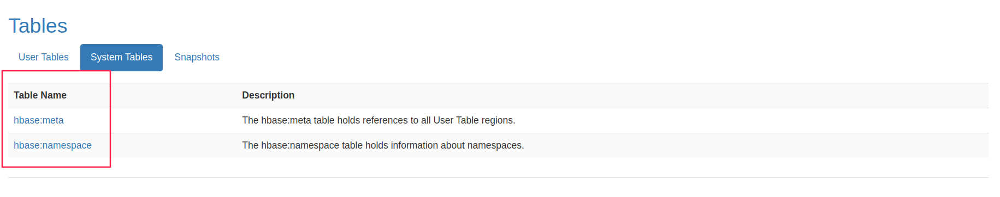
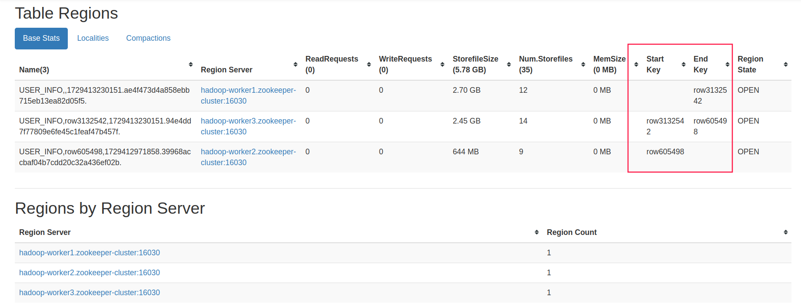
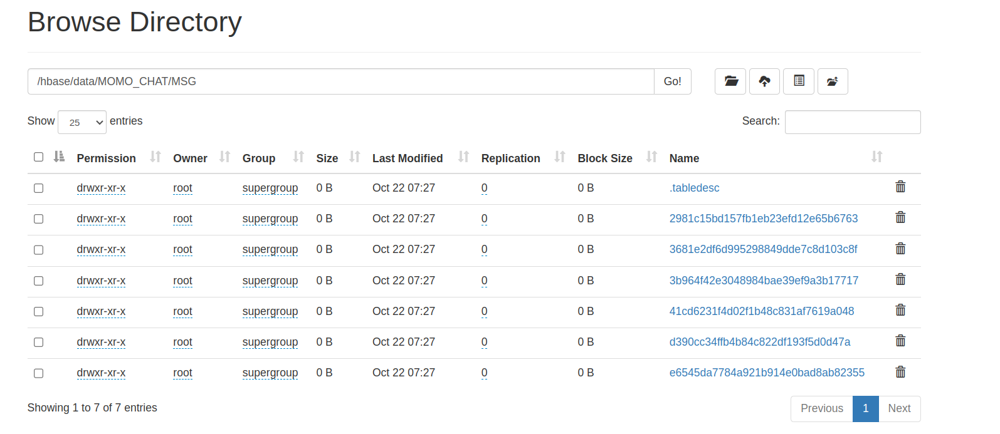
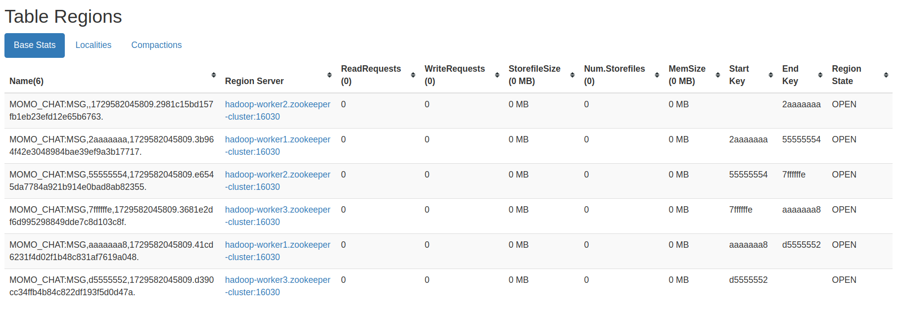

# HBase表结构设计与调优

## 一、HBase基础架构

### 1. 名称空间（namespace）概念

- 名称空间用于对一个项目中的多张表按业务域进行划分，便于管理
- 类似于Hive中的数据库，不同数据库下可放不同类型的表
- HBase默认名称空间是「default」，创建表时默认使用此名称空间
- HBase系统内建名称空间「hbase」，用于存放系统内建表（namespace、meta）

<div align="center">
  
   <p style="margin-top: 2px;">namespace default</p>
</div>

<div align="center">
  
   <p style="margin-top: 2px;">namespace hbase</p>
</div>

### 2. 名称空间操作语法

#### 创建命名空间
```shell
create_namespace 'MOMO_CHAT'
```

#### 列出命名空间
```shell
list_namespace
```

#### 删除命名空间
```shell
drop_namespace 'MOMO_CHAT'  # 注意：删除命名空间时，必须确保命名空间内没有表
```

#### 查看命名空间
```shell
describe_namespace 'MOMO_CHAT'
```

#### 创建带命名空间的表
```shell
create 'MOMO_CHAT:MSG', 'C1'  # 表名必须带上命名空间，否则默认为default命名空间
```

## 二、HBase表设计核心要点

### 1. 表设计基本原则
- 列族：推荐1-2个，能使用1个就不使用2个
- 版本设计：如无需保存历史版本，使用默认配置VERSIONS=1；如需保存历史变更，可设置VERSIONS>1（注意会占用更多空间）

### 2. 列族设计
- HBase列的数量应该越少越好
  - 两个及以上的列族会影响HBase性能
  - 当一个列所存储的数据达到flush阈值时，表中所有列族将同时进行flush操作
  - 这将带来不必要的I/O开销，列族越多，对性能影响越大

### 3. 版本设计
- 对于不会更新的历史记录数据：
  - 只保留一个版本即可，节省空间
  - HBase默认版本为1，保持默认配置
- 对于HBase版本特性：
  - 版本是相对于列族而言
  - 可通过describe命令查看版本设置：
  ```shell
  hbase:005:0> describe 'MOMO_CHAT:MSG'
  Table MOMO_CHAT:MSG is ENABLED                                                                                                                                                                                
  MOMO_CHAT:MSG, {TABLE_ATTRIBUTES => {METADATA => {'hbase.store.file-tracker.impl' => 'DEFAULT'}}}                                                                                                             
  COLUMN FAMILIES DESCRIPTION                                                                                                                                                                                   
  {NAME => 'C1', INDEX_BLOCK_ENCODING => 'NONE', VERSIONS => '1', KEEP_DELETED_CELLS => 'FALSE', DATA_BLOCK_ENCODING => 'NONE', TTL => 'FOREVER', MIN_VERSIONS => '0', REPLICATION_SCOPE => '0', BLOOMFILTER => 
  'ROW', IN_MEMORY => 'false', COMPRESSION => 'NONE', BLOCKCACHE => 'true', BLOCKSIZE => '65536 B (64KB)'}                                                                                                      
  ```
 
### 4. 数据压缩策略

#### 压缩算法对比
在HBase可以使用多种压缩编码，包括LZO、SNAPPY、GZIP。只在硬盘压缩，内存中或者网络传输中没有压缩。

| 压缩算法       | 压缩后占比 | 压缩速度   | 解压缩速度   | 适用场景 |
| ------------- | ---------- | ---------- | ------------ | ------- |
| GZIP          | 13.4%      | 21 MB/s    | 118 MB/s     | 高压缩率场景，但需考虑CPU消耗 |
| LZO           | 20.5%      | 135 MB/s   | 410 MB/s     | 需要快速压缩和极快解压的场景，适合高吞吐量应用 |
| Zippy/Snappy  | 22.2%      | 172 MB/s   | 409 MB/s     | 对压缩率要求不高但追求速度的场景，适合实时性高的系统 |

#### 数据压缩配置
创建新表时指定压缩算法：
  ```shell
  create 'MOMO_CHAT:MSG',{NAME => 'C1',COMPRESSION => 'GZ'}
  ```

修改已有表的压缩算法：
  ```shell
disable 'MOMO_CHAT:MSG'  # 上线使用的表需谨慎操作，防止数据丢失
  alter 'MOMO_CHAT:MSG', {NAME => 'C1', COMPRESSION => 'GZ'}
  enable 'MOMO_CHAT:MSG'
  ```

## 三、ROWKEY设计策略

### 1. HBase官方设计原则

1. **避免使用递增行键/时序数据**
   - 递增ROWKEY（如时间戳）会导致写入压力集中在单一机器上
   - 应尽量将写入压力均衡分布到各个RegionServer

2. **避免ROWKEY和列名过长**
    - 访问Cell需要ROWKEY、列名，过大会占用较多内存
    - ROWKEY最大长度为64KB，建议尽量短小

3. **使用数值类型比字符串更省空间**
    - long类型（8字节）可存储非常大的无符号整数
    - 字符串按一个字节一个字符存储，需要约3倍空间

4. **确保ROWKEY唯一性**
    - 相同ROWKEY的数据会被新数据覆盖
    - HBase数据以key-value形式存储，必须保证RowKey唯一

### 2. 热点问题及解决方案

热点问题说明：
- 热点指大量客户端直接访问集群的一个或几个节点
- 过大访问量可能使某节点超出承受能力，影响整个RegionServer性能

#### 解决方案A：预分区

- 默认情况下一个HBase表只有一个Region，被托管在一个RegionServer中
- 每个Region有两个重要属性：Start Key、End Key，表示维护的ROWKEY范围
- 单一Region在数据量大时会分裂，但初始阶段负载不均衡
- 预分区数量建议为节点数的倍数，根据预估数据量和默认Region大小计算

<div align="center">
  
   <p style="margin-top: 2px;">Start Key - End Key</p>
</div>

#### 解决方案B：ROWKEY设计优化

1. **反转策略**
    - 将ROWKEY尾部随机性好的部分提前到前面
    - 可以使ROWKEY随机分布，但牺牲了有序性
    - 利于Get操作，但不利于Scan操作

2. **加盐策略**
    - 在原ROWKEY前添加固定长度随机数
    - 保障数据在所有Regions的负载均衡
    - 但查询时需要查找多个可能的Regions，降低查询效率

3. **哈希策略**
    - 基于ROWKEY完整或部分数据进行Hash
    - 可使用MD5、sha1、sha256等算法
    - 同样不利于Scan操作，打乱了自然顺序

### 3. 实践推荐策略

1. **预分区**：创建表时配置多个region，分布在不同HRegionServer
2. **ROWKEY设计**：
   - 反转：对手机号码、时间戳等进行反转
   - 加盐：在rowkey前加随机数（注意会影响查询）
   - hash：对rowkey部分取hash，计算结果固定便于获取

## 四、预分区与ROWKEY设计实例

### 1. 预分区方法

HBase预分区可通过多种方式实现：

1. **指定分区数量**
      ```shell
      create 'namespace:t1', 'f1', SPLITS_NUM => 5
      ```
  
2. **手动指定分区点**
      ```shell
      create 'namespace:t1', 'f1', SPLITS => ['10', '20', '30', '40', '50']
      ```
  
3. **通过文件指定分区点**
      ```shell
      create 'namespace:t1', 'f1', SPLITS_FILE => 'hdfs://path/to/splits_file', OWNER => 'Johndoe'
      ```

4. **指定分区数量和策略**
    ```shell
    create 't1', 'f1', {NUMREGIONS => 15, SPLITALGO => 'HexStringSplit'}
    ```

分区策略选择：
- HexStringSplit：ROWKEY是十六进制字符串前缀
- DecimalStringSplit：ROWKEY是10进制数字字符串前缀
- UniformSplit：ROWKEY前缀完全随机

### 2. 实际业务中的分区示例

业务需求分析：
- 需确保数据均匀分布到每个Region
- 决策：使用MD5Hash作为前缀
- ROWKEY设计：MD5Hash_账号id_收件人id_时间戳

创建表脚本：
```shell
create 'MOMO_CHAT:MSG', {NAME => 'C1', COMPRESSION => 'GZ'}, {NUMREGIONS => 6, SPLITALGO => 'HexStringSplit'}
```

<div align="center">
  
   <p style="margin-top: 2px;">观察Hadoop HDFS中的内容 和 Hbase Web UI 中显示的内容</p>
   <p style="margin-top: 2px;">Region其实对应着HDFS中的文件</p>
  
</div>

### 3. RowKey设计示例

模拟场景分析：
1. RowKey构成：MD5Hash_发件人id_收件人id_消息时间戳
2. MD5Hash计算：将发送人账号+"_"+收件人账号+"_"+消息时间戳取MD5值前8位
3. 实现目的：确保数据均匀分布，避免热点问题

关键实现代码：
```java
    // 根据Msg实体对象生成rowkey
    public static byte[] getRowkey(Msg msg) throws ParseException {
        // ROWKEY = MD5Hash_发件人账号_收件人账号_消息时间戳
    
    // 将发件人账号、收件人账号、消息时间戳拼接
        StringBuilder builder = new StringBuilder();
        builder.append(msg.getSender_account());
        builder.append("_");
        builder.append(msg.getReceiver_account());
        builder.append("_");
        // 获取消息的时间戳
        String msgDateTime = msg.getMsg_time();
        SimpleDateFormat simpleDateFormat = new SimpleDateFormat("yyyy-MM-dd HH:mm:ss");
        Date msgDate = simpleDateFormat.parse(msgDateTime);
        long timestamp = msgDate.getTime();
        builder.append(timestamp);

    // 生成MD5值并取前8位
        String md5AsHex = MD5Hash.getMD5AsHex(builder.toString().getBytes());
        String md5Hex8bit = md5AsHex.substring(0, 8);

    // 拼接最终的rowkey
        String rowkeyString = md5Hex8bit + "_" + builder.toString();

        return Bytes.toBytes(rowkeyString);
    }
```

## 五、HBase性能优化与二级索引

### 1. 性能瓶颈分析

- HBase默认只支持行键索引，针对其他列查询只能全表扫描
- 使用scan+filter组合查询效率不高，特别是数据量大时
- 存在的问题：
  - 网络传输压力大
  - 客户端处理压力大
  - 大数据量查询效率极低

### 2. 二级索引解决方案

- 需要在ROWKEY索引外添加其他索引便于查询
- 原生HBase开发二级索引较为复杂
- 使用SQL引擎可以简化查询操作，提高开发效率

> 如果每次需要我们开发二级索引来查询数据，这样使用起来很麻烦。再者，查询数据都是HBase Java API，使用起来不是很方便。为了让其他开发人员更容易使用该接口，使用SQL引擎通过SQL语句来查询数据会更加方便。