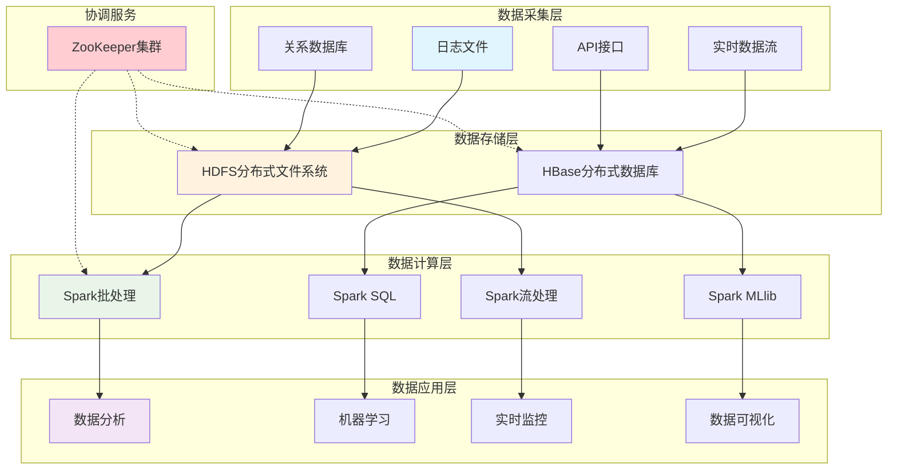
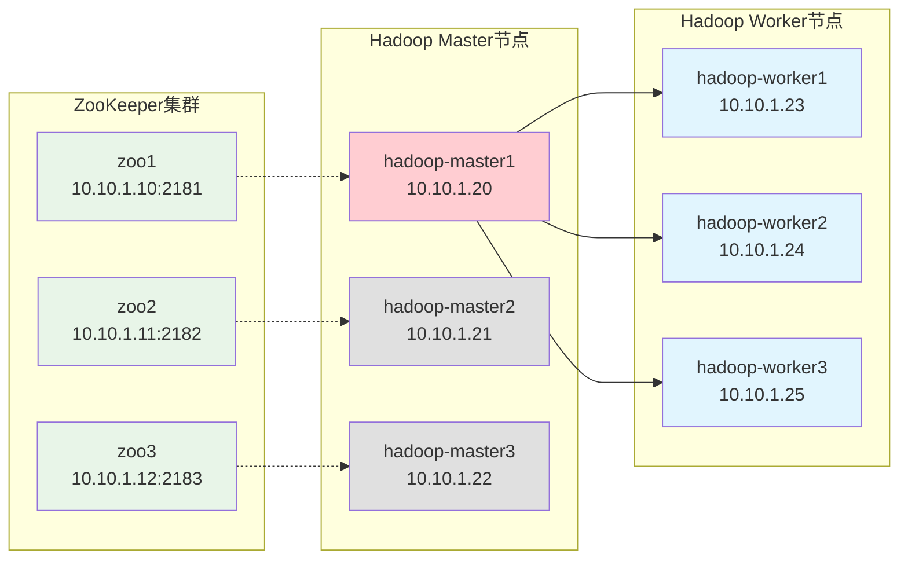
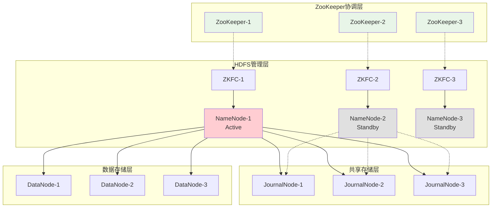
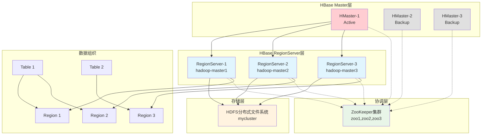
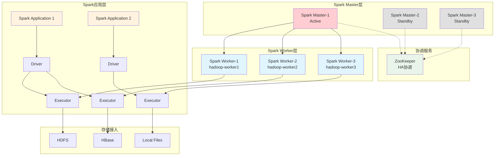
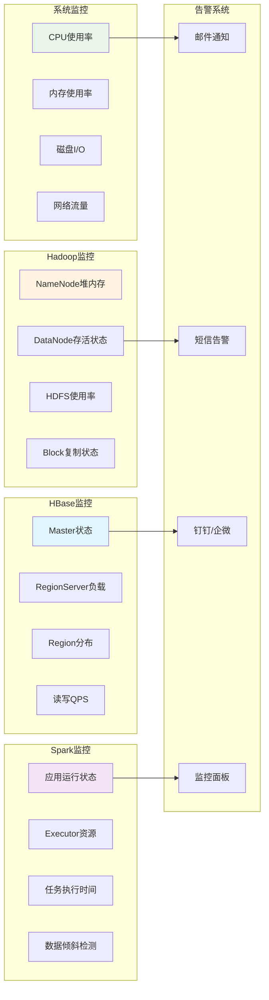
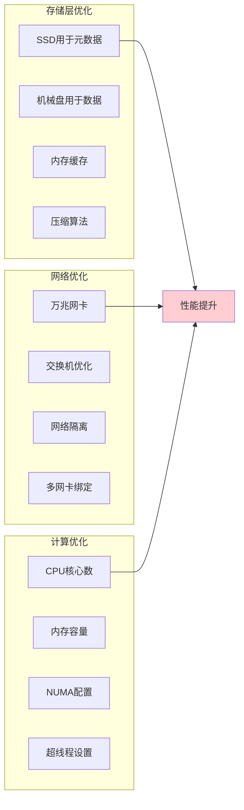

# 大数据生态系统环境搭建指南

> 🚀 **从零开始构建生产级大数据平台**
> 本指南将带您构建包含 Hadoop、HBase、Spark 的完整高可用大数据生态系统

## 📋 目录

### 🚀 快速开始
- [概述](#概述)
  - [生态系统架构](#生态系统架构)
  - [技术栈对比](#技术栈对比)

### 📋 环境准备
- [前置条件](#前置条件)
  - [硬件要求](#硬件要求)
  - [软件要求](#软件要求)
  - [网络架构](#网络架构)
- [基础环境准备](#基础环境准备)
  - [Docker环境配置](#步骤-1docker-环境配置)
  - [软件包下载](#步骤-2下载软件包)
  - [网络和主机配置](#步骤-3网络和主机配置)

### 🏗️ 分阶段部署指南

#### 阶段一：Hadoop 分布式文件系统
- [HDFS高可用架构](#hdfs-高可用架构)
- [步骤1：部署ZooKeeper集群](#步骤-1部署-zookeeper-集群)
- [步骤2：部署Hadoop集群](#步骤-2部署-hadoop-集群)
- [步骤3：Hadoop配置文件](#步骤-3hadoop-配置文件)
  - [hadoop-env.sh配置](#hadoop-envsh-配置)
  - [core-site.xml配置](#core-sitexml-配置)
  - [hdfs-site.xml](#hdfs-sitexml)
  - [yarn-site.xml](#yarn-sitexml)
  - [mapred-site.xml](#mapred-sitexml)
  - [Workers配置](#workers-配置)
- [步骤4：启动Hadoop集群](#步骤-4启动-hadoop-集群)
- [步骤5：验证Hadoop集群](#步骤-5验证-hadoop-集群)

#### 阶段二：HBase 分布式数据库
- [HBase架构设计](#hbase-架构设计)
- [步骤1：HBase配置](#步骤-1hbase-配置)
  - [hbase-env.sh](#hbase-envsh)
  - [hbase-site.xml](#hbase-sitexml)
  - [RegionServer和备用Master配置](#regionserver-和备用-master-配置)
- [步骤2：启动HBase](#步骤-2启动-hbase)

#### 阶段三：Spark 计算引擎
- [Spark集群架构](#spark-集群架构)
- [步骤1：Spark配置](#步骤-2spark-配置)
  - [spark-defaults.conf](#spark-defaultsconf)
  - [spark-env.sh](#spark-envsh)
  - [Workers配置](#workers-配置-1)
- [步骤2：启动Spark集群](#步骤-3启动-spark-集群)
- [步骤3：Spark模式选择](#步骤-4spark-模式选择)
  - [Local模式](#local-模式开发测试)
  - [Standalone模式](#standalone-模式集群部署)
  - [PySpark集群模式](#pyspark-集群模式)
- [步骤4：验证Spark](#步骤-5验证-spark)

### 🔧 集群验证与测试
- [系统集成测试](#系统集成测试)
  - [完整集群状态检查](#完整集群状态检查)
  - [数据流测试](#数据流测试)
- [故障转移测试](#故障转移测试)
  - [NameNode故障转移](#namenode-故障转移)

### 🔧 监控与运维
- [监控指标](#监控指标)
- [日志管理](#日志管理)
  - [日志收集脚本](#日志收集脚本)
- [备份策略](#备份策略)
  - [HDFS数据备份](#hdfs-数据备份)

### 🛠️ 故障排除
- [常见问题解决](#常见问题解决)
  - [集群启动问题](#1-集群启动问题)
    - [ZooKeeper连接失败](#zookeeper连接失败)
    - [NameNode无法启动](#namenode无法启动)
  - [性能问题](#2-性能问题)
    - [内存不足](#内存不足)
    - [网络延迟高](#网络延迟高)
- [诊断工具](#诊断工具)
  - [集群诊断脚本](#集群诊断脚本)

### 📈 性能优化
- [硬件优化建议](#硬件优化建议)
  - [存储优化](#存储优化)
- [软件调优参数](#软件调优参数)
  - [Hadoop调优](#hadoop-调优)
  - [HBase调优](#hbase-调优)
  - [Spark调优](#spark-调优)

### 🎯 总结
- [技术架构回顾](#技术架构回顾)
- [平台能力矩阵](#平台能力矩阵)
- [应用场景建议](#应用场景建议)
- [进阶学习路径](#进阶学习路径)
- [生产实践建议](#生产实践建议)

## 概述

本指南将帮助您构建一个完整的企业级大数据处理平台，包含存储、计算和数据库三大核心组件。

### 生态系统架构



### 技术栈对比

| 组件                  | 作用         | 高可用 | 扩展性     | 复杂度   |
| --------------------- | ------------ | ------ | ---------- | -------- |
| **Hadoop HDFS** | 分布式存储   | ✅     | ⭐⭐⭐⭐⭐ | ⭐⭐⭐   |
| **HBase**       | NoSQL 数据库 | ✅     | ⭐⭐⭐⭐   | ⭐⭐⭐⭐ |
| **Spark**       | 计算引擎     | ✅     | ⭐⭐⭐⭐⭐ | ⭐⭐⭐   |
| **ZooKeeper**   | 协调服务     | ✅     | ⭐⭐⭐     | ⭐⭐     |

## 前置条件

### 硬件要求

#### 集群资源规划

| 节点类型       | 数量 | CPU   | 内存  | 磁盘   | 网络  |
| -------------- | ---- | ----- | ----- | ------ | ----- |
| Master 节点    | 3    | 4 核+ | 8GB+  | 100GB+ | 千兆+ |
| Worker 节点    | 3+   | 8 核+ | 16GB+ | 500GB+ | 千兆+ |
| ZooKeeper 节点 | 3    | 2 核+ | 4GB+  | 50GB+  | 千兆+ |

### 软件要求

- **操作系统**: Linux (Ubuntu 20.04+ / CentOS 8+ / RHEL 8+)
- **容器化**: Docker 20.10+ / Docker Compose 2.0+
- **Java**: OpenJDK 8 或 11
- **Python**: Python 3.8+ (用于 Spark)

### 网络架构



## 基础环境准备

### 步骤 1：Docker 环境配置

#### 创建基础镜像

根据您的架构选择相应的 Dockerfile：

#### AMD64架构 Dockerfile

```dockerfile
FROM ubuntu:22.04

# 环境变量设置
ENV HADOOP_HOME=/opt/hadoop
ENV HBASE_HOME=/opt/hbase
ENV SPARK_HOME=/opt/spark
ENV JAVA_HOME=/usr/lib/jvm/java-8-openjdk-amd64

# 以 root 用户执行
USER root

# 更新并安装依赖包
RUN apt-get update && \
    apt-get install -y sudo openjdk-8-jdk openssh-server openssh-client \
                       wget curl vim net-tools telnet && \
    ssh-keygen -t rsa -P '' -f ~/.ssh/id_rsa && \
    cat ~/.ssh/id_rsa.pub >> ~/.ssh/authorized_keys && \
    chmod 0600 ~/.ssh/authorized_keys && \
    mkdir -p /data/hdfs && \
    mkdir -p /data/hdfs/journal/node/local/data

# 下载并安装Miniconda
RUN wget https://repo.anaconda.com/miniconda/Miniconda3-latest-Linux-x86_64.sh -O /tmp/miniconda.sh && \
    chmod +x /tmp/miniconda.sh && \
    /tmp/miniconda.sh -b -p /opt/miniconda3 && \
    rm /tmp/miniconda.sh

# 设置Miniconda环境变量
ENV PATH="/opt/miniconda3/bin:$PATH"

# 启动 SSH 服务
RUN service ssh start

# 暴露端口
EXPOSE 9870 9868 9864 9866 8088 8020 16000 16010 16020 7077 8080 8081 22

# 容器启动时启动 SSH
CMD ["/usr/sbin/sshd", "-D"]
```

#### ARM64架构 Dockerfile

```dockerfile
FROM ubuntu:22.04

# 环境变量设置
ENV HADOOP_HOME=/opt/hadoop
ENV HBASE_HOME=/opt/hbase
ENV SPARK_HOME=/opt/spark
ENV JAVA_HOME=/usr/lib/jvm/java-8-openjdk-arm64

# 以 root 用户执行
USER root

# 更新并安装依赖包
RUN apt-get update && \
    apt-get install -y sudo openjdk-8-jdk openssh-server openssh-client \
                       wget curl vim net-tools telnet && \
    ssh-keygen -t rsa -P '' -f ~/.ssh/id_rsa && \
    cat ~/.ssh/id_rsa.pub >> ~/.ssh/authorized_keys && \
    chmod 0600 ~/.ssh/authorized_keys && \
    mkdir -p /data/hdfs && \
    mkdir -p /data/hdfs/journal/node/local/data

# 下载并安装Miniconda
RUN wget https://repo.anaconda.com/miniconda/Miniconda3-latest-Linux-x86_64.sh -O /tmp/miniconda.sh && \
    chmod +x /tmp/miniconda.sh && \
    /tmp/miniconda.sh -b -p /opt/miniconda3 && \
    rm /tmp/miniconda.sh

# 设置Miniconda环境变量
ENV PATH="/opt/miniconda3/bin:$PATH"

# 启动 SSH 服务
RUN service ssh start

# 暴露端口
EXPOSE 9870 9868 9864 9866 8088 8020 16000 16010 16020 7077 8080 8081 22

# 容器启动时启动 SSH
CMD ["/usr/sbin/sshd", "-D"]
```

#### 构建镜像

```bash
# 构建基础镜像
docker build -t bigdata-platform:1.0 .
```

### 步骤 2：下载软件包

创建软件下载脚本：

> [!NOTE]
> 文件名: download-packages.sh

```bash
#!/bin/bash

# 创建下载目录
mkdir -p ~/opt/docker-data/hadoop-hbase-spark
cd ~/opt/docker-data/hadoop-hbase-spark

# 下载Hadoop
echo "下载Hadoop..."
wget https://archive.apache.org/dist/hadoop/common/hadoop-3.4.0/hadoop-3.4.0.tar.gz
tar -xzf hadoop-3.4.0.tar.gz

# 下载HBase
echo "下载HBase..."
wget https://archive.apache.org/dist/hbase/2.5.10/hbase-2.5.10-hadoop3-bin.tar.gz
tar -xzf hbase-2.5.10-hadoop3-bin.tar.gz

# 下载Spark
echo "下载Spark..."
wget https://archive.apache.org/dist/spark/spark-3.4.1/spark-3.4.1-bin-hadoop3.tgz
tar -xzf spark-3.4.1-bin-hadoop3.tgz

# 下载Miniconda
echo "下载Miniconda..."
wget https://repo.anaconda.com/miniconda/Miniconda3-latest-Linux-x86_64.sh
# 设置权限
chmod -R 755 ~/opt/docker-data/hadoop-hbase-spark
echo "软件包下载完成!"

#解压文件
tar -xzf hadoop-3.4.0.tar.gz && mv hadoop-3.4.0 hadoop
tar -xzf hbase-2.5.10-hadoop3-bin.tar.gz && mv hbase-2.5.10-hadoop3 hbase
tar -xzf spark-3.4.1-bin-hadoop3.tgz && mv spark-3.4.1-bin-hadoop3 spark
echo "解压文件完成!"
```

### 步骤 3：网络和主机配置

#### 配置 hosts 文件

```bash
# 在所有节点的/etc/hosts文件中添加
10.10.1.10 zoo1
10.10.1.11 zoo2
10.10.1.12 zoo3
10.10.1.20 hadoop-master1
10.10.1.21 hadoop-master2
10.10.1.22 hadoop-master3
10.10.1.23 hadoop-worker1
10.10.1.24 hadoop-worker2
10.10.1.25 hadoop-worker3
```

## 阶段一：Hadoop 分布式文件系统

Hadoop HDFS 是整个大数据生态系统的存储基础，提供高可用、高可靠的分布式存储能力。

### HDFS 高可用架构



### 步骤 1：部署 ZooKeeper 集群

#### ZooKeeper Docker Compose 配置

> [!NOTE]
> 文件名: zookeeper-compose.yml

```yaml
services:
  zoo1:
    image: zookeeper:3.7.1-temurin
    container_name: zoo1
    restart: always
    hostname: zoo1
    ports:
      - 2181:2181
    environment:
      ZOO_MY_ID: 1
      ZOO_SERVERS: server.1=zoo1:2888:3888;2181 server.2=zoo2:2888:3888;2181 server.3=zoo3:2888:3888;2181
    volumes:
      - ~/opt/docker-data/hadoop-hbase-spark/zoo1/data:/data
      - ~/opt/docker-data/hadoop-hbase-spark/zoo1/logs:/datalog
    networks:
      zookeeper-cluster:
        ipv4_address: 10.10.1.10

  zoo2:
    image: zookeeper:3.7.1-temurin
    container_name: zoo2
    restart: always
    hostname: zoo2
    ports:
      - 2182:2181
    environment:
      ZOO_MY_ID: 2
      ZOO_SERVERS: server.1=zoo1:2888:3888;2181 server.2=zoo2:2888:3888;2181 server.3=zoo3:2888:3888;2181
    volumes:
      - ~/opt/docker-data/hadoop-hbase-spark/zoo2/data:/data
      - ~/opt/docker-data/hadoop-hbase-spark/zoo2/logs:/datalog
    networks:
       zookeeper-cluster:
        ipv4_address: 10.10.1.11

  zoo3:
    image: zookeeper:3.7.1-temurin
    container_name: zoo3
    restart: always
    hostname: zoo3
    ports:
      - 2183:2181
    environment:
      ZOO_MY_ID: 3
      ZOO_SERVERS: server.1=zoo1:2888:3888;2181 server.2=zoo2:2888:3888;2181 server.3=zoo3:2888:3888;2181
    volumes:
      - ~/opt/docker-data/hadoop-hbase-spark/zoo3/data:/data
      - ~/opt/docker-data/hadoop-hbase-spark/zoo3/logs:/datalog
    networks:
      zookeeper-cluster:
        ipv4_address: 10.10.1.12

networks:
  zookeeper-cluster:
    name: zookeeper-cluster
    external: true
    ipam:
      config:
        - subnet: "10.10.1.0/24"
```

#### 启动 ZooKeeper 集群

```bash
# 启动ZooKeeper集群
docker-compose -f zookeeper-compose.yml up -d

# 验证ZooKeeper集群状态
docker exec zoo1 /apache-zookeeper-3.7.1-bin/bin/zkServer.sh status
docker exec zoo2 /apache-zookeeper-3.7.1-bin/bin/zkServer.sh status
docker exec zoo3 /apache-zookeeper-3.7.1-bin/bin/zkServer.sh status
```

### 步骤 2：部署 Hadoop 集群

#### Hadoop 集群 Docker Compose 配置

> [!NOTE]
> 文件名: hadoop-compose.yml

```yaml
# 定义公共配置锚点
x-hadoop: &hadoop-common
  image: big-data-components:1.0
  stdin_open: true
  tty: true
  command: sh -c "/usr/sbin/sshd -D"
  networks:
    zookeeper-cluster:
  volumes: &hadoop-volumes
    - type: bind
      source: ~/opt/docker-data/hadoop-hbase-spark/hadoop
      target: /opt/hadoop
    - type: bind
      source: ~/opt/docker-data/hadoop-hbase-spark/hbase
      target: /opt/hbase
    - type: bind
      source: ~/opt/docker-data/hadoop-hbase-spark/spark
      target: /opt/spark
    - /etc/localtime:/etc/localtime:ro
    - /etc/timezone:/etc/timezone:ro
  environment: &hadoop-env
    JAVA_HOME: "/usr/lib/jvm/java-8-openjdk-amd64"
    HADOOP_HOME: "/opt/hadoop"
    HADOOP_COMMON_HOME: "/opt/hadoop"
    HADOOP_HDFS_HOME: "/opt/hadoop"
    HADOOP_MAPRED_HOME: "/opt/hadoop"
    YARN_HOME: "/opt/hadoop"
    HBASE_HOME: "/opt/hbase"
    SPARK_HOME: "/opt/spark"
    PYTHON_HOME: "/opt/miniconda3"
    HADOOP_CONF_DIR: "/opt/hadoop/etc/hadoop"
    HBASE_CONF_DIR: "/opt/hbase/conf"
    SPARK_CONF_DIR: "/opt/spark/conf"
    PYSPARK_PYTHON: "/opt/miniconda3/bin/python"
    PYSPARK_DRIVER_PYTHON: "/opt/miniconda3/bin/python"
    PYTHONPATH: "/opt/miniconda3/lib/python3.8/site-packages"
    PYTHONIOENCODING: "utf-8"
    CLASSPATH: ".:/usr/lib/jvm/java-8-openjdk-amd64/lib/dt.jar:/usr/lib/jvm/java-8-openjdk-amd64/lib/tools.jar:/usr/lib/jvm/java-8-openjdk-amd64/jre/lib/rt.jar"
    PATH: "/opt/miniconda3/bin:/usr/lib/jvm/java-8-openjdk-amd64/bin:/opt/hadoop/bin:/opt/hadoop/sbin:/opt/hbase/bin:/opt/spark/bin:/opt/spark/sbin:${PATH}"
    # Hadoop用户权限配置 - 解决root用户运行错误
    HDFS_NAMENODE_USER: "root"
    HDFS_DATANODE_USER: "root"
    HDFS_JOURNALNODE_USER: "root"
    HDFS_ZKFC_USER: "root"
    YARN_RESOURCEMANAGER_USER: "root"
    YARN_NODEMANAGER_USER: "root"
    YARN_PROXYSERVER_USER: "root"
    MAPRED_HISTORYSERVER_USER: "root"

services:
  # Hadoop 主节点配置
  hadoop-master1: &hadoop-master
    <<: *hadoop-common
    container_name: hadoop-master1
    hostname: hadoop-master1
    volumes: *hadoop-volumes
    environment: *hadoop-env
    networks:
      zookeeper-cluster:
        ipv4_address: 10.10.1.20
    restart: no
    
  hadoop-master2:
    <<: *hadoop-master
    container_name: hadoop-master2
    hostname: hadoop-master2
    networks:
      zookeeper-cluster:
        ipv4_address: 10.10.1.21
    restart: no
    
  hadoop-master3:
    <<: *hadoop-master
    container_name: hadoop-master3
    hostname: hadoop-master3
    networks:
      zookeeper-cluster:
        ipv4_address: 10.10.1.22
    restart: no
    
  hadoop-worker1:
    <<: *hadoop-common
    container_name: hadoop-worker1
    hostname: hadoop-worker1
    environment: *hadoop-env
    networks:
      zookeeper-cluster:
        ipv4_address: 10.10.1.23
    restart: no
    
  hadoop-worker2:
    <<: *hadoop-common
    container_name: hadoop-worker2
    hostname: hadoop-worker2
    environment: *hadoop-env
    networks:
      zookeeper-cluster:
        ipv4_address: 10.10.1.24
    restart: no
    
  hadoop-worker3:
    <<: *hadoop-common
    container_name: hadoop-worker3
    hostname: hadoop-worker3
    environment: *hadoop-env
    networks:
      zookeeper-cluster:
        ipv4_address: 10.10.1.25
    restart: no

networks:
  zookeeper-cluster:
    name: zookeeper-cluster
    external: true
    ipam:
      config:
        - subnet: "10.10.1.0/24"
```

### 步骤 3：Hadoop 配置文件

#### 核心配置文件详解

#### hadoop-env.sh 配置

> [!NOTE]
> 路径: ~/opt/docker-data/hadoop-hbase-spark/hadoop/etc/hadoop/hadoop-env.sh

```bash
# Java路径配置
export JAVA_HOME=/usr/lib/jvm/java-8-openjdk-amd64

# Hadoop用户配置
export HDFS_NAMENODE_USER=root
export HDFS_DATANODE_USER=root
export HDFS_SECONDARYNAMENODE_USER=root
export YARN_RESOURCEMANAGER_USER=root
export YARN_NODEMANAGER_USER=root

# 内存配置
export HADOOP_HEAPSIZE=2048m
export HADOOP_NAMENODE_INIT_HEAPSIZE=2048m
```

#### core-site.xml 配置

> [!NOTE]
> 路径: ~/opt/docker-data/hadoop-hbase-spark/hadoop/etc/hadoop/core-site.xml

```xml
<?xml version="1.0" encoding="UTF-8"?>
<configuration>
    <!-- 设置默认文件系统为高可用的HDFS -->
    <property>
        <name>fs.defaultFS</name>
        <value>hdfs://mycluster</value>
    </property>

    <!-- Hadoop临时目录 -->
    <property>
        <name>hadoop.tmp.dir</name>
        <value>/tmp/hadoop-${user.name}</value>
    </property>

    <!-- ZooKeeper配置 -->
    <property>
        <name>ha.zookeeper.quorum</name>
        <value>zoo1:2181,zoo2:2181,zoo3:2181</value>
    </property>

    <!-- 代理用户配置 -->
    <property>
        <name>hadoop.proxyuser.root.hosts</name>
        <value>*</value>
    </property>
    <property>
        <name>hadoop.proxyuser.root.groups</name>
        <value>*</value>
    </property>
</configuration>
```

#### hdfs-site.xml

> [!NOTE]
> 路径: ~/opt/docker-data/hadoop-hbase-spark/hadoop/etc/hadoop/hdfs-site.xml

```xml
<?xml version="1.0" encoding="UTF-8"?>
<configuration>
    <!-- 命名服务配置 -->
    <property>
        <name>dfs.nameservices</name>
        <value>mycluster</value>
    </property>

    <!-- NameNode高可用配置 -->
    <property>
        <name>dfs.ha.namenodes.mycluster</name>
        <value>nn1,nn2,nn3</value>
    </property>

    <!-- NameNode RPC地址 -->
    <property>
        <name>dfs.namenode.rpc-address.mycluster.nn1</name>
        <value>hadoop-master1:8020</value>
    </property>
    <property>
        <name>dfs.namenode.rpc-address.mycluster.nn2</name>
        <value>hadoop-master2:8020</value>
    </property>
    <property>
        <name>dfs.namenode.rpc-address.mycluster.nn3</name>
        <value>hadoop-master3:8020</value>
    </property>

    <!-- NameNode HTTP地址 -->
    <property>
        <name>dfs.namenode.http-address.mycluster.nn1</name>
        <value>hadoop-master1:9870</value>
    </property>
    <property>
        <name>dfs.namenode.http-address.mycluster.nn2</name>
        <value>hadoop-master2:9870</value>
    </property>
    <property>
        <name>dfs.namenode.http-address.mycluster.nn3</name>
        <value>hadoop-master3:9870</value>
    </property>

    <!-- 共享编辑日志配置 -->
    <property>
        <name>dfs.namenode.shared.edits.dir</name>
        <value>qjournal://hadoop-master1:8485;hadoop-master2:8485;hadoop-master3:8485/mycluster</value>
    </property>

    <!-- JournalNode配置 -->
    <property>
        <name>dfs.journalnode.edits.dir</name>
        <value>/data/hdfs/journal/node/local/data</value>
    </property>

    <!-- 客户端故障转移配置 -->
    <property>
        <name>dfs.client.failover.proxy.provider.mycluster</name>
        <value>org.apache.hadoop.hdfs.server.namenode.ha.ConfiguredFailoverProxyProvider</value>
    </property>

    <!-- 自动故障转移 -->
    <property>
        <name>dfs.ha.automatic-failover.enabled</name>
        <value>true</value>
    </property>

    <!-- 隔离机制 -->
    <property>
        <name>dfs.ha.fencing.methods</name>
        <value>sshfence</value>
    </property>
    <property>
        <name>dfs.ha.fencing.ssh.private-key-files</name>
        <value>/root/.ssh/id_rsa</value>
    </property>

    <!-- 数据存储配置 -->
    <property>
        <name>dfs.namenode.name.dir</name>
        <value>/data/hdfs/namenode</value>
    </property>
    <property>
        <name>dfs.datanode.data.dir</name>
        <value>/data/hdfs/datanode</value>
    </property>

    <!-- 复制因子 -->
    <property>
        <name>dfs.replication</name>
        <value>3</value>
    </property>

    <!-- 权限检查 -->
    <property>
        <name>dfs.permissions.enabled</name>
        <value>false</value>
    </property>
</configuration>
```

#### yarn-site.xml

> [!NOTE]
> 路径: ~/opt/docker-data/hadoop-hbase-spark/hadoop/etc/hadoop/yarn-site.xml

```xml
<?xml version="1.0"?>
<configuration>
    <!-- ResourceManager高可用配置 -->
    <property>
        <name>yarn.resourcemanager.ha.enabled</name>
        <value>true</value>
    </property>
    <property>
        <name>yarn.resourcemanager.cluster-id</name>
        <value>cluster1</value>
    </property>
    <property>
        <name>yarn.resourcemanager.ha.rm-ids</name>
        <value>rm1,rm2,rm3</value>
    </property>

    <!-- ResourceManager地址配置 -->
    <property>
        <name>yarn.resourcemanager.hostname.rm1</name>
        <value>hadoop-master1</value>
    </property>
    <property>
        <name>yarn.resourcemanager.hostname.rm2</name>
        <value>hadoop-master2</value>
    </property>
    <property>
        <name>yarn.resourcemanager.hostname.rm3</name>
        <value>hadoop-master3</value>
    </property>

    <!-- ZooKeeper配置 -->
    <property>
        <name>hadoop.zk.address</name>
        <value>zoo1:2181,zoo2:2181,zoo3:2181</value>
    </property>

    <!-- NodeManager配置 -->
    <property>
        <name>yarn.nodemanager.aux-services</name>
        <value>mapreduce_shuffle</value>
    </property>
    <property>
        <name>yarn.nodemanager.resource.memory-mb</name>
        <value>8192</value>
    </property>
    <property>
        <name>yarn.nodemanager.resource.cpu-vcores</name>
        <value>4</value>
    </property>

    <!-- 调度器配置 -->
    <property>
        <name>yarn.resourcemanager.scheduler.class</name>
        <value>org.apache.hadoop.yarn.server.resourcemanager.scheduler.capacity.CapacityScheduler</value>
    </property>
</configuration>
```

#### mapred-site.xml

> [!NOTE]
> 路径: ~/opt/docker-data/hadoop-hbase-spark/hadoop/etc/hadoop/mapred-site.xml

```xml
<?xml version="1.0"?>
<configuration>
    <!-- MapReduce框架配置 -->
    <property>
        <name>mapreduce.framework.name</name>
        <value>yarn</value>
    </property>

    <!-- JobHistory Server高可用配置 -->
    <property>
        <name>mapreduce.jobhistory.address</name>
        <value>0.0.0.0:10020</value>
        <description>JobHistory Server RPC地址，使用0.0.0.0监听所有接口</description>
    </property>
    <property>
        <name>mapreduce.jobhistory.webapp.address</name>
        <value>0.0.0.0:19888</value>
        <description>JobHistory Server Web UI地址</description>
    </property>

    <!-- JobHistory存储目录配置 - 使用HDFS高可用 -->
    <property>
        <name>mapreduce.jobhistory.done-dir</name>
        <value>hdfs://mycluster/mr-history/done</value>
        <description>已完成作业的历史文件存储目录</description>
    </property>
    <property>
        <name>mapreduce.jobhistory.intermediate-done-dir</name>
        <value>hdfs://mycluster/mr-history/tmp</value>
        <description>中间历史文件存储目录</description>
    </property>

    <!-- 自动创建目录配置 -->
    <property>
        <name>mapreduce.jobhistory.move.interval-ms</name>
        <value>180000</value>
        <description>JobHistory移动文件的间隔时间，启用后会自动创建目录</description>
    </property>
    <property>
        <name>mapreduce.jobhistory.move.thread-count</name>
        <value>3</value>
        <description>JobHistory移动文件的线程数</description>
    </property>
    
    <!-- 启动时检查和创建目录 -->
    <property>
        <name>mapreduce.jobhistory.recovery.enable</name>
        <value>true</value>
        <description>启用JobHistory恢复功能，自动处理目录问题</description>
    </property>
    <property>
        <name>mapreduce.jobhistory.recovery.store.class</name>
        <value>org.apache.hadoop.mapreduce.v2.hs.HistoryServerFileSystemStateStoreService</value>
        <description>使用文件系统存储状态，会自动创建必要目录</description>
    </property>
    <property>
        <name>mapreduce.jobhistory.recovery.store.fs.uri</name>
        <value>hdfs://mycluster/mr-history/recovery</value>
        <description>恢复状态存储目录</description>
    </property>

    <!-- 应用环境配置 -->
    <property>
        <name>yarn.app.mapreduce.am.env</name>
        <value>HADOOP_MAPRED_HOME=/opt/hadoop</value>
    </property>
    <property>
        <name>mapreduce.map.env</name>
        <value>HADOOP_MAPRED_HOME=/opt/hadoop</value>
    </property>
    <property>
        <name>mapreduce.reduce.env</name>
        <value>HADOOP_MAPRED_HOME=/opt/hadoop</value>
    </property>

    <!-- 分布式集群性能优化配置 -->
    <property>
        <name>mapreduce.job.ubertask.enable</name>
        <value>true</value>
        <description>启用uber任务优化小作业性能</description>
    </property>
    <property>
        <name>mapreduce.job.ubertask.maxmaps</name>
        <value>9</value>
        <description>uber任务的最大map数量</description>
    </property>
    <property>
        <name>mapreduce.job.ubertask.maxreduces</name>
        <value>1</value>
        <description>uber任务的最大reduce数量</description>
    </property>

    <!-- Map任务配置 -->
    <property>
        <name>mapreduce.map.memory.mb</name>
        <value>2048</value>
        <description>Map任务内存配置</description>
    </property>
    <property>
        <name>mapreduce.map.java.opts</name>
        <value>-Xmx1638m</value>
        <description>Map任务JVM参数</description>
    </property>

    <!-- Reduce任务配置 -->
    <property>
        <name>mapreduce.reduce.memory.mb</name>
        <value>2048</value>
        <description>Reduce任务内存配置</description>
    </property>
    <property>
        <name>mapreduce.reduce.java.opts</name>
        <value>-Xmx1638m</value>
        <description>Reduce任务JVM参数</description>
    </property>

    <!-- ApplicationMaster配置 -->
    <property>
        <name>yarn.app.mapreduce.am.resource.mb</name>
        <value>1024</value>
        <description>ApplicationMaster内存配置</description>
    </property>
    <property>
        <name>yarn.app.mapreduce.am.command-opts</name>
        <value>-Xmx819m</value>
        <description>ApplicationMaster JVM参数</description>
    </property>

    <!-- 作业历史记录保留配置 -->
    <property>
        <name>mapreduce.jobhistory.max-age-ms</name>
        <value>604800000</value>
        <description>作业历史保留时间（7天）</description>
    </property>
    <property>
        <name>mapreduce.jobhistory.cleaner.enable</name>
        <value>true</value>
        <description>启用历史文件清理</description>
    </property>
    <property>
        <name>mapreduce.jobhistory.cleaner.interval-ms</name>
        <value>86400000</value>
        <description>历史文件清理间隔（1天）</description>
    </property>

    <!-- 压缩配置 -->
    <property>
        <name>mapreduce.map.output.compress</name>
        <value>true</value>
        <description>启用Map输出压缩</description>
    </property>
    <property>
        <name>mapreduce.map.output.compress.codec</name>
        <value>org.apache.hadoop.io.compress.SnappyCodec</value>
        <description>Map输出压缩编解码器</description>
    </property>
    <property>
        <name>mapreduce.output.fileoutputformat.compress</name>
        <value>true</value>
        <description>启用最终输出压缩</description>
    </property>
    <property>
        <name>mapreduce.output.fileoutputformat.compress.codec</name>
        <value>org.apache.hadoop.io.compress.SnappyCodec</value>
        <description>最终输出压缩编解码器</description>
    </property>
</configuration>
```

#### Workers 配置

> [!NOTE]
> 路径: ~/opt/docker-data/hadoop-hbase-spark/hadoop/etc/hadoop/workers

```bash
hadoop-worker1
hadoop-worker2
hadoop-worker3
```

### 步骤 4：启动 Hadoop 集群

> [!NOTE]
> 文件名: hadoop-init.sh

#### 集群初始化脚本

```bash
#!/bin/bash

#######################################################################
# Hadoop 集群高可用(HA)初始化脚本
# 
# 功能说明：
# 1. 配置SSH免密登录
# 2. 启动JournalNode服务 
# 3. 格式化NameNode并配置Standby
# 4. 初始化ZooKeeper故障切换控制器
# 5. 启动Hadoop分布式文件系统和YARN
#
# 使用方法：bash hadoop-init.sh
# 作者：DavidHLP
# 版本：1.0
#######################################################################

# 颜色定义
RED='\033[0;31m'
GREEN='\033[0;32m'
YELLOW='\033[1;33m'
BLUE='\033[0;34m'
PURPLE='\033[0;35m'
CYAN='\033[0;36m'
NC='\033[0m' # No Color

# 日志文件配置
LOG_DIR="$(pwd)"
LOG_FILE="${LOG_DIR}/hadoop-init-$(date '+%Y%m%d_%H%M%S').log"

# 初始化日志文件
init_log() {
    echo "=====================================" > "$LOG_FILE"
    echo "Hadoop 集群初始化日志" >> "$LOG_FILE"
    echo "开始时间: $(date '+%Y-%m-%d %H:%M:%S')" >> "$LOG_FILE"
    echo "日志文件: $LOG_FILE" >> "$LOG_FILE"
    echo "=====================================" >> "$LOG_FILE"
    echo "" >> "$LOG_FILE"
}

# 日志函数 - 同时输出到终端和文件
log_info() {
    local msg="[INFO] $(date '+%Y-%m-%d %H:%M:%S') - $1"
    echo -e "${BLUE}${msg}${NC}"
    echo "$msg" >> "$LOG_FILE"
}

log_success() {
    local msg="[SUCCESS] $(date '+%Y-%m-%d %H:%M:%S') - $1"
    echo -e "${GREEN}${msg}${NC}"
    echo "$msg" >> "$LOG_FILE"
}

log_warning() {
    local msg="[WARNING] $(date '+%Y-%m-%d %H:%M:%S') - $1"
    echo -e "${YELLOW}${msg}${NC}"
    echo "$msg" >> "$LOG_FILE"
}

log_error() {
    local msg="[ERROR] $(date '+%Y-%m-%d %H:%M:%S') - $1"
    echo -e "${RED}${msg}${NC}"
    echo "$msg" >> "$LOG_FILE"
}

log_step() {
    local step_msg="步骤 $1: $2"
    echo -e "\n${PURPLE}========================================${NC}"
    echo -e "${PURPLE}${step_msg}${NC}"
    echo -e "${PURPLE}========================================${NC}"
    
    echo "" >> "$LOG_FILE"
    echo "========================================" >> "$LOG_FILE"
    echo "$step_msg" >> "$LOG_FILE"
    echo "========================================" >> "$LOG_FILE"
}

# 检查容器状态
check_container() {
    if docker ps --format "table {{.Names}}" | grep -q "$1"; then
        return 0
    else
        return 1
    fi
}

# 执行命令并记录输出到日志
exec_and_log() {
    local cmd="$1"
    local description="$2"
    
    if [ -n "$description" ]; then
        log_info "执行: $description"
        echo "[COMMAND] $description" >> "$LOG_FILE"
    fi
    
    echo "[CMD] $cmd" >> "$LOG_FILE"
    
    # 执行命令并捕获输出
    local output
    output=$(eval "$cmd" 2>&1)
    local exit_code=$?
    
    # 记录输出到日志文件
    if [ -n "$output" ]; then
        echo "[OUTPUT] $output" >> "$LOG_FILE"
    fi
    
    echo "[EXIT_CODE] $exit_code" >> "$LOG_FILE"
    echo "" >> "$LOG_FILE"
    
    return $exit_code
}

echo -e "${CYAN}"
echo "  _   _           _                   _____       _ _   "
echo " | | | |         | |                 |_   _|     (_) |  "
echo " | |_| | __ _  __| | ___   ___  _ __   | |  _ __  _| |_ "
echo " |  _  |/ _\` |/ _\` |/ _ \ / _ \| '_ \  | | | '_ \| | __|"
echo " | | | | (_| | (_| | (_) | (_) | |_) |_| |_| | | | | |_ "
echo " |_| |_|\__,_|\__,_|\___/ \___/| .__/|_____|_| |_|_|\__|"
echo "                              | |                      "
echo "                              |_|                      "
echo -e "${NC}"
echo -e "${CYAN}Hadoop 高可用集群初始化脚本启动...${NC}\n"

# 初始化日志文件
init_log
log_info "Hadoop 高可用集群初始化脚本启动..."
log_info "日志文件位置: $LOG_FILE"

# 启动Docker容器
log_step "0" "启动Hadoop集群容器"
log_info "使用docker-compose启动所有容器..."
exec_and_log "docker-compose -f hadoop-compose.yml up -d" "启动Docker容器"
if [ $? -eq 0 ]; then
    log_success "容器启动命令执行成功"
    log_info "等待容器完全启动..."
    sleep 10
else
    log_error "容器启动失败，请检查docker-compose.yml文件"
    exit 1
fi

# 检查必要的容器是否运行
log_step "1" "检查Docker容器状态"
containers=("hadoop-master1" "hadoop-master2" "hadoop-master3" "hadoop-worker1" "hadoop-worker2" "hadoop-worker3")
for container in "${containers[@]}"; do
    if check_container "$container"; then
        log_success "容器 $container 正在运行"
    else
        log_error "容器 $container 未运行，启动可能失败"
        exit 1
    fi
done

# SSH 配置检查
log_step "2" "检查SSH免密登录配置"
log_info "配置master1到其他节点的SSH连接..."
docker exec hadoop-master1 ssh -o StrictHostKeyChecking=no hadoop-master2 exit
if [ $? -eq 0 ]; then
    log_success "master1 -> master2 SSH连接成功"
else
    log_warning "master1 -> master2 SSH连接失败"
fi

docker exec hadoop-master1 ssh -o StrictHostKeyChecking=no hadoop-master3 exit
if [ $? -eq 0 ]; then
    log_success "master1 -> master3 SSH连接成功"
else
    log_warning "master1 -> master3 SSH连接失败"
fi

log_info "配置master2到其他节点的SSH连接..."
docker exec hadoop-master2 ssh -o StrictHostKeyChecking=no hadoop-master1 exit
docker exec hadoop-master2 ssh -o StrictHostKeyChecking=no hadoop-master3 exit

log_info "配置master3到其他节点的SSH连接..."
docker exec hadoop-master3 ssh -o StrictHostKeyChecking=no hadoop-master1 exit
docker exec hadoop-master3 ssh -o StrictHostKeyChecking=no hadoop-master2 exit

log_success "SSH免密登录配置完成"

# 启动 journalnode
log_step "3" "启动JournalNode服务"
log_info "在Master节点启动JournalNode..."
docker exec hadoop-master1 /opt/hadoop/bin/hdfs --daemon start journalnode
docker exec hadoop-master2 /opt/hadoop/bin/hdfs --daemon start journalnode
docker exec hadoop-master3 /opt/hadoop/bin/hdfs --daemon start journalnode

log_info "在Worker节点启动JournalNode（可选）..."
# 可以不启动 worker 节点上的 journalnode
docker exec hadoop-worker1 /opt/hadoop/bin/hdfs --daemon start journalnode
docker exec hadoop-worker2 /opt/hadoop/bin/hdfs --daemon start journalnode
docker exec hadoop-worker3 /opt/hadoop/bin/hdfs --daemon start journalnode

log_success "JournalNode服务启动完成"
sleep 3

# 初始化 NameNode
log_step "4" "初始化主NameNode"
log_info "格式化master1上的NameNode..."
docker exec hadoop-master1 bash /opt/hadoop/bin/hdfs namenode -format -force
if [ $? -eq 0 ]; then
    log_success "NameNode格式化成功"
else
    log_error "NameNode格式化失败"
    exit 1
fi

log_info "启动master1上的NameNode..."
docker exec hadoop-master1 /opt/hadoop/bin/hdfs --daemon start namenode
sleep 5

# Bootstrap Standby
log_step "5" "配置备用NameNode"
log_info "配置master2作为Standby NameNode..."
docker exec -it hadoop-master2 bash /opt/hadoop/bin/hdfs namenode -bootstrapStandby -force
if [ $? -eq 0 ]; then
    log_success "master2 Standby NameNode配置成功"
else
    log_error "master2 Standby NameNode配置失败"
fi

docker exec hadoop-master2 /opt/hadoop/bin/hdfs --daemon start namenode

log_info "配置master3作为Standby NameNode..."
docker exec -it hadoop-master3 bash /opt/hadoop/bin/hdfs namenode -bootstrapStandby -force
if [ $? -eq 0 ]; then
    log_success "master3 Standby NameNode配置成功"
else
    log_error "master3 Standby NameNode配置失败"
fi

docker exec hadoop-master3 /opt/hadoop/bin/hdfs --daemon start namenode

log_success "备用NameNode配置完成"
sleep 3

# 停止 DFS
log_step "6" "停止DFS服务准备重新配置"
log_info "停止分布式文件系统..."
docker exec hadoop-master1 /opt/hadoop/sbin/stop-dfs.sh
sleep 5

# Zookeeper 数据重新格式化（如果需要）
log_step "7" "初始化ZooKeeper故障切换控制器"
log_info "格式化ZooKeeper中的HA状态信息..."
docker exec -it hadoop-master1 bash /opt/hadoop/bin/hdfs zkfc -formatZK -force
if [ $? -eq 0 ]; then
    log_success "ZooKeeper格式化成功"
else
    log_error "ZooKeeper格式化失败"
fi

# 启动 zkfc 和 DFS/YARN
log_step "8" "启动Hadoop服务"
log_info "启动ZooKeeper故障切换控制器..."
docker exec hadoop-master1 /opt/hadoop/bin/hdfs --daemon start zkfc

log_info "启动分布式文件系统..."
docker exec hadoop-master1 /opt/hadoop/sbin/start-dfs.sh
sleep 5

log_info "启动YARN资源管理器..."
docker exec hadoop-master1 /opt/hadoop/sbin/start-yarn.sh
sleep 5

log_success "Hadoop服务启动完成"

log_step "9" "验证服务状态"
log_info "检查NameNode状态..."
exec_and_log "docker exec hadoop-master1 /opt/hadoop/bin/hdfs haadmin -getServiceState nn1" "检查NameNode nn1状态"
exec_and_log "docker exec hadoop-master1 /opt/hadoop/bin/hdfs haadmin -getServiceState nn2" "检查NameNode nn2状态"
exec_and_log "docker exec hadoop-master1 /opt/hadoop/bin/hdfs dfsadmin -report" "检查HDFS集群状态"

echo -e "\n${GREEN}========================================${NC}"
echo -e "${GREEN}  Hadoop HA集群初始化完成！${NC}"
echo -e "${GREEN}========================================${NC}"
echo -e "${YELLOW}访问信息：${NC}"
echo -e "  • NameNode Web UI: http://hadoop-master1:9870"
echo -e "  • ResourceManager Web UI: http://hadoop-master1:8088"
echo -e "  • DataNode Web UI: http://hadoop-worker1:9864"
echo -e "${YELLOW}常用命令：${NC}"
echo -e "  • 检查集群状态: docker exec hadoop-master1 /opt/hadoop/bin/hdfs dfsadmin -report"
echo -e "  • 检查HA状态: docker exec hadoop-master1 /opt/hadoop/bin/hdfs haadmin -getServiceState nn1"
echo -e "${YELLOW}如需停止服务，请运行以下命令：${NC}"

# 记录完成日志
log_success "Hadoop 高可用集群初始化脚本执行完成！"
log_info "完成时间: $(date '+%Y-%m-%d %H:%M:%S')"
log_info "日志已保存到: $LOG_FILE"
echo "" >> "$LOG_FILE"
echo "=====================================" >> "$LOG_FILE"
echo "脚本执行完成" >> "$LOG_FILE"
echo "结束时间: $(date '+%Y-%m-%d %H:%M:%S')" >> "$LOG_FILE"
echo "=====================================" >> "$LOG_FILE"

# 停止服务的命令（注释掉，供用户参考）
# docker exec hadoop-master1 /opt/hadoop/sbin/stop-yarn.sh
# docker exec hadoop-master1 /opt/hadoop/sbin/stop-dfs.sh
# docker exec hadoop-master1 /opt/hadoop/bin/hdfs --daemon stop zkfc
```

#### 集群管理脚本

#### 启动脚本(start-hadoop.sh)

> [!NOTE]
> 文件名: start-hadoop.sh

```bash
#!/bin/bash
# start-hadoop.sh - Hadoop集群启动脚本
# 优化版本：提供更好的用户体验

# 颜色定义
RED='\033[0;31m'
GREEN='\033[0;32m'
YELLOW='\033[0;33m'
BLUE='\033[0;34m'
PURPLE='\033[0;35m'
CYAN='\033[0;36m'
BOLD='\033[1m'
NC='\033[0m' # No Color

# 集群节点配置
MASTER_NODES=("hadoop-master1" "hadoop-master2" "hadoop-master3")
WORKER_NODES=("hadoop-worker1" "hadoop-worker2" "hadoop-worker3")
ALL_NODES=("${MASTER_NODES[@]}" "${WORKER_NODES[@]}")

# 服务配置
HADOOP_BIN="/opt/hadoop/bin"
HADOOP_SBIN="/opt/hadoop/sbin"
STARTUP_TIMEOUT=120
HEALTH_CHECK_TIMEOUT=30

# 打印带颜色的消息
print_message() {
    local color=$1
    local message=$2
    echo -e "${color}${message}${NC}"
}

# 打印成功消息
print_success() {
    print_message $GREEN "✓ $1"
}

# 打印警告消息
print_warning() {
    print_message $YELLOW "⚠ $1"
}

# 打印错误消息
print_error() {
    print_message $RED "✗ $1"
}

# 打印信息消息
print_info() {
    print_message $BLUE "ℹ $1"
}

# 打印步骤标题
print_step() {
    print_message $PURPLE "${BOLD}=== $1 ===${NC}"
}

# 显示启动动画
show_progress() {
    local duration=$1
    local description=$2
    local chars="⠋⠙⠹⠸⠼⠴⠦⠧⠇⠏"
    local delay=0.1
    local i=0
    
    while [ $i -lt $duration ]; do
        for (( j=0; j<${#chars}; j++ )); do
            printf "\r${BLUE}${chars:$j:1} $description... ${CYAN}(%ds)${NC}" $((duration - i))
            sleep $delay
            i=$((i + 1))
            if [ $i -ge $duration ]; then
                break
            fi
        done
    done
    printf "\r${GREEN}✓ $description 完成${NC}\n"
}

# 检查Docker容器状态
check_containers() {
    print_step "检查Docker容器状态"
    
    local failed_containers=()
    
    for node in "${ALL_NODES[@]}"; do
        if docker ps | grep -q "$node"; then
            print_success "$node 容器正在运行"
        else
            print_error "$node 容器未运行"
            failed_containers+=("$node")
        fi
    done
    
    if [ ${#failed_containers[@]} -gt 0 ]; then
        print_error "以下容器未运行: ${failed_containers[*]}"
        print_info "请先启动所有Hadoop容器"
        return 1
    fi
    
    print_success "所有容器状态正常"
    return 0
}

# 执行命令并检查结果
execute_command() {
    local node=$1
    local command=$2
    local description=$3
    
    if docker exec "$node" $command &>/dev/null; then
        print_success "$node: $description"
        return 0
    else
        print_error "$node: $description 失败"
        return 1
    fi
}

# 启动JournalNode服务
start_journalnodes() {
    print_step "启动JournalNode服务"
    
    local failed_nodes=()
    
    for node in "${ALL_NODES[@]}"; do
        if execute_command "$node" "$HADOOP_BIN/hdfs --daemon start journalnode" "启动JournalNode"; then
            continue
        else
            failed_nodes+=("$node")
        fi
    done
    
    if [ ${#failed_nodes[@]} -gt 0 ]; then
        print_warning "以下节点JournalNode启动失败: ${failed_nodes[*]}"
    fi
    
    # 等待JournalNode启动
    show_progress 5 "等待JournalNode服务启动"
    
    return 0
}

# 启动ZKFC服务
start_zkfc() {
    print_step "启动ZKFC服务"
    
    execute_command "hadoop-master1" "$HADOOP_BIN/hdfs --daemon start zkfc" "启动ZKFC"
    
    # 等待ZKFC启动
    show_progress 3 "等待ZKFC服务启动"
    
    return 0
}

# 启动HDFS服务
start_hdfs() {
    print_step "启动HDFS服务"
    
    print_info "从 hadoop-master1 启动分布式文件系统..."
    
    if docker exec hadoop-master1 $HADOOP_SBIN/start-dfs.sh; then
        print_success "HDFS启动命令执行成功"
    else
        print_error "HDFS启动失败"
        return 1
    fi
    
    # 等待HDFS服务启动
    show_progress 10 "等待HDFS服务完全启动"
    
    return 0
}

# 启动YARN服务
start_yarn() {
    print_step "启动YARN服务"
    
    print_info "从 hadoop-master1 启动资源管理器..."
    
    if docker exec hadoop-master1 $HADOOP_SBIN/start-yarn.sh; then
        print_success "YARN启动命令执行成功"
    else
        print_error "YARN启动失败"
        return 1
    fi
    
    # 等待YARN服务启动
    show_progress 8 "等待YARN服务完全启动"
    
    return 0
}

# 启动JobHistory Server
start_jobhistory() {
    print_step "启动JobHistory Server"
    
    local failed_nodes=()
    
    for node in "${MASTER_NODES[@]}"; do
        if execute_command "$node" "$HADOOP_BIN/mapred --daemon start historyserver" "启动JobHistory Server"; then
            continue
        else
            failed_nodes+=("$node")
        fi
    done
    
    if [ ${#failed_nodes[@]} -gt 0 ]; then
        print_warning "以下节点JobHistory Server启动失败: ${failed_nodes[*]}"
    fi
    
    # 等待服务启动
    show_progress 5 "等待JobHistory Server启动"
    
    return 0
}

# 健康检查
health_check() {
    print_step "集群健康检查"
    
    local checks=(
        "check_hdfs_namenode:检查HDFS NameNode"
        "check_yarn_resourcemanager:检查YARN ResourceManager"
        "check_cluster_nodes:检查集群节点状态"
    )
    
    for check_info in "${checks[@]}"; do
        local func_name="${check_info%%:*}"
        local description="${check_info##*:}"
        
        print_info "$description..."
        if $func_name; then
            print_success "$description 通过"
        else
            print_warning "$description 失败或异常"
        fi
    done
}

# 检查HDFS NameNode状态
check_hdfs_namenode() {
    docker exec hadoop-master1 $HADOOP_BIN/hdfs dfs -ls / &>/dev/null
}

# 检查YARN ResourceManager状态
check_yarn_resourcemanager() {
    docker exec hadoop-master1 $HADOOP_BIN/yarn node -list &>/dev/null
}

# 检查集群节点状态
check_cluster_nodes() {
    local active_nodes=$(docker exec hadoop-master1 $HADOOP_BIN/hdfs dfsadmin -report 2>/dev/null | grep "Live datanodes" | cut -d'(' -f2 | cut -d')' -f1 || echo "0")
    if [ "$active_nodes" -gt 0 ]; then
        print_info "发现 $active_nodes 个活跃的DataNode"
        return 0
    else
        return 1
    fi
}

# 显示集群状态
show_cluster_status() {
    print_step "集群状态概览"
    
    echo
    print_message $CYAN "HDFS状态:"
    docker exec hadoop-master1 $HADOOP_BIN/hdfs dfsadmin -report 2>/dev/null | head -10 || print_warning "无法获取HDFS状态"
    
    echo
    print_message $CYAN "YARN节点状态:"
    docker exec hadoop-master1 $HADOOP_BIN/yarn node -list 2>/dev/null || print_warning "无法获取YARN节点状态"
    
    echo
    print_message $CYAN "Web访问地址:"
    echo "  - HDFS NameNode: http://localhost:9870"
    echo "  - YARN ResourceManager: http://localhost:8088"
    echo "  - JobHistory Server: http://localhost:19888"
}

# 显示启动摘要
show_startup_summary() {
    local start_time=$1
    local end_time=$2
    local duration=$((end_time - start_time))
    
    print_step "启动摘要"
    
    print_message $GREEN "=========================================="
    print_message $GREEN "       Hadoop集群启动完成！"
    print_message $GREEN "=========================================="
    echo
    print_success "启动耗时: ${duration}秒"
    print_success "集群节点: ${#ALL_NODES[@]} 个"
    print_success "主节点: ${#MASTER_NODES[@]} 个"
    print_success "工作节点: ${#WORKER_NODES[@]} 个"
}

# 主函数
main() {
    local start_time=$(date +%s)
    
    # 显示标题
    echo
    print_message $PURPLE "${BOLD}========================================"
    print_message $PURPLE "${BOLD}    Hadoop集群启动脚本 (优化版)"
    print_message $PURPLE "${BOLD}========================================"
    echo
    
    # 显示集群配置
    print_message $CYAN "集群配置信息:"
    echo "  - 主节点: ${MASTER_NODES[*]}"
    echo "  - 工作节点: ${WORKER_NODES[*]}"
    echo "  - 启动超时: ${STARTUP_TIMEOUT}秒"
    echo
    
    # 执行启动步骤
    local steps=(
        "check_containers:检查容器状态"
        "start_journalnodes:启动JournalNode"
        "start_zkfc:启动ZKFC"
        "start_hdfs:启动HDFS"
        "start_yarn:启动YARN"
        "start_jobhistory:启动JobHistory Server"
        "health_check:健康检查"
    )
    
    local total_steps=${#steps[@]}
    local current_step=0
    local failed_steps=()
    
    for step_info in "${steps[@]}"; do
        current_step=$((current_step + 1))
        local func_name="${step_info%%:*}"
        local description="${step_info##*:}"
        
        print_message $BLUE "[$current_step/$total_steps] $description"
        echo
        
        if ! $func_name; then
            failed_steps+=("$description")
            print_error "步骤失败: $description"
            
            # 对于关键步骤失败，询问是否继续
            if [[ "$func_name" == "check_containers" ]]; then
                print_message $YELLOW "关键步骤失败，是否继续？[y/N]"
                read -t 10 -n 1 -r
                echo
                if [[ ! $REPLY =~ ^[Yy]$ ]]; then
                    print_error "用户选择退出"
                    exit 1
                fi
            fi
        fi
        echo
    done
    
    local end_time=$(date +%s)
    
    # 显示启动结果
    if [ ${#failed_steps[@]} -eq 0 ]; then
        show_startup_summary $start_time $end_time
    else
        print_message $YELLOW "========================================"
        print_message $YELLOW "    Hadoop集群启动完成（有警告）"
        print_message $YELLOW "========================================"
        echo
        print_warning "以下步骤执行失败或有警告:"
        for failed_step in "${failed_steps[@]}"; do
            print_error "- $failed_step"
        done
        echo
        print_info "启动耗时: $((end_time - start_time))秒"
    fi
    
    # 询问是否显示集群状态
    echo
    print_info "是否显示详细的集群状态？[y/N]"
    read -t 10 -n 1 -r
    echo
    if [[ $REPLY =~ ^[Yy]$ ]]; then
        show_cluster_status
    fi
    
    echo
    print_message $CYAN "提示: 如需停止集群，请运行相应的停止脚本"
    print_message $CYAN "集群现在可以接受作业提交"
}

# 错误处理
set -e
trap 'print_error "脚本执行过程中发生错误，位置: $BASH_COMMAND"' ERR

# 允许脚本在某些命令失败时继续运行
set +e

# 运行主函数
main "$@"
```

#### 停止脚本(stop-hadoop.sh)

> [!NOTE]
> 文件名: stop-hadoop.sh

```bash
#!/bin/bash
echo "=== 停止Hadoop集群 ==="

echo "停止JobHistory Server..."
docker exec hadoop-master3 /opt/hadoop/bin/mapred --daemon stop historyserver
docker exec hadoop-master2 /opt/hadoop/bin/mapred --daemon stop historyserver
docker exec hadoop-master1 /opt/hadoop/bin/mapred --daemon stop historyserver

echo "停止YARN..."
docker exec hadoop-master1 /opt/hadoop/sbin/stop-yarn.sh

sleep 5

echo "停止HDFS..."
docker exec hadoop-master1 /opt/hadoop/sbin/stop-dfs.sh

echo "停止ZKFC..."
docker exec hadoop-master1 /opt/hadoop/bin/hdfs --daemon stop zkfc

sleep 5

echo "停止JournalNode..."
docker exec hadoop-worker3 /opt/hadoop/bin/hdfs --daemon stop journalnode
docker exec hadoop-worker2 /opt/hadoop/bin/hdfs --daemon stop journalnode
docker exec hadoop-worker1 /opt/hadoop/bin/hdfs --daemon stop journalnode
docker exec hadoop-master3 /opt/hadoop/bin/hdfs --daemon stop journalnode
docker exec hadoop-master2 /opt/hadoop/bin/hdfs --daemon stop journalnode
docker exec hadoop-master1 /opt/hadoop/bin/hdfs --daemon stop journalnode

echo "=== Hadoop集群停止完成 ==="
```

### 步骤 5：验证 Hadoop 集群

#### 检查服务状态

> [!NOTE]
> 文件名: check-hadoop.sh

```bash
#!/bin/bash

echo "=== Hadoop集群状态检查 ==="

echo "--- hadoop-master1 进程 ---"
docker exec hadoop-master1 jps

echo "--- hadoop-master2 进程 ---"
docker exec hadoop-master2 jps

echo "--- hadoop-master3 进程 ---"
docker exec hadoop-master3 jps

echo "--- hadoop-worker1 进程 ---"
docker exec hadoop-worker1 jps

echo "--- hadoop-worker2 进程 ---"
docker exec hadoop-worker2 jps

echo "--- hadoop-worker3 进程 ---"
docker exec hadoop-worker3 jps

echo "--- HDFS集群报告 ---"
docker exec hadoop-master1 /opt/hadoop/bin/hdfs dfsadmin -report

echo "--- YARN节点列表 ---"
docker exec hadoop-master1 /opt/hadoop/bin/yarn node -list
```

#### Web 界面访问

- **NameNode Web UI**: http://hadoop-master1:9870
- **ResourceManager Web UI**: http://hadoop-master1:8088

## 阶段二：HBase 分布式数据库

HBase 是基于 Hadoop 的 NoSQL 数据库，提供实时读写能力和大规模数据存储。

### HBase 架构设计



### 步骤 1：HBase 配置

#### HBase 环境配置

#### hbase-env.sh

> [!NOTE]
> 路径: ~/opt/docker-data/hadoop-hbase-spark/hbase/conf/hbase-env.sh

```bash
# Java环境
export JAVA_HOME=/usr/lib/jvm/java-8-openjdk-amd64

# HBase管理ZooKeeper（设为false使用外部ZK）
export HBASE_MANAGES_ZK=false

# 禁用Hadoop classpath查找，避免类路径冲突
export HBASE_DISABLE_HADOOP_CLASSPATH_LOOKUP="true"

# HBase堆内存设置
export HBASE_HEAPSIZE=2G

# RegionServer堆内存设置
export HBASE_REGIONSERVER_OPTS="$HBASE_REGIONSERVER_OPTS -Xmx2048m"

# Master堆内存设置
export HBASE_MASTER_OPTS="$HBASE_MASTER_OPTS -Xmx1024m"

# 垃圾回收配置
export HBASE_OPTS="$HBASE_OPTS -XX:+UseG1GC -XX:+UnlockExperimentalVMOptions"
```

#### hbase-site.xml

> [!NOTE]
> 路径: ~/opt/docker-data/hadoop-hbase-spark/hbase/conf/hbase-site.xml

```xml
<?xml version="1.0"?>
<configuration>
    <!-- 集群模式配置 -->
    <property>
        <name>hbase.cluster.distributed</name>
        <value>true</value>
    </property>

    <!-- HBase根目录，指向HDFS高可用命名服务 -->
    <property>
        <name>hbase.rootdir</name>
        <value>hdfs://mycluster/hbase</value>
    </property>

    <!-- 临时目录 -->
    <property>
        <name>hbase.tmp.dir</name>
        <value>./tmp</value>
    </property>

    <!-- 安全配置 -->
    <property>
        <name>hbase.unsafe.stream.capability.enforce</name>
        <value>false</value>
    </property>

    <!-- ZooKeeper配置 -->
    <property>
        <name>hbase.zookeeper.quorum</name>
        <value>zoo1,zoo2,zoo3</value>
    </property>
    <property>
        <name>hbase.zookeeper.property.clientPort</name>
        <value>2181</value>
    </property>
    <property>
        <name>hbase.zookeeper.property.dataDir</name>
        <value>/data/zookeeper</value>
    </property>

    <!-- Master高可用配置 -->
    <property>
        <name>hbase.master.wait.on.zk</name>
        <value>true</value>
    </property>
    <property>
        <name>hbase.master.znode</name>
        <value>/hbase/master</value>
    </property>

    <!-- RegionServer配置 -->
    <property>
        <name>hbase.regionserver.handler.count</name>
        <value>30</value>
    </property>
    <property>
        <name>hbase.regionserver.port</name>
        <value>16020</value>
    </property>

    <!-- 分区分割策略 -->
    <property>
        <name>hbase.hregion.max.filesize</name>
        <value>10737418240</value> <!-- 10GB -->
    </property>

    <!-- WAL配置 -->
    <property>
        <name>hbase.wal.provider</name>
        <value>filesystem</value>
    </property>

    <!-- 客户端配置 -->
    <property>
        <name>hbase.client.write.buffer</name>
        <value>20971520</value> <!-- 20MB -->
    </property>
</configuration>
```

#### RegionServer 和备用 Master 配置

> [!NOTE]
> 路径: ~/opt/docker-data/hadoop-hbase-spark/hbase/conf/regionservers

```bash
hadoop-master1
hadoop-master2
hadoop-master3
```

> [!NOTE]
> 路径: ~/opt/docker-data/hadoop-hbase-spark/hbase/conf/backup-masters

```bash
hadoop-master2
hadoop-master3
```

#### 复制 Hadoop 配置

```bash
# 复制Hadoop配置文件到HBase
cp ~/opt/docker-data/hadoop-hbase-spark/hadoop/etc/hadoop/core-site.xml ~/opt/docker-data/hadoop-hbase-spark/hbase/conf/
cp ~/opt/docker-data/hadoop-hbase-spark/hadoop/etc/hadoop/hdfs-site.xml ~/opt/docker-data/hadoop-hbase-spark/hbase/conf/
```

### 步骤 2：启动 HBase

#### HBase 启动脚本

> [!NOTE]
> 文件名: start-hbase.sh

```bash
#!/bin/bash
# start-hbase.sh - HBase集群启动脚本
# 优化版本：提供更好的用户体验

# 颜色定义
RED='\033[0;31m'
GREEN='\033[0;32m'
YELLOW='\033[0;33m'
BLUE='\033[0;34m'
PURPLE='\033[0;35m'
CYAN='\033[0;36m'
BOLD='\033[1m'
NC='\033[0m' # No Color

# 配置变量
MASTER_CONTAINER="hadoop-master1"
HBASE_BIN="/opt/hbase/bin"
HADOOP_BIN="/opt/hadoop/bin"
HBASE_DIR="/hbase"
STARTUP_TIMEOUT=120
HEALTH_CHECK_RETRIES=5

# 打印带颜色的消息
print_message() {
    local color=$1
    local message=$2
    echo -e "${color}${message}${NC}"
}

# 打印成功消息
print_success() {
    print_message $GREEN "✓ $1"
}

# 打印警告消息
print_warning() {
    print_message $YELLOW "⚠ $1"
}

# 打印错误消息
print_error() {
    print_message $RED "✗ $1"
}

# 打印信息消息
print_info() {
    print_message $BLUE "ℹ $1"
}

# 打印步骤标题
print_step() {
    print_message $PURPLE "${BOLD}=== $1 ===${NC}"
}

# 显示启动动画
show_progress() {
    local duration=$1
    local description=$2
    local chars="⠋⠙⠹⠸⠼⠴⠦⠧⠇⠏"
    local delay=0.1
    local i=0
    
    while [ $i -lt $duration ]; do
        for (( j=0; j<${#chars}; j++ )); do
            printf "\r${BLUE}${chars:$j:1} $description... ${CYAN}(%ds)${NC}" $((duration - i))
            sleep $delay
            i=$((i + 1))
            if [ $i -ge $duration ]; then
                break
            fi
        done
    done
    printf "\r${GREEN}✓ $description 完成${NC}\n"
}

# 检查Docker容器状态
check_container() {
    print_step "检查Docker容器状态"
    
    if ! command -v docker &> /dev/null; then
        print_error "Docker 未安装或不在PATH中"
        return 1
    fi
    
    if ! docker ps | grep -q "$MASTER_CONTAINER"; then
        print_error "容器 '$MASTER_CONTAINER' 未运行"
        print_info "请先启动Hadoop集群容器"
        return 1
    fi
    
    print_success "容器 '$MASTER_CONTAINER' 正在运行"
    return 0
}

# 检查Hadoop集群状态
check_hadoop_cluster() {
    print_step "检查Hadoop集群状态"
    
    # 检查HDFS是否可访问
    print_info "检查HDFS服务..."
    if ! docker exec "$MASTER_CONTAINER" "$HADOOP_BIN/hdfs" dfs -ls / &>/dev/null; then
        print_error "HDFS服务不可用"
        print_info "请先启动Hadoop集群"
        return 1
    fi
    print_success "HDFS服务正常"
    
    # 检查HDFS安全模式
    print_info "检查HDFS安全模式..."
    local safemode_status=$(docker exec "$MASTER_CONTAINER" "$HADOOP_BIN/hdfs" dfsadmin -safemode get 2>/dev/null)
    
    if echo "$safemode_status" | grep -q "ON"; then
        print_warning "HDFS处于安全模式，等待退出..."
        show_progress 10 "等待HDFS退出安全模式"
        
        # 尝试等待安全模式自动退出
        if docker exec "$MASTER_CONTAINER" timeout 60 "$HADOOP_BIN/hdfs" dfsadmin -safemode wait; then
            print_success "HDFS已退出安全模式"
        else
            print_warning "HDFS安全模式等待超时，尝试强制退出"
            docker exec "$MASTER_CONTAINER" "$HADOOP_BIN/hdfs" dfsadmin -safemode leave
        fi
    else
        print_success "HDFS不在安全模式"
    fi
    
    return 0
}

# 检查HBase目录
check_hbase_directory() {
    print_step "检查HBase HDFS目录"
    
    if docker exec "$MASTER_CONTAINER" "$HADOOP_BIN/hdfs" dfs -test -d "$HBASE_DIR" 2>/dev/null; then
        print_success "HBase目录 '$HBASE_DIR' 存在"
        
        # 显示目录权限
        local permissions=$(docker exec "$MASTER_CONTAINER" "$HADOOP_BIN/hdfs" dfs -ls / 2>/dev/null | grep "hbase" | awk '{print $1}')
        if [[ -n "$permissions" ]]; then
            print_info "目录权限: $permissions"
        fi
    else
        print_warning "HBase目录 '$HBASE_DIR' 不存在"
        print_info "建议先运行 hbase-init.sh 初始化HBase目录"
        
        print_message $YELLOW "是否自动创建HBase目录？[y/N]"
        read -t 10 -n 1 -r
        echo
        if [[ $REPLY =~ ^[Yy]$ ]]; then
            print_info "正在创建HBase目录..."
            if docker exec "$MASTER_CONTAINER" "$HADOOP_BIN/hdfs" dfs -mkdir -p "$HBASE_DIR" && \
               docker exec "$MASTER_CONTAINER" "$HADOOP_BIN/hdfs" dfs -chmod 755 "$HBASE_DIR"; then
                print_success "HBase目录创建成功"
            else
                print_error "HBase目录创建失败"
                return 1
            fi
        fi
    fi
    
    return 0
}

# 启动HBase集群
start_hbase_cluster() {
    print_step "启动HBase集群"
    
    print_info "正在启动HBase服务..."
    
    if docker exec "$MASTER_CONTAINER" "$HBASE_BIN/start-hbase.sh"; then
        print_success "HBase启动命令执行成功"
    else
        print_error "HBase启动失败"
        return 1
    fi
    
    # 等待HBase服务启动
    show_progress 30 "等待HBase服务完全启动"
    
    return 0
}

# 健康检查
health_check() {
    print_step "HBase服务健康检查"
    
    local retry_count=0
    local max_retries=$HEALTH_CHECK_RETRIES
    
    while [ $retry_count -lt $max_retries ]; do
        print_info "健康检查 ($((retry_count + 1))/$max_retries)..."
        
        # 检查HBase状态
        if check_hbase_status; then
            print_success "HBase服务健康检查通过"
            return 0
        else
            retry_count=$((retry_count + 1))
            if [ $retry_count -lt $max_retries ]; then
                print_warning "健康检查失败，等待重试..."
                sleep 10
            fi
        fi
    done
    
    print_error "HBase服务健康检查失败，已重试 $max_retries 次"
    return 1
}

# 检查HBase状态
check_hbase_status() {
    # 尝试连接HBase shell并获取状态
    local status_output
    if status_output=$(docker exec "$MASTER_CONTAINER" bash -c "echo 'status' | $HBASE_BIN/hbase shell 2>/dev/null | tail -10"); then
        if echo "$status_output" | grep -q "servers"; then
            return 0
        fi
    fi
    return 1
}

# 显示HBase详细状态
show_hbase_status() {
    print_step "HBase集群状态详情"
    
    echo
    print_message $CYAN "HBase集群状态:"
    docker exec "$MASTER_CONTAINER" bash -c "echo 'status \"detailed\"' | $HBASE_BIN/hbase shell 2>/dev/null" || print_warning "无法获取详细状态"
    
    echo
    print_message $CYAN "HBase版本信息:"
    docker exec "$MASTER_CONTAINER" bash -c "echo 'version' | $HBASE_BIN/hbase shell 2>/dev/null" || print_warning "无法获取版本信息"
}

# 显示连接信息
show_connection_info() {
    print_step "连接信息"
    
    echo
    print_message $CYAN "HBase Web访问地址:"
    echo "  - HBase Master: http://hadoop-master1:16010"
    echo "  - HBase Region Server: http://hadoop-master2:16030"
    
    echo
    print_message $CYAN "HBase Shell连接命令:"
    echo "  docker exec -it $MASTER_CONTAINER $HBASE_BIN/hbase shell"
    
    echo
    print_message $CYAN "HBase配置信息:"
    echo "  - ZooKeeper端口: 2181"
    echo "  - Master端口: 16000"
    echo "  - Region Server端口: 16020"
}

# 测试HBase基本功能
test_hbase_functionality() {
    print_info "测试HBase基本功能..."
    
    local test_table="test_table_$(date +%s)"
    local test_commands="
create '$test_table', 'cf'
put '$test_table', 'row1', 'cf:col1', 'value1'
get '$test_table', 'row1'
scan '$test_table'
disable '$test_table'
drop '$test_table'
"
    
    if docker exec "$MASTER_CONTAINER" bash -c "echo \"$test_commands\" | $HBASE_BIN/hbase shell 2>/dev/null" >/dev/null; then
        print_success "HBase基本功能测试通过"
        return 0
    else
        print_warning "HBase基本功能测试失败"
        return 1
    fi
}

# 显示启动摘要
show_startup_summary() {
    local start_time=$1
    local end_time=$2
    local duration=$((end_time - start_time))
    
    print_step "启动摘要"
    
    print_message $GREEN "=========================================="
    print_message $GREEN "       HBase集群启动完成！"
    print_message $GREEN "=========================================="
    echo
    print_success "启动耗时: ${duration}秒"
    print_success "主容器: $MASTER_CONTAINER"
    print_success "HBase目录: $HBASE_DIR"
}

# 主函数
main() {
    local start_time=$(date +%s)
    
    # 显示标题
    echo
    print_message $PURPLE "${BOLD}========================================"
    print_message $PURPLE "${BOLD}    HBase集群启动脚本 (优化版)"
    print_message $PURPLE "${BOLD}========================================"
    echo
    
    # 显示配置信息
    print_message $CYAN "配置信息:"
    echo "  - 主容器: $MASTER_CONTAINER"
    echo "  - HBase目录: $HBASE_DIR"
    echo "  - 启动超时: ${STARTUP_TIMEOUT}秒"
    echo "  - 健康检查重试: ${HEALTH_CHECK_RETRIES}次"
    echo
    
    # 执行启动步骤
    local steps=(
        "check_container:检查容器状态"
        "check_hadoop_cluster:检查Hadoop集群"
        "check_hbase_directory:检查HBase目录"
        "start_hbase_cluster:启动HBase集群"
        "health_check:健康检查"
    )
    
    local total_steps=${#steps[@]}
    local current_step=0
    local failed_steps=()
    
    for step_info in "${steps[@]}"; do
        current_step=$((current_step + 1))
        local func_name="${step_info%%:*}"
        local description="${step_info##*:}"
        
        print_message $BLUE "[$current_step/$total_steps] $description"
        echo
        
        if ! $func_name; then
            failed_steps+=("$description")
            print_error "步骤失败: $description"
            
            # 对于关键步骤失败，询问是否继续
            if [[ "$func_name" == "check_container" || "$func_name" == "check_hadoop_cluster" ]]; then
                print_message $YELLOW "关键步骤失败，是否继续？[y/N]"
                read -t 10 -n 1 -r
                echo
                if [[ ! $REPLY =~ ^[Yy]$ ]]; then
                    print_error "用户选择退出"
                    exit 1
                fi
            fi
        fi
        echo
    done
    
    local end_time=$(date +%s)
    
    # 显示启动结果
    if [ ${#failed_steps[@]} -eq 0 ]; then
        show_startup_summary $start_time $end_time
    else
        print_message $YELLOW "========================================"
        print_message $YELLOW "    HBase集群启动完成（有警告）"
        print_message $YELLOW "========================================"
        echo
        print_warning "以下步骤执行失败或有警告:"
        for failed_step in "${failed_steps[@]}"; do
            print_error "- $failed_step"
        done
        echo
        print_info "启动耗时: $((end_time - start_time))秒"
    fi
    
    # 显示连接信息
    show_connection_info
    
    # 询问可选操作
    echo
    print_info "可选操作:"
    print_message $YELLOW "1. 显示详细状态 [1]"
    print_message $YELLOW "2. 测试基本功能 [2]"
    print_message $YELLOW "3. 跳过 [任意键]"
    read -t 10 -n 1 -r
    echo
    
    case $REPLY in
        1)
            show_hbase_status
            ;;
        2)
            test_hbase_functionality
            ;;
        *)
            print_info "跳过可选操作"
            ;;
    esac
    
    echo
    print_message $CYAN "提示: HBase集群现在可以接受连接和表操作"
    print_message $CYAN "使用 'docker exec -it $MASTER_CONTAINER $HBASE_BIN/hbase shell' 连接到HBase Shell"
}

# 错误处理
set -e
trap 'print_error "脚本执行过程中发生错误，位置: $BASH_COMMAND"' ERR

# 允许脚本在某些命令失败时继续运行
set +e

# 运行主函数
main "$@"
```

#### HBase 停止脚本

> [!NOTE]
> 文件名: stop-hbase.sh

```bash
#!/bin/bash

echo "=== 停止HBase集群 ==="

docker exec hadoop-master1 /opt/hbase/bin/stop-hbase.sh

echo "=== HBase集群停止完成 ==="
```

#### Web 界面访问

- **HBase Master Web UI**: http://hadoop-master1:16010

## 阶段三：Spark 计算引擎

Spark 是统一的大数据处理引擎，支持批处理、流处理、SQL 查询和机器学习。

### Spark 集群架构



### 步骤 2：Spark 配置

#### Spark 配置文件

#### spark-defaults.conf

> [!NOTE]
> 路径: ~/opt/docker-data/hadoop-hbase-spark/spark/conf/spark-defaults.conf

```properties
# 基础配置
spark.master                    spark://hadoop-master1:7077,hadoop-master2:7077,hadoop-master3:7077
spark.eventLog.enabled          true
spark.eventLog.dir              hdfs://mycluster/sparklog/
spark.eventLog.compress         true

# 序列化配置
spark.serializer                org.apache.spark.serializer.KryoSerializer

# SQL适应性优化
spark.sql.adaptive.enabled                     true
spark.sql.adaptive.coalescePartitions.enabled  true
spark.sql.adaptive.skewJoin.enabled            true

# 动态资源分配
spark.dynamicAllocation.enabled         true
spark.dynamicAllocation.minExecutors    1
spark.dynamicAllocation.maxExecutors    10
spark.dynamicAllocation.initialExecutors 3

# 高可用配置
spark.deploy.recoveryMode           ZOOKEEPER
spark.deploy.zookeeper.url          zoo1:2181,zoo2:2181,zoo3:2181
spark.deploy.zookeeper.dir          /spark

# 历史服务器配置
spark.history.provider              org.apache.spark.deploy.history.FsHistoryProvider
spark.history.fs.logDirectory       hdfs://mycluster/sparklog/
spark.history.fs.update.interval    10s

# 性能调优
spark.driver.memory                 2g
spark.driver.cores                  2
spark.executor.memory               2g
spark.executor.cores                2
spark.executor.instances            3

# 网络配置
spark.network.timeout           300s
spark.rpc.askTimeout            300s
```

#### spark-env.sh

> [!NOTE]
> 路径: ~/opt/docker-data/hadoop-hbase-spark/spark/conf/spark-env.sh

```bash
#!/usr/bin/env bash

# Java和Hadoop环境
export JAVA_HOME=/usr/lib/jvm/java-8-openjdk-amd64
export HADOOP_HOME=/opt/hadoop
export HADOOP_CONF_DIR=/opt/hadoop/etc/hadoop
export YARN_CONF_DIR=/opt/hadoop/etc/hadoop

# Python环境
export PYSPARK_PYTHON=/opt/anaconda3/envs/pyspark/bin/python
export PYSPARK_DRIVER_PYTHON=/opt/anaconda3/envs/pyspark/bin/python

# Spark Worker配置
export SPARK_WORKER_CORES=2
export SPARK_WORKER_MEMORY=2g
export SPARK_WORKER_PORT=7078
export SPARK_WORKER_WEBUI_PORT=8081
export SPARK_WORKER_DIR=/opt/spark/work

# 历史服务器配置
export SPARK_HISTORY_OPTS="-Dspark.history.fs.logDirectory=hdfs://mycluster/sparklog/ \
                           -Dspark.history.fs.cleaner.enabled=true \
                           -Dspark.history.fs.cleaner.interval=1d \
                           -Dspark.history.fs.cleaner.maxAge=7d"

# HA配置
export SPARK_DAEMON_JAVA_OPTS="-Dspark.deploy.recoveryMode=ZOOKEEPER \
                               -Dspark.deploy.zookeeper.url=zoo1:2181,zoo2:2181,zoo3:2181 \
                               -Dspark.deploy.zookeeper.dir=/spark"

# 内存配置
export SPARK_DRIVER_MEMORY=2g
export SPARK_EXECUTOR_MEMORY=2g

# 日志配置
export SPARK_LOG_DIR=/opt/spark/logs
```

#### Workers 配置

> [!NOTE]
> 路径: ~/opt/docker-data/hadoop-hbase-spark/spark/conf/workers

```bash
hadoop-worker1
hadoop-worker2
hadoop-worker3
```

### 步骤 3：启动 Spark 集群

#### 准备 HDFS 目录

> [!NOTE]
> 文件名: spark-init.sh

```bash
#!/bin/bash
# spark-init.sh - Spark 初始化脚本
# 优化版本：提供更好的用户体验

# 颜色定义
RED='\033[0;31m'
GREEN='\033[0;32m'
YELLOW='\033[0;33m'
BLUE='\033[0;34m'
PURPLE='\033[0;35m'
CYAN='\033[0;36m'
ORANGE='\033[0;33m'
NC='\033[0m' # No Color

# 配置变量
CONTAINER_NAME="hadoop-master1"
HDFS_SPARK_DIR="/sparklog"
HADOOP_BIN="/opt/hadoop/bin/hdfs"
SPARK_PERMISSIONS="777"

# 打印带颜色的消息
print_message() {
    local color=$1
    local message=$2
    echo -e "${color}${message}${NC}"
}

# 打印成功消息
print_success() {
    print_message $GREEN "✓ $1"
}

# 打印警告消息
print_warning() {
    print_message $YELLOW "⚠ $1"
}

# 打印错误消息
print_error() {
    print_message $RED "✗ $1"
}

# 打印信息消息
print_info() {
    print_message $BLUE "ℹ $1"
}

# 打印安全警告
print_security_warning() {
    print_message $ORANGE "🔒 安全警告: $1"
}

# 检查Docker容器是否运行
check_container() {
    print_info "检查Docker容器状态..."
    
    if ! command -v docker &> /dev/null; then
        print_error "Docker 未安装或不在PATH中"
        return 1
    fi
    
    if ! docker ps | grep -q "$CONTAINER_NAME"; then
        print_error "容器 '$CONTAINER_NAME' 未运行"
        print_info "请先启动Hadoop集群容器"
        return 1
    fi
    
    print_success "容器 '$CONTAINER_NAME' 正在运行"
    return 0
}

# 检查HDFS服务状态
check_hdfs_status() {
    print_info "检查HDFS服务状态..."
    
    if ! docker exec "$CONTAINER_NAME" "$HADOOP_BIN" dfs -ls / &>/dev/null; then
        print_error "HDFS服务未正常运行"
        print_info "请确保Hadoop集群已正确启动"
        return 1
    fi
    
    print_success "HDFS服务正常"
    return 0
}

# 检查目录是否存在
check_directory_exists() {
    local dir_path=$1
    docker exec "$CONTAINER_NAME" "$HADOOP_BIN" dfs -test -d "$dir_path" 2>/dev/null
}

# 显示权限安全警告
show_security_warning() {
    echo
    print_security_warning "权限设置警告"
    echo
    print_message $ORANGE "即将设置目录权限为 777 (rwxrwxrwx)"
    print_message $ORANGE "这意味着："
    echo "  - 所有用户都可以读取、写入和执行"
    echo "  - 这可能存在安全风险"
    echo "  - 建议仅在开发环境中使用"
    echo
    print_message $YELLOW "是否继续设置 777 权限？[y/N]"
    read -t 15 -n 1 -r
    echo
    
    if [[ ! $REPLY =~ ^[Yy]$ ]]; then
        print_info "用户取消操作，将设置更安全的 755 权限"
        SPARK_PERMISSIONS="755"
        return 1
    fi
    
    print_warning "用户确认使用 777 权限"
    return 0
}

# 创建HDFS目录
create_hdfs_directory() {
    print_info "创建HDFS目录: $HDFS_SPARK_DIR"
    
    if check_directory_exists "$HDFS_SPARK_DIR"; then
        print_warning "目录 '$HDFS_SPARK_DIR' 已存在"
        return 0
    fi
    
    if docker exec "$CONTAINER_NAME" "$HADOOP_BIN" dfs -mkdir -p "$HDFS_SPARK_DIR"; then
        print_success "目录创建成功: $HDFS_SPARK_DIR"
        return 0
    else
        print_error "目录创建失败: $HDFS_SPARK_DIR"
        return 1
    fi
}

# 设置目录权限
set_directory_permissions() {
    print_info "设置目录权限: $HDFS_SPARK_DIR ($SPARK_PERMISSIONS)"
    
    if docker exec "$CONTAINER_NAME" "$HADOOP_BIN" dfs -chmod "$SPARK_PERMISSIONS" "$HDFS_SPARK_DIR"; then
        print_success "权限设置成功: $SPARK_PERMISSIONS"
        return 0
    else
        print_error "权限设置失败"
        return 1
    fi
}

# 验证目录权限
verify_permissions() {
    print_info "验证目录权限..."
    
    local permissions=$(docker exec "$CONTAINER_NAME" "$HADOOP_BIN" dfs -ls / 2>/dev/null | grep "sparklog" | awk '{print $1}')
    
    if [[ -n "$permissions" ]]; then
        print_success "权限验证通过: $permissions"
        
        # 检查是否为777权限并再次提醒安全风险
        if [[ $permissions =~ rwxrwxrwx ]]; then
            print_security_warning "当前使用777权限，请在生产环境中考虑更安全的权限设置"
        fi
        return 0
    else
        print_warning "无法获取权限信息"
        return 1
    fi
}

# 显示目录信息
show_directory_info() {
    print_info "显示Spark日志目录信息:"
    echo
    print_message $CYAN "目录详情:"
    docker exec "$CONTAINER_NAME" "$HADOOP_BIN" dfs -ls -d "$HDFS_SPARK_DIR" 2>/dev/null || {
        print_error "无法获取目录信息"
        return 1
    }
    echo
}

# 测试目录访问权限
test_directory_access() {
    print_info "测试目录访问权限..."
    
    # 尝试在目录中创建一个测试文件
    local test_file="$HDFS_SPARK_DIR/spark-init-test-$(date +%s)"
    
    if docker exec "$CONTAINER_NAME" "$HADOOP_BIN" dfs -touchz "$test_file" 2>/dev/null; then
        print_success "目录写入测试成功"
        # 清理测试文件
        docker exec "$CONTAINER_NAME" "$HADOOP_BIN" dfs -rm "$test_file" 2>/dev/null
        return 0
    else
        print_error "目录写入测试失败"
        return 1
    fi
}

# 显示Spark配置建议
show_spark_config_tips() {
    print_info "Spark配置建议:"
    echo
    print_message $CYAN "在Spark配置中设置以下参数："
    echo "  spark.eventLog.enabled=true"
    echo "  spark.eventLog.dir=hdfs://namenode:9000$HDFS_SPARK_DIR"
    echo "  spark.history.fs.logDirectory=hdfs://namenode:9000$HDFS_SPARK_DIR"
    echo
    print_message $CYAN "这将启用Spark事件日志记录功能"
}

# 显示HDFS概览
show_hdfs_overview() {
    print_info "HDFS文件系统概览:"
    echo
    print_message $CYAN "根目录内容:"
    docker exec "$CONTAINER_NAME" "$HADOOP_BIN" dfs -ls / 2>/dev/null || {
        print_error "无法获取HDFS信息"
        return 1
    }
    echo
}

# 主函数
main() {
    # 显示标题
    echo
    print_message $PURPLE "========================================"
    print_message $PURPLE "    Spark HDFS 初始化脚本 (优化版)"
    print_message $PURPLE "========================================"
    echo
    
    # 显示配置信息
    print_message $CYAN "配置信息:"
    echo "  - 容器名称: $CONTAINER_NAME"
    echo "  - Spark日志目录: $HDFS_SPARK_DIR"
    echo "  - Hadoop二进制: $HADOOP_BIN"
    echo "  - 默认权限: $SPARK_PERMISSIONS"
    echo
    
    # 显示权限安全警告
    if [[ "$SPARK_PERMISSIONS" == "777" ]]; then
        show_security_warning
    fi
    
    # 执行检查和初始化步骤
    local steps=(
        "check_container:检查Docker容器"
        "check_hdfs_status:检查HDFS状态"
        "create_hdfs_directory:创建Spark日志目录"
        "set_directory_permissions:设置目录权限"
        "verify_permissions:验证权限设置"
        "test_directory_access:测试目录访问"
        "show_directory_info:显示目录信息"
    )
    
    local total_steps=${#steps[@]}
    local current_step=0
    local failed_steps=()
    
    for step_info in "${steps[@]}"; do
        current_step=$((current_step + 1))
        local func_name="${step_info%%:*}"
        local description="${step_info##*:}"
        
        print_message $BLUE "[$current_step/$total_steps] $description"
        
        if ! $func_name; then
            failed_steps+=("$description")
            print_error "步骤失败: $description"
            
            # 对于关键步骤失败，询问是否继续
            if [[ "$func_name" == "check_container" || "$func_name" == "check_hdfs_status" ]]; then
                print_message $YELLOW "关键步骤失败，是否继续？[y/N]"
                read -t 10 -n 1 -r
                echo
                if [[ ! $REPLY =~ ^[Yy]$ ]]; then
                    print_error "用户选择退出"
                    exit 1
                fi
            fi
        fi
        echo
    done
    
    # 显示最终结果
    if [ ${#failed_steps[@]} -eq 0 ]; then
        print_message $GREEN "========================================"
        print_message $GREEN "       Spark 初始化成功完成！"
        print_message $GREEN "========================================"
        echo
        print_success "所有步骤均已成功执行"
    else
        print_message $YELLOW "========================================"
        print_message $YELLOW "    Spark 初始化完成（有警告）"
        print_message $YELLOW "========================================"
        echo
        print_warning "以下步骤执行失败或有警告:"
        for failed_step in "${failed_steps[@]}"; do
            print_error "- $failed_step"
        done
    fi
    
    # 显示配置建议
    echo
    show_spark_config_tips
    
    echo
    print_info "可选操作:"
    print_message $YELLOW "1. 显示HDFS概览 [1]"
    print_message $YELLOW "2. 显示目录大小 [2]"
    print_message $YELLOW "3. 跳过 [任意键]"
    read -t 8 -n 1 -r
    echo
    
    case $REPLY in
        1)
            show_hdfs_overview
            ;;
        2)
            print_info "目录大小信息:"
            docker exec "$CONTAINER_NAME" "$HADOOP_BIN" dfs -du -h "$HDFS_SPARK_DIR" 2>/dev/null || print_warning "目录为空或无法访问"
            ;;
        *)
            print_info "跳过可选操作"
            ;;
    esac
    
    echo
    print_message $CYAN "提示: Spark现在可以使用HDFS目录 '$HDFS_SPARK_DIR' 存储事件日志"
    print_message $CYAN "下一步: 配置Spark以启用事件日志记录"
}

# 错误处理
set -e
trap 'print_error "脚本执行过程中发生错误，位置: $BASH_COMMAND"' ERR

# 允许脚本在某些命令失败时继续运行
set +e

# 运行主函数
main "$@"
```

#### Spark 启动脚本

#### SparkStandaloneHA启动脚本

> [!NOTE]
> 文件名: start-spark.sh

```bash
#!/bin/bash
# start-spark.sh - Spark集群启动脚本 (HA模式)
# 优化版本：提供更好的用户体验

# 颜色定义
RED='\033[0;31m'
GREEN='\033[0;32m'
YELLOW='\033[0;33m'
BLUE='\033[0;34m'
PURPLE='\033[0;35m'
CYAN='\033[0;36m'
BOLD='\033[1m'
NC='\033[0m' # No Color

# 集群配置
MASTER_NODES=("hadoop-master1" "hadoop-master2" "hadoop-master3")
WORKER_NODES=("hadoop-worker1" "hadoop-worker2" "hadoop-worker3")
ALL_NODES=("${MASTER_NODES[@]}" "${WORKER_NODES[@]}")

# 服务配置
SPARK_BIN="/opt/spark/bin"
SPARK_SBIN="/opt/spark/sbin"
SPARK_LOG_DIR="/sparklog"
STARTUP_TIMEOUT=120
HEALTH_CHECK_RETRIES=5

# 打印带颜色的消息
print_message() {
    local color=$1
    local message=$2
    echo -e "${color}${message}${NC}"
}

# 打印成功消息
print_success() {
    print_message $GREEN "✓ $1"
}

# 打印警告消息
print_warning() {
    print_message $YELLOW "⚠ $1"
}

# 打印错误消息
print_error() {
    print_message $RED "✗ $1"
}

# 打印信息消息
print_info() {
    print_message $BLUE "ℹ $1"
}

# 打印步骤标题
print_step() {
    print_message $PURPLE "${BOLD}=== $1 ===${NC}"
}

# 显示启动动画
show_progress() {
    local duration=$1
    local description=$2
    local chars="⠋⠙⠹⠸⠼⠴⠦⠧⠇⠏"
    local delay=0.1
    local i=0
    
    while [ $i -lt $duration ]; do
        for (( j=0; j<${#chars}; j++ )); do
            printf "\r${BLUE}${chars:$j:1} $description... ${CYAN}(%ds)${NC}" $((duration - i))
            sleep $delay
            i=$((i + 1))
            if [ $i -ge $duration ]; then
                break
            fi
        done
    done
    printf "\r${GREEN}✓ $description 完成${NC}\n"
}

# 检查Docker容器状态
check_containers() {
    print_step "检查Docker容器状态"
    
    if ! command -v docker &> /dev/null; then
        print_error "Docker 未安装或不在PATH中"
        return 1
    fi
    
    local failed_containers=()
    
    for node in "${ALL_NODES[@]}"; do
        if docker ps | grep -q "$node"; then
            print_success "$node 容器正在运行"
        else
            print_error "$node 容器未运行"
            failed_containers+=("$node")
        fi
    done
    
    if [ ${#failed_containers[@]} -gt 0 ]; then
        print_error "以下容器未运行: ${failed_containers[*]}"
        print_info "请先启动所有容器"
        return 1
    fi
    
    print_success "所有容器状态正常"
    return 0
}

# 检查HDFS和Spark日志目录
check_spark_dependencies() {
    print_step "检查Spark依赖"
    
    # 检查HDFS是否可访问
    print_info "检查HDFS服务..."
    if ! docker exec "${MASTER_NODES[0]}" /opt/hadoop/bin/hdfs dfs -ls / &>/dev/null; then
        print_warning "HDFS服务不可用，Spark历史服务器可能无法正常工作"
    else
        print_success "HDFS服务正常"
    fi
    
    # 检查Spark日志目录
    print_info "检查Spark日志目录..."
    if docker exec "${MASTER_NODES[0]}" /opt/hadoop/bin/hdfs dfs -test -d "$SPARK_LOG_DIR" 2>/dev/null; then
        print_success "Spark日志目录 '$SPARK_LOG_DIR' 存在"
    else
        print_warning "Spark日志目录 '$SPARK_LOG_DIR' 不存在"
        print_info "建议先运行 spark-init.sh 初始化Spark目录"
        
        print_message $YELLOW "是否自动创建Spark日志目录？[y/N]"
        read -t 10 -n 1 -r
        echo
        if [[ $REPLY =~ ^[Yy]$ ]]; then
            if docker exec "${MASTER_NODES[0]}" /opt/hadoop/bin/hdfs dfs -mkdir -p "$SPARK_LOG_DIR" && \
               docker exec "${MASTER_NODES[0]}" /opt/hadoop/bin/hdfs dfs -chmod 777 "$SPARK_LOG_DIR"; then
                print_success "Spark日志目录创建成功"
            else
                print_error "Spark日志目录创建失败"
            fi
        fi
    fi
    
    return 0
}

# 执行命令并检查结果
execute_command() {
    local node=$1
    local command=$2
    local description=$3
    
    if docker exec "$node" $command &>/dev/null; then
        print_success "$node: $description"
        return 0
    else
        print_error "$node: $description 失败"
        return 1
    fi
}

# 启动Spark Master节点
start_spark_masters() {
    print_step "启动Spark Master节点 (HA模式)"
    
    local failed_masters=()
    
    for master in "${MASTER_NODES[@]}"; do
        print_info "启动 $master 上的Spark Master..."
        if execute_command "$master" "$SPARK_SBIN/start-master.sh" "启动Spark Master"; then
            continue
        else
            failed_masters+=("$master")
        fi
    done
    
    if [ ${#failed_masters[@]} -gt 0 ]; then
        print_warning "以下Master节点启动失败: ${failed_masters[*]}"
    fi
    
    # 等待Master启动
    show_progress 10 "等待Spark Master节点启动"
    
    return 0
}

# 启动Spark Worker节点
start_spark_workers() {
    print_step "启动Spark Worker节点"
    
    print_info "从 ${MASTER_NODES[0]} 启动所有Worker节点..."
    
    if docker exec "${MASTER_NODES[0]}" "$SPARK_SBIN/start-workers.sh"; then
        print_success "Spark Worker启动命令执行成功"
    else
        print_error "Spark Worker启动失败"
        return 1
    fi
    
    # 等待Worker启动
    show_progress 8 "等待Spark Worker节点启动"
    
    return 0
}

# 启动Spark历史服务器
start_spark_history_server() {
    print_step "启动Spark历史服务器"
    
    print_info "启动Spark历史服务器..."
    
    if docker exec "${MASTER_NODES[0]}" "$SPARK_SBIN/start-history-server.sh"; then
        print_success "Spark历史服务器启动成功"
    else
        print_warning "Spark历史服务器启动失败"
        return 1
    fi
    
    # 等待历史服务器启动
    show_progress 5 "等待Spark历史服务器启动"
    
    return 0
}

# 健康检查
health_check() {
    print_step "Spark集群健康检查"
    
    local checks=(
        "check_spark_masters:检查Spark Master状态"
        "check_spark_workers:检查Spark Worker状态"
        "check_spark_version:检查Spark版本"
        "check_spark_ui:检查Spark Web UI"
    )
    
    for check_info in "${checks[@]}"; do
        local func_name="${check_info%%:*}"
        local description="${check_info##*:}"
        
        print_info "$description..."
        if $func_name; then
            print_success "$description 通过"
        else
            print_warning "$description 失败或异常"
        fi
    done
}

# 检查Spark Master状态
check_spark_masters() {
    local active_masters=0
    
    for master in "${MASTER_NODES[@]}"; do
        if docker exec "$master" "$SPARK_BIN/spark-submit" --version &>/dev/null; then
            active_masters=$((active_masters + 1))
        fi
    done
    
    print_info "发现 $active_masters 个活跃的Spark Master"
    [ $active_masters -gt 0 ]
}

# 检查Spark Worker状态
check_spark_workers() {
    # 尝试从Spark Master获取Worker信息
    local worker_info
    if worker_info=$(docker exec "${MASTER_NODES[0]}" curl -s http://hadoop-master1:8080 2>/dev/null); then
        if echo "$worker_info" | grep -q "worker"; then
            return 0
        fi
    fi
    return 1
}

# 检查Spark版本
check_spark_version() {
    docker exec "${MASTER_NODES[0]}" "$SPARK_BIN/spark-submit" --version &>/dev/null
}

# 检查Spark Web UI
check_spark_ui() {
    docker exec "${MASTER_NODES[0]}" curl -s http://hadoop-master1:8080 &>/dev/null
}

# 显示集群状态
show_cluster_status() {
    print_step "Spark集群状态详情"
    
    echo
    print_message $CYAN "Spark版本信息:"
    docker exec "${MASTER_NODES[0]}" "$SPARK_BIN/spark-submit" --version 2>/dev/null || print_warning "无法获取Spark版本"
    
    echo
    print_message $CYAN "Spark Master节点状态:"
    for master in "${MASTER_NODES[@]}"; do
        if docker exec "$master" pgrep -f "org.apache.spark.deploy.master.Master" &>/dev/null; then
            print_success "$master: Master进程运行中"
        else
            print_warning "$master: Master进程未运行"
        fi
    done
    
    echo
    print_message $CYAN "Spark Worker节点状态:"
    for worker in "${WORKER_NODES[@]}"; do
        if docker exec "$worker" pgrep -f "org.apache.spark.deploy.worker.Worker" &>/dev/null; then
            print_success "$worker: Worker进程运行中"
        else
            print_warning "$worker: Worker进程未运行"
        fi
    done
}

# 显示连接信息
show_connection_info() {
    print_step "连接信息"
    
    echo
    print_message $CYAN "Spark Web访问地址:"
    echo "  - Master UI (主): http://hadoop-master1:8080"
    echo "  - Master UI (备1): http://hadoop-master2:8080"  
    echo "  - Master UI (备2): http://hadoop-master3:8080"
    echo "  - History Server: http://hadoop-master1:18080"
    
    echo
    print_message $CYAN "Spark Shell连接命令:"
    echo "  docker exec -it ${MASTER_NODES[0]} $SPARK_BIN/spark-shell"
    echo "  docker exec -it ${MASTER_NODES[0]} $SPARK_BIN/pyspark"
    
    echo
    print_message $CYAN "Spark Submit示例:"
    echo "  docker exec ${MASTER_NODES[0]} $SPARK_BIN/spark-submit \\"
    echo "    --class org.apache.spark.examples.SparkPi \\"
    echo "    --master spark://hadoop-master1:7077 \\"
    echo "    /opt/spark/examples/jars/spark-examples_*.jar 10"
}

# 测试Spark基本功能
test_spark_functionality() {
    print_info "测试Spark基本功能..."
    
    # 运行Spark Pi示例
    local test_command="$SPARK_BIN/spark-submit --class org.apache.spark.examples.SparkPi --master spark://hadoop-master1:7077 /opt/spark/examples/jars/spark-examples_*.jar 2"
    
    if docker exec "${MASTER_NODES[0]}" timeout 60 $test_command &>/dev/null; then
        print_success "Spark基本功能测试通过 (SparkPi)"
        return 0
    else
        print_warning "Spark基本功能测试失败"
        return 1
    fi
}

# 显示启动摘要
show_startup_summary() {
    local start_time=$1
    local end_time=$2
    local duration=$((end_time - start_time))
    
    print_step "启动摘要"
    
    print_message $GREEN "=========================================="
    print_message $GREEN "       Spark集群启动完成！"
    print_message $GREEN "=========================================="
    echo
    print_success "启动耗时: ${duration}秒"
    print_success "集群模式: HA (高可用)"
    print_success "Master节点: ${#MASTER_NODES[@]} 个"
    print_success "Worker节点: ${#WORKER_NODES[@]} 个"
}

# 主函数
main() {
    local start_time=$(date +%s)
    
    # 显示标题
    echo
    print_message $PURPLE "${BOLD}========================================"
    print_message $PURPLE "${BOLD}    Spark集群启动脚本 (HA模式优化版)"
    print_message $PURPLE "${BOLD}========================================"
    echo
    
    # 显示集群配置
    print_message $CYAN "集群配置信息:"
    echo "  - Master节点: ${MASTER_NODES[*]}"
    echo "  - Worker节点: ${WORKER_NODES[*]}"
    echo "  - 运行模式: 高可用 (HA)"
    echo "  - 启动超时: ${STARTUP_TIMEOUT}秒"
    echo "  - 日志目录: $SPARK_LOG_DIR"
    echo
    
    # 执行启动步骤
    local steps=(
        "check_containers:检查容器状态"
        "check_spark_dependencies:检查Spark依赖"
        "start_spark_masters:启动Spark Masters"
        "start_spark_workers:启动Spark Workers"
        "start_spark_history_server:启动历史服务器"
        "health_check:健康检查"
    )
    
    local total_steps=${#steps[@]}
    local current_step=0
    local failed_steps=()
    
    for step_info in "${steps[@]}"; do
        current_step=$((current_step + 1))
        local func_name="${step_info%%:*}"
        local description="${step_info##*:}"
        
        print_message $BLUE "[$current_step/$total_steps] $description"
        echo
        
        if ! $func_name; then
            failed_steps+=("$description")
            print_error "步骤失败: $description"
            
            # 对于关键步骤失败，询问是否继续
            if [[ "$func_name" == "check_containers" ]]; then
                print_message $YELLOW "关键步骤失败，是否继续？[y/N]"
                read -t 10 -n 1 -r
                echo
                if [[ ! $REPLY =~ ^[Yy]$ ]]; then
                    print_error "用户选择退出"
                    exit 1
                fi
            fi
        fi
        echo
    done
    
    local end_time=$(date +%s)
    
    # 显示启动结果
    if [ ${#failed_steps[@]} -eq 0 ]; then
        show_startup_summary $start_time $end_time
    else
        print_message $YELLOW "========================================"
        print_message $YELLOW "    Spark集群启动完成（有警告）"
        print_message $YELLOW "========================================"
        echo
        print_warning "以下步骤执行失败或有警告:"
        for failed_step in "${failed_steps[@]}"; do
            print_error "- $failed_step"
        done
        echo
        print_info "启动耗时: $((end_time - start_time))秒"
    fi
    
    # 显示连接信息
    show_connection_info
    
    # 询问可选操作
    echo
    print_info "可选操作:"
    print_message $YELLOW "1. 显示详细状态 [1]"
    print_message $YELLOW "2. 测试基本功能 [2]"
    print_message $YELLOW "3. 跳过 [任意键]"
    read -t 10 -n 1 -r
    echo
    
    case $REPLY in
        1)
            show_cluster_status
            ;;
        2)
            test_spark_functionality
            ;;
        *)
            print_info "跳过可选操作"
            ;;
    esac
    
    echo
    print_message $CYAN "提示: Spark集群现在可以接受作业提交"
    print_message $CYAN "访问 http://hadoop-master1:8080 查看Master Web UI"
}

# 错误处理
set -e
trap 'print_error "脚本执行过程中发生错误，位置: $BASH_COMMAND"' ERR

# 允许脚本在某些命令失败时继续运行
set +e

# 运行主函数
main "$@"
```

#### Spark停止脚本

> [!NOTE]
> 文件名: stop-spark.sh

```bash
#!/bin/bash

echo "=== 停止Spark集群 ==="

# 停止历史服务器
echo "停止历史服务器..."
docker exec hadoop-master1 /opt/spark/sbin/stop-history-server.sh

# 停止所有Worker
echo "停止Worker节点..."
docker exec hadoop-master1 /opt/spark/sbin/stop-workers.sh

# 停止所有Master
echo "停止Master节点..."
docker exec hadoop-master3 /opt/spark/sbin/stop-master.sh
docker exec hadoop-master2 /opt/spark/sbin/stop-master.sh
docker exec hadoop-master1 /opt/spark/sbin/stop-master.sh

echo "=== Spark集群停止完成 ==="
```

### 步骤 4：Spark 模式选择

#### Local 模式（开发测试）

```bash
# 进入Spark Local模式
docker exec -it hadoop-master1 /opt/spark/bin/pyspark

# Python代码测试
sc.parallelize([1,2,3,4,5]).map(lambda x: x*10).collect()
```

#### Standalone 模式（集群部署）

```bash
# 提交Spark应用到集群
docker exec hadoop-master1 /opt/spark/bin/spark-submit \
  --class org.apache.spark.examples.SparkPi \
  --master spark://hadoop-master1:7077,hadoop-master2:7077,hadoop-master3:7077 \
  --deploy-mode client \
  --driver-memory 1g \
  --executor-memory 1g \
  --executor-cores 1 \
  /opt/spark/examples/jars/spark-examples_2.12-3.4.1.jar \
  10
```

#### PySpark 集群模式

```bash
# 启动PySpark连接到集群
docker exec -it hadoop-master1 /opt/spark/bin/pyspark \
  --master spark://hadoop-master1:7077,hadoop-master2:7077,hadoop-master3:7077 \
  --driver-memory 1g \
  --executor-memory 1g \
  --executor-cores 1
```

### 步骤 5：验证 Spark

#### 集成测试脚本

> [!NOTE]
> 文件名: spark-integration-test.py

```python
from pyspark.sql import SparkSession
from pyspark import SparkContext, SparkConf
import time

def test_spark_cluster():
    print("=== Spark集群集成测试 ===")

    # 创建Spark会话
    spark = SparkSession.builder \
        .appName("BigDataPlatformTest") \
        .config("spark.master", "spark://hadoop-master1:7077,hadoop-master2:7077,hadoop-master3:7077") \
        .config("spark.driver.memory", "1g") \
        .config("spark.executor.memory", "1g") \
        .getOrCreate()

    sc = spark.sparkContext

    # 测试1: 基本RDD操作
    print("测试1: 基本RDD操作")
    data = range(1, 1000000)
    rdd = sc.parallelize(data, 10)
    result = rdd.map(lambda x: x * 2).filter(lambda x: x % 1000 == 0).count()
    print(f"过滤结果数量: {result}")

    # 测试2: HDFS读写
    print("测试2: HDFS读写测试")
    try:
        # 写入HDFS
        test_rdd = sc.parallelize(["Hello", "World", "Spark", "Hadoop", "HBase"])
        test_rdd.saveAsTextFile("hdfs://mycluster/tmp/spark-test")

        # 从HDFS读取
        read_rdd = sc.textFile("hdfs://mycluster/tmp/spark-test")
        read_data = read_rdd.collect()
        print(f"从HDFS读取的数据: {read_data}")

    except Exception as e:
        print(f"HDFS测试失败: {e}")

    # 测试3: Spark SQL
    print("测试3: Spark SQL测试")
    df = spark.createDataFrame([
        (1, "Alice", 25),
        (2, "Bob", 30),
        (3, "Charlie", 35)
    ], ["id", "name", "age"])

    df.createOrReplaceTempView("people")
    result_df = spark.sql("SELECT name, age FROM people WHERE age > 28")
    result_df.show()

    # 测试4: 性能测试
    print("测试4: 性能测试")
    start_time = time.time()
    large_rdd = sc.parallelize(range(10000000), 100)
    result = large_rdd.map(lambda x: x ** 2).filter(lambda x: x % 10000 == 0).count()
    end_time = time.time()
    print(f"大数据集处理时间: {end_time - start_time:.2f}秒, 结果: {result}")

    spark.stop()
    print("=== 测试完成 ===")

if __name__ == "__main__":
    test_spark_cluster()
```

#### Web 界面访问

- **Spark Master Web UI**: http://hadoop-master1:8080
- **Spark History Server**: http://hadoop-master1:18080
- **Spark Worker Web UI**: http://hadoop-worker1:8081

## 集群验证与测试

### 系统集成测试

#### 完整集群状态检查

> [!NOTE]
> 文件名: cluster-health-check.sh

```bash
#!/bin/bash

echo "========== 大数据平台健康检查 =========="

echo "1. ZooKeeper集群状态:"
docker exec zoo1 /apache-zookeeper-3.7.1-bin/bin/zkServer.sh status
docker exec zoo2 /apache-zookeeper-3.7.1-bin/bin/zkServer.sh status
docker exec zoo3 /apache-zookeeper-3.7.1-bin/bin/zkServer.sh status

echo -e "\n2. Hadoop集群状态:"
echo "--- NameNode状态 ---"
docker exec hadoop-master1 /opt/hadoop/bin/hdfs haadmin -getServiceState nn1
docker exec hadoop-master2 /opt/hadoop/bin/hdfs haadmin -getServiceState nn2
docker exec hadoop-master3 /opt/hadoop/bin/hdfs haadmin -getServiceState nn3

echo "--- HDFS报告 ---"
docker exec hadoop-master1 /opt/hadoop/bin/hdfs dfsadmin -report | head -20

echo "--- YARN节点 ---"
docker exec hadoop-master1 /opt/hadoop/bin/yarn node -list
```

#### 数据流测试

> [!NOTE]
> 文件名: data-flow-test.sh

```bash
#!/bin/bash

echo "=== 数据流完整性测试 ==="

# 1. HDFS存储测试
echo "1. 测试HDFS存储..."
docker exec hadoop-master1 bash -c "
echo 'Hello Big Data Platform' | /opt/hadoop/bin/hdfs dfs -put - /tmp/test-data.txt
/opt/hadoop/bin/hdfs dfs -cat /tmp/test-data.txt
/opt/hadoop/bin/hdfs dfs -rm /tmp/test-data.txt
"

# 2. HBase数据库测试
echo "2. 测试HBase数据库..."
docker exec hadoop-master1 /opt/hbase/bin/hbase shell <<EOF
create 'test_flow', 'data'
put 'test_flow', 'row1', 'data:message', 'Integration Test Success'
get 'test_flow', 'row1'
disable 'test_flow'
drop 'test_flow'
exit
EOF

# 3. Spark计算测试
echo "3. 测试Spark计算..."
docker exec hadoop-master1 /opt/spark/bin/spark-submit \
  --master spark://hadoop-master1:7077 \
  --class org.apache.spark.examples.SparkPi \
  /opt/spark/examples/jars/spark-examples_2.12-3.4.1.jar 5

echo "=== 数据流测试完成 ==="
```

### 故障转移测试

#### NameNode 故障转移

> [!NOTE]
> 文件名: test-namenode-failover.sh

```bash
#!/bin/bash

echo "=== NameNode故障转移测试 ==="

# 查看当前Active NameNode
echo "当前Active NameNode:"
docker exec hadoop-master1 /opt/hadoop/bin/hdfs haadmin -getServiceState nn1
docker exec hadoop-master2 /opt/hadoop/bin/hdfs haadmin -getServiceState nn2
docker exec hadoop-master3 /opt/hadoop/bin/hdfs haadmin -getServiceState nn3

# 模拟故障转移
echo "手动切换到nn2..."
docker exec hadoop-master1 /opt/hadoop/bin/hdfs haadmin -transitionToStandby nn1
docker exec hadoop-master2 /opt/hadoop/bin/hdfs haadmin -transitionToActive nn2

# 验证切换结果
echo "切换后状态:"
docker exec hadoop-master1 /opt/hadoop/bin/hdfs haadmin -getServiceState nn1
docker exec hadoop-master2 /opt/hadoop/bin/hdfs haadmin -getServiceState nn2
docker exec hadoop-master3 /opt/hadoop/bin/hdfs haadmin -getServiceState nn3

echo "=== 故障转移测试完成 ==="
```

## 监控与运维

### 监控指标



### 日志管理

#### 日志收集脚本

> [!NOTE]
> 文件名: collect-logs.sh

```bash
#!/bin/bash

LOG_DIR="/opt/bigdata-logs/$(date +%Y%m%d)"
mkdir -p $LOG_DIR

echo "=== 收集集群日志 ==="

# 收集Hadoop日志
echo "收集Hadoop日志..."
docker exec hadoop-master1 tar -czf /tmp/hadoop-logs.tar.gz /opt/hadoop/logs/
docker cp hadoop-master1:/tmp/hadoop-logs.tar.gz $LOG_DIR/

# 收集HBase日志
echo "收集HBase日志..."
docker exec hadoop-master1 tar -czf /tmp/hbase-logs.tar.gz /opt/hbase/logs/
docker cp hadoop-master1:/tmp/hbase-logs.tar.gz $LOG_DIR/

# 收集Spark日志
echo "收集Spark日志..."
docker exec hadoop-master1 tar -czf /tmp/spark-logs.tar.gz /opt/spark/logs/
docker cp hadoop-master1:/tmp/spark-logs.tar.gz $LOG_DIR/

echo "日志已收集到: $LOG_DIR"
```

### 备份策略

#### HDFS 数据备份

> [!NOTE]
> 文件名: backup-hdfs.sh

```bash
#!/bin/bash

BACKUP_DATE=$(date +%Y%m%d_%H%M%S)
BACKUP_DIR="/opt/bigdata-backup/hdfs/$BACKUP_DATE"

echo "=== HDFS数据备份 ==="

# 创建备份目录
mkdir -p $BACKUP_DIR

# 备份HDFS元数据
echo "备份NameNode元数据..."
docker exec hadoop-master1 /opt/hadoop/bin/hdfs dfsadmin -saveNamespace
docker exec hadoop-master1 tar -czf /tmp/namenode-backup.tar.gz /data/hdfs/namenode/
docker cp hadoop-master1:/tmp/namenode-backup.tar.gz $BACKUP_DIR/

# 备份重要数据
echo "备份用户数据..."
docker exec hadoop-master1 /opt/hadoop/bin/hadoop distcp \
    hdfs://mycluster/user \
    hdfs://mycluster/backup/user_$BACKUP_DATE

echo "HDFS备份完成: $BACKUP_DIR"
```

## 故障排除

### 常见问题解决

#### 1. 集群启动问题

#### ZooKeeper连接失败

**问题现象**: 服务无法连接到 ZooKeeper

**排查步骤**:

```bash
# 检查ZooKeeper状态
docker exec zoo1 /apache-zookeeper-3.7.1-bin/bin/zkServer.sh status

# 检查网络连通性
docker exec hadoop-master1 nc -v zoo1 2181

# 检查防火墙和端口
netstat -tulpn | grep 2181
```

**解决方案**:

```bash
# 重启ZooKeeper集群
docker-compose -f zookeeper-compose.yml restart

# 检查hosts配置
docker exec hadoop-master1 cat /etc/hosts
```

#### NameNode无法启动

**问题现象**: NameNode 启动失败或处于 Safe Mode

**排查步骤**:

```bash
# 检查JournalNode状态
docker exec hadoop-master1 jps | grep JournalNode

# 检查共享存储
docker exec hadoop-master1 ls -la /data/hdfs/journal/node/local/data/

# 查看NameNode日志
docker exec hadoop-master1 tail -100 /opt/hadoop/logs/hadoop-root-namenode-*.log
```

**解决方案**:

```bash
# 重新初始化（谨慎操作）
docker exec hadoop-master1 /opt/hadoop/bin/hdfs namenode -format -force

# 手动退出安全模式
docker exec hadoop-master1 /opt/hadoop/bin/hdfs dfsadmin -safemode leave
```

#### 2. 性能问题

#### 内存不足

**问题现象**: OutOfMemoryError 异常

**解决方案**:

```bash
# 调整JVM堆内存（在对应的env.sh文件中）
export SPARK_DRIVER_MEMORY=2g
export SPARK_EXECUTOR_MEMORY=2g

# 或在spark-submit中指定
--driver-memory 2g --executor-memory 2g
```

#### 网络延迟高

**问题现象**: 任务执行缓慢，网络超时

**解决方案**:

```bash
# 增加网络超时配置
# 在core-site.xml中添加
<property>
    <name>ipc.client.connect.timeout</name>
    <value>60000</value>
</property>

# 在spark-defaults.conf中添加
spark.network.timeout 300s
spark.rpc.askTimeout 300s
```

### 诊断工具

#### 集群诊断脚本

> [!NOTE]
> 文件名: diagnose-cluster.sh

```bash
#!/bin/bash

echo "========== 集群诊断报告 =========="
echo "生成时间: $(date)"

echo -e "\n1. 容器状态:"
docker ps --format "table {{.Names}}\t{{.Status}}\t{{.Ports}}"

echo -e "\n2. 资源使用情况:"
echo "--- 内存使用 ---"
docker stats --no-stream --format "table {{.Name}}\t{{.CPUPerc}}\t{{.MemUsage}}"

echo -e "\n3. 网络连通性:"
hosts=("zoo1" "hadoop-master1" "hadoop-master2" "hadoop-master3")
for host in "${hosts[@]}"; do
    if docker exec hadoop-master1 ping -c 1 $host > /dev/null 2>&1; then
        echo "✅ $host 网络正常"
    else
        echo "❌ $host 网络异常"
    fi
done

echo -e "\n4. 关键进程检查:"
containers=("hadoop-master1" "hadoop-master2" "hadoop-master3" "hadoop-worker1")
for container in "${containers[@]}"; do
    echo "--- $container ---"
    docker exec $container jps 2>/dev/null || echo "容器不可访问"
done

echo -e "\n5. 磁盘空间:"
docker exec hadoop-master1 df -h | grep -E "(Filesystem|/data|/opt|/tmp)"

echo -e "\n========== 诊断完成 =========="
```

## 性能优化

### 硬件优化建议

#### 存储优化



### 软件调优参数

#### Hadoop 调优

```xml
<!-- HDFS性能优化配置 -->
<configuration>
    <!-- 增加数据传输线程 -->
    <property>
        <name>dfs.datanode.max.transfer.threads</name>
        <value>8192</value>
    </property>

    <!-- 增加NameNode处理线程 -->
    <property>
        <name>dfs.namenode.handler.count</name>
        <value>100</value>
    </property>

    <!-- 优化块大小 -->
    <property>
        <name>dfs.blocksize</name>
        <value>268435456</value> <!-- 256MB -->
    </property>

    <!-- 启用短路读取 -->
    <property>
        <name>dfs.client.read.shortcircuit</name>
        <value>true</value>
    </property>
</configuration>
```

#### HBase 调优

```xml
<!-- HBase性能优化配置 -->
<configuration>
    <!-- 增加RegionServer处理线程 -->
    <property>
        <name>hbase.regionserver.handler.count</name>
        <value>100</value>
    </property>

    <!-- 优化块缓存 -->
    <property>
        <name>hbase.bucketcache.size</name>
        <value>2048</value>
    </property>

    <!-- 预分区设置 -->
    <property>
        <name>hbase.hregion.presplit.size</name>
        <value>1073741824</value> <!-- 1GB -->
    </property>

    <!-- 压缩配置 -->
    <property>
        <name>hbase.hregion.majorcompaction</name>
        <value>604800000</value> <!-- 7天 -->
    </property>
</configuration>
```

#### Spark 调优

```properties
# Spark性能优化配置

# 内存配置
spark.driver.memory              4g
spark.driver.maxResultSize       2g
spark.executor.memory            4g
spark.executor.memoryFraction    0.8

# 并行度配置
spark.default.parallelism        200
spark.sql.shuffle.partitions     200

# 网络配置
spark.network.timeout           300s
spark.rpc.askTimeout            300s
spark.rpc.lookupTimeout         300s

# 存储配置
spark.storage.memoryFraction     0.6
spark.storage.unrollFraction     0.2

# GC配置
spark.executor.extraJavaOptions  -XX:+UseG1GC -XX:MaxGCPauseMillis=200
```

## 总结

通过本指南，我们成功构建了一个完整的企业级大数据处理平台，涵盖了从存储到计算的完整技术栈。

### 技术架构回顾


### 平台能力矩阵

| 能力维度           | Hadoop    | HBase      | Spark    | 整体平台   |
| ------------------ | --------- | ---------- | -------- | ---------- |
| **存储能力** | PB 级存储 | 结构化存储 | 内存计算 | ⭐⭐⭐⭐⭐ |
| **计算能力** | 批处理    | 随机读写   | 批流统一 | ⭐⭐⭐⭐⭐ |
| **可靠性**   | 高可用    | 故障转移   | 容错机制 | ⭐⭐⭐⭐⭐ |
| **扩展性**   | 水平扩展  | 自动分区   | 弹性伸缩 | ⭐⭐⭐⭐⭐ |
| **性能**     | 高吞吐    | 低延迟     | 内存计算 | ⭐⭐⭐⭐   |
| **易用性**   | 配置复杂  | 学习曲线   | API 丰富 | ⭐⭐⭐     |

### 应用场景建议

1. **数据仓库**: 使用 HDFS+Spark 构建离线数据处理管道
2. **实时分析**: 结合 HBase+Spark Streaming 实现实时数据分析
3. **机器学习**: 利用 Spark MLlib 进行大规模机器学习训练
4. **日志分析**: 通过完整链路处理海量日志数据

### 进阶学习路径

- 🔮 **容器编排**: Kubernetes 部署大数据平台
- 🔮 **流式计算**: Flink 集成与对比分析
- 🔮 **数据治理**: 元数据管理与血缘关系
- 🔮 **机器学习**: MLOps 平台建设
- 🔮 **云原生**: 云上大数据解决方案

### 生产实践建议

1. **分阶段部署**: 先搭建测试环境，验证后再上生产
2. **容量规划**: 根据业务需求合理规划硬件资源
3. **监控告警**: 建立完善的监控和告警体系
4. **备份策略**: 制定数据备份和恢复计划
5. **文档维护**: 保持技术文档和操作手册更新

---

> 💡 **最佳实践**: 在生产环境中，建议使用专业的大数据平台管理工具（如 Ambari、Cloudera Manager）来简化运维工作。

> 🎯 **技术发展**: 关注云原生、serverless 等新技术趋势，适时进行平台升级和技术栈优化。

> ⚠️ **安全提醒**: 生产环境部署时，请务必配置 Kerberos 认证、SSL 加密等安全措施。

**如果本指南对您有帮助，请给个 Star 支持！如有问题欢迎提 Issue 交流讨论。** ⭐️
