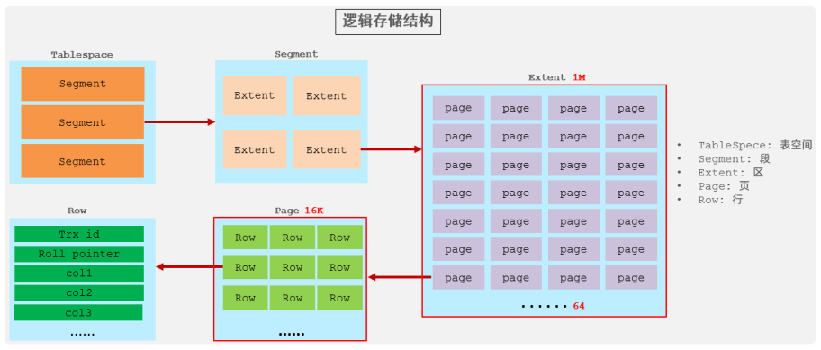

# Mysql 存储引擎

## InnoDB

> [!NOTE]
> InnoDB 是一种兼顾高可靠性和高性能的通用存储引擎，在 MySQL 5.5 之后，InnoDB 是默认的 MySQL 存储引擎。

### 特点

- DML 操作遵循 ACID 模型，支持事务；
- 行级锁，提高并发访问性能；
- 支持外键 FOREIGN KEY 约束，保证数据的完整性和正确性；

### 逻辑存储结构



1. **表空间 (Tablespace)**

   - InnoDB 存储引擎逻辑结构的最高层
   - 每个表空间对应一个.ibd 文件
   - 一个表空间可以包含多个段(Segment)

2. **段 (Segment)**

   - 表空间由多个段组成
   - 主要包含数据段、索引段、回滚段等
   - 段的管理完全由 InnoDB 引擎自动完成，无需人工干预
   - 一个段由多个区(Extent)组成

3. **区 (Extent)**

   - 表空间的基本分配单元
   - 每个区固定大小为 1MB
   - 默认情况下，InnoDB 页大小为 16KB，因此一个区包含 64 个连续的页

4. **页 (Page)**

   - InnoDB 磁盘管理的最小单位
   - 默认大小为 16KB
   - 为了保持页的连续性，InnoDB 在分配空间时，每次会申请 4-5 个区(即 4-5MB)

5. **行 (Row)**
   - InnoDB 采用行式存储结构
   - 每行数据除了包含用户定义的列外，还包含两个隐藏字段(将在后续详细介绍)
   - 行数据以行为单位进行存储和检索

### 物理存储结构

#### 表空间文件说明

- 文件命名格式：`表名.ibd`
- 每个 InnoDB 表都会对应一个表空间文件
- 存储内容包括：
  - 表结构信息（早期版本使用.frm 文件，8.0+版本使用 SDI 数据字典）
  - 表数据
  - 索引数据

#### 配置参数：innodb_file_per_table

```sql
-- 查看参数设置
SHOW VARIABLES LIKE 'innodb_file_per_table';
```

- 当 `innodb_file_per_table=ON` 时（默认值）：

  - 每个 InnoDB 表都会创建独立的.ibd 文件
  - 文件默认存储在数据库目录下
  - 例如：`/var/lib/mysql/数据库名/表名.ibd`

- 当 `innodb_file_per_table=OFF` 时：
  - 所有表数据存储在系统表空间文件(ibdata1)中
  - 不推荐使用，因为会导致系统表空间过大且难以管理

#### 查看表结构信息

.ibd 文件是二进制格式，不能直接用文本编辑器查看。可以使用 MySQL 提供的工具提取表结构信息：

```bash
# 从.ibd文件中提取SDI信息
ibd2sdi 表名.ibd
```

SDI (Serialized Dictionary Information) 是 MySQL 8.0 引入的序列化数据字典信息，包含了完整的表结构定义。

## MyISAM

MyISAM 是 MySQL 5.5 版本之前的默认存储引擎，具有以下特点：

#### 主要特点
- **非事务安全**：不支持事务和崩溃恢复
- **表级锁定**：并发性能较差，不适合高并发写入场景
- **不支持外键**：无法保证参照完整性
- **全文索引**：支持全文索引功能
- **高速读取**：适合读多写少的应用场景

#### 物理存储结构
MyISAM 将每个表存储为三个文件：

| 文件扩展名 | 用途 | 说明 |
|-----------|------|------|
| `.sdi` | 表结构 | 存储表的元数据信息（MySQL 8.0+） |
| `.MYD` | 数据文件 | 存储表的数据内容 |
| `.MYI` | 索引文件 | 存储表的索引信息 |

#### 适用场景
- 只读或读多写少的应用
- 对事务完整性要求不高的应用
- 需要全文索引的功能
- 数据仓库等分析型应用

> [!WARNING]
> 由于 MyISAM 不支持事务和行级锁，在需要数据一致性和高并发写入的场景下，建议使用 InnoDB 存储引擎。

> [!NOTE]
> MyISAM 的性能在高并发写入场景下较差，因此在 MySQL 5.5 之后，MyISAM 已经被标记为过时，不推荐使用。

> [!TIP]
> 如果需要使用 MyISAM，可以考虑使用 MyISAM 的替代方案，如 InnoDB 的 MyISAM 模式。

## Memory

Memory 存储引擎（也称为 HEAP）将表数据完全存储在内存中，提供极快的访问速度。由于数据存储在内存中，在服务器重启或崩溃时，所有数据都会丢失。

### 主要特点
- **内存存储**：所有数据都保存在 RAM 中，读写速度极快
- **表级锁定**：并发写入时会有锁竞争
- **不支持 BLOB/TEXT 类型**：仅支持固定长度的数据类型
- **默认使用 HASH 索引**：支持 BTREE 索引
- **临时表**：适合用作临时表或查询缓存

### 物理存储结构
Memory 表在磁盘上只存储表结构定义文件：
- `.sdi`：存储表的元数据信息（MySQL 8.0+）

### 适用场景
- 临时数据处理
- 只读或读多写少的缓存表
- 中间结果集处理
- 会话级别的数据存储

> [!WARNING]
> 由于数据完全存储在内存中，服务器重启或崩溃会导致数据丢失，不应用于存储关键业务数据。

> [!TIP]
> 对于需要持久化的内存表，可以考虑使用 InnoDB 的内存优化表或 Redis 等内存数据库。

## 存储引擎对比

| 特性 | InnoDB | MyISAM | Memory |
|------|--------|--------|---------|
| **存储限制** | 64TB | 256TB | RAM大小 |
| **事务支持** | ✅ 支持 | ❌ 不支持 | ❌ 不支持 |
| **锁机制** | 行级锁 | 表级锁 | 表级锁 |
| **外键支持** | ✅ 支持 | ❌ 不支持 | ❌ 不支持 |
| **MVCC** | ✅ 支持 | ❌ 不支持 | ❌ 不支持 |
| **全文索引** | ✅ 5.6+ | ✅ 支持 | ❌ 不支持 |
| **哈希索引** | ❌ 不支持 | ❌ 不支持 | ✅ 默认 |
| **B树索引** | ✅ 支持 | ✅ 支持 | ✅ 支持 |
| **数据缓存** | ✅ 支持 | ❌ 不支持 | N/A |
| **索引缓存** | ✅ 支持 | ✅ 支持 | N/A |
| **数据压缩** | ✅ 支持 | ✅ 支持 | ❌ 不支持 |
| **崩溃恢复** | ✅ 支持 | ❌ 不支持 | ❌ 不支持 |
| **空间使用** | 高 | 低 | N/A |
| **内存使用** | 高 | 低 | 高 |
| **批量插入速度** | 慢 | 快 | 最快 |
| **适用场景** | 事务处理、高并发 | 读密集型、数据仓库 | 临时表、缓存 |

### 主要特点总结

1. **InnoDB**
   - 适合需要事务、外键约束的应用
   - 提供提交、回滚和崩溃恢复能力
   - 支持行级锁定，提高多用户并发性能

2. **MyISAM**
   - 适合读多写少的应用
   - 占用空间小，查询速度快
   - 不支持事务和行级锁

3. **Memory**
   - 数据存储在内存中，读写速度快
   - 服务器重启后数据丢失
   - 适合临时数据存储和缓存

> [!TIP]
> 在 MySQL 5.5 及以后版本中，推荐使用 InnoDB 作为默认存储引擎，除非有特殊需求。