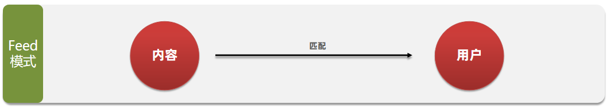

# Feed 流设计模型

## 概念解析

Feed 流（信息流）是一种内容分发模式，系统通过分析用户兴趣和行为，主动推送个性化内容，提供"沉浸式"的浏览体验。用户可以通过无限下拉刷新持续获取新内容，无需主动搜索。

## 传统模式与 Feed 流对比

### 传统内容获取模式

- 用户需主动通过搜索引擎或其他方式查找内容
- 获取过程耗时耗力，需要明确需求并进行搜索
- 内容获取效率较低


### Feed 流模式

- 系统主动推送个性化内容
- 内容自动呈现，无需主动搜索
- 提供"无限滚动"的沉浸式体验
- 提升内容获取效率



## 应用场景

- 社交媒体动态（如微博、Twitter）
- 新闻资讯应用
- 短视频平台
- 电商推荐系统

## 实现模式

### 1. 时间线（Timeline）

按内容发布时间排序，不做个性化筛选，常见于朋友圈等社交场景。

- **优点**：信息全面，不会有缺失。并且实现也相对简单
- **缺点**：信息噪音较多，用户不一定感兴趣，内容获取效率低

### 2. 智能推荐

利用算法分析用户兴趣，推送个性化内容。

- **优点**：信息准确，用户粘度很高，容易沉迷
- **缺点**：如果算法不精准，可能起到反作用，用户体验不好

## 时间线（Timeline）实现

Timeline 的实现主要分为三种模式，各有其适用场景和优缺点。

### 1. 拉模式（读扩散）

- **工作原理**：
  - 用户发布的内容存储在各自的发件箱中
  - 当粉丝查看动态时，系统会实时拉取其关注的所有人的最新内容
  - 拉取的内容按时间排序后展示
    - **优点**：比较节约空间，因为赵六在读信息时，并没有重复读取，而且读取完之后可以把他的收件箱进行清楚。
    - **缺点**：比较延迟，当用户读取数据时才去关注的人里边去读取数据，假设用户关注了大量的用户，那么此时就会拉取海量的内容，对服务器压力巨大。


#### **伪代码实现**：

- **数据模型设计**

```java
// 用户实体
@Data
public class User {
    private Long id;
    private String username;
}

// Feed内容实体
@Data
public class FeedItem {
    private Long id;
    private Long userId;       // 发布者ID
    private String content;     // 内容
    private Date createTime;    // 创建时间
}

```

- **核心服务实现**

```java
@Service
public class PullFeedService {
    @Autowired
    private UserFollowMapper userFollowMapper;
    @Autowired
    private FeedItemMapper feedItemMapper;
    @Autowired
    private RedisTemplate<String, Object> redisTemplate;

    // 发布Feed
    public void publishFeed(FeedItem feedItem) {
        // 1. 保存到数据库
        feedItemMapper.insert(feedItem);

        // 2. 写入Redis发件箱 (使用Sorted Set存储，score为时间戳)
        String postKey = "user:post:" + feedItem.getUserId();
        redisTemplate.opsForZSet().add(
            postKey,
            feedItem.getId(),
            feedItem.getCreateTime().getTime()
        );
    }

    // 获取用户Feed流
    public List<FeedItem> getUserFeed(Long userId, int page, int pageSize) {
        List<FeedItem> result = new ArrayList<>();

        // 1. 获取用户关注列表
        List<Long> followingIds = userFollowMapper.selectFollowingIds(userId);

        // 2. 从Redis拉取所有关注人的最新动态
        Set<Object> feedIds = new TreeSet<>(Collections.reverseOrder());
        for (Long followingId : followingIds) {
            String postKey = "user:post:" + followingId;
            Set<Object> postIds = redisTemplate.opsForZSet().reverseRange(
                postKey, 0, pageSize - 1);
            if (postIds != null) {
                feedIds.addAll(postIds);
            }
        }

        // 3. 分页处理
        List<Object> paginatedIds = feedIds.stream()
            .skip((long) (page - 1) * pageSize)
            .limit(pageSize)
            .collect(Collectors.toList());

        // 4. 批量获取Feed内容
        if (!paginatedIds.isEmpty()) {
            result = feedItemMapper.selectBatchIds(paginatedIds);
        }

        return result;
    }
}
```

- **Redis Key 设计**

```bash
# 用户发件箱（拉模式）
user:post:{userId} -> SortedSet<postId, timestamp>

# 用户关注关系
user:following:{userId} -> Set<followingId>

# 用户信息缓存
user:info:{userId} -> Hash {
    id: 123,
    username: "example"
}
```

### 2. 推模式（写扩散）

**工作原理**：

- 用户发布内容时，立即推送给所有粉丝的收件箱
- 粉丝查看动态时直接读取自己的收件箱
- **优点**：时效快，不用临时拉取
- **缺点**：内存压力大，假设一个大 V 写信息，很多人关注他， 就会写很多分数据到粉丝那边去，


#### 伪代码实现

- **数据模型设计**

```java
// 用户实体
@Data
public class User {
    private Long id;
    private String username;
}

// Feed内容实体
@Data
public class FeedItem {
    private Long id;
    private Long userId;       // 发布者ID
    private String content;     // 内容
    private Date createTime;    // 创建时间
}
```

- **核心服务实现**

```java
@Service
public class PushFeedService {
    @Autowired
    private UserFollowMapper userFollowMapper;
    @Autowired
    private FeedItemMapper feedItemMapper;
    @Autowired
    private RedisTemplate<String, Object> redisTemplate;

    // 发布Feed
    public void publishFeed(FeedItem feedItem) {
        // 1. 保存到数据库
        feedItemMapper.insert(feedItem);

        // 2. 获取发布者的粉丝列表
        List<Long> followers = userFollowMapper.selectFollowerIds(feedItem.getUserId());

        // 3. 推送给所有粉丝的收件箱
        for (Long followerId : followers) {
            String inboxKey = "user:inbox:" + followerId;
            redisTemplate.opsForZSet().add(
                inboxKey,
                feedItem.getId(),
                feedItem.getCreateTime().getTime()
            );

            // 控制收件箱大小，避免无限增长
            redisTemplate.opsForZSet().removeRange(inboxKey, 0, -1000); // 保留最新的1000条
        }
    }

    // 获取用户Feed流
    public List<FeedItem> getUserFeed(Long userId, int page, int pageSize) {
        List<FeedItem> result = new ArrayList<>();

        // 从收件箱获取Feed ID列表
        String inboxKey = "user:inbox:" + userId;
        Set<Object> feedIds = redisTemplate.opsForZSet().reverseRange(
            inboxKey,
            (page - 1) * pageSize,
            page * pageSize - 1
        );

        // 批量获取Feed内容
        if (feedIds != null && !feedIds.isEmpty()) {
            result = feedItemMapper.selectBatchIds(feedIds);
        }

        return result;
    }
}
```

- **Redis Key 设计**

```
# 用户收件箱（推模式）
user:inbox:{userId} -> SortedSet<feedId, timestamp>

# 用户信息缓存
user:info:{userId} -> Hash {
    id: 123,
    username: "example"
}

# 用户关系缓存
user:followers:{userId} -> Set<followerId>
user:followings:{userId} -> Set<followingId>
```

### 3. 推拉结合模式（读写混合）

**工作原理**：

- 对普通用户：采用推模式，直接推送给粉丝
- 对大 V 用户：
  - 活跃粉丝：直接推送到收件箱
  - 非活跃粉丝：需要时从大 V 的发件箱拉取
- 对普通粉丝：直接接收所有内容
- 对非活跃粉丝：按需拉取大 V 内容
  - **优点**：兼具推和拉两种模式的优点
  - **缺点**：需要维护发件箱，增加了系统的复杂度


#### 伪代码实现

- **数据模型设计**

```java
// 用户实体
@Data
public class User {
    private Long id;
    private String username;
    private boolean isVip;      // 是否是大V
    private boolean isActive;   // 是否活跃用户
}

// Feed内容实体
@Data
public class FeedItem {
    private Long id;
    private Long userId;       // 发布者ID
    private String content;     // 内容
    private Date createTime;    // 创建时间
}
```

- **核心服务实现**

```java
@Service
public class FeedService {
    @Autowired
    private UserFollowMapper userFollowMapper;
    @Autowired
    private FeedItemMapper feedItemMapper;
    @Autowired
    private RedisTemplate<String, Object> redisTemplate;

    // 发布Feed
    public void publishFeed(FeedItem feedItem) {
        // 1. 保存到数据库
        feedItemMapper.insert(feedItem);

        // 2. 获取发布者的粉丝列表
        List<Long> followers = userFollowMapper.selectFollowerIds(feedItem.getUserId());

        // 3. 推送给粉丝
        for (Long followerId : followers) {
            User follower = getUserFromCacheOrDB(followerId);

            // 3.1 大V的活跃粉丝直接推送到收件箱
            if (isVipUser(feedItem.getUserId()) && follower.isActive()) {
                pushToInbox(followerId, feedItem);
            }
            // 3.2 普通用户直接推送给所有粉丝
            else if (!isVipUser(feedItem.getUserId())) {
                pushToInbox(followerId, feedItem);
            }
            // 3.3 大V的非活跃粉丝不推送，按需拉取
        }

        // 4. 将内容保存到大V的发件箱（如果是大V）
        if (isVipUser(feedItem.getUserId())) {
            String outboxKey = "user:outbox:" + feedItem.getUserId();
            redisTemplate.opsForZSet().add(outboxKey, feedItem.getId(),
                feedItem.getCreateTime().getTime());
        }
    }

    // 获取用户Feed流
    public List<FeedItem> getUserFeed(Long userId, int page, int pageSize) {
        List<FeedItem> result = new ArrayList<>();

        // 1. 从收件箱获取已推送的内容
        String inboxKey = "user:inbox:" + userId;
        Set<Object> feedIds = redisTemplate.opsForZSet().reverseRange(
            inboxKey, (page - 1) * pageSize, page * pageSize - 1);

        // 2. 如果收件箱不足，且用户关注了大V，则从大V的发件箱拉取
        if ((feedIds == null || feedIds.isEmpty()) && isFollowingVip(userId)) {
            List<Long> followingVips = userFollowMapper.selectVipFollowingIds(userId);
            for (Long vipId : followingVips) {
                String outboxKey = "user:outbox:" + vipId;
                Set<Object> vipFeedIds = redisTemplate.opsForZSet().reverseRange(
                    outboxKey, 0, pageSize - 1);
                if (vipFeedIds != null) {
                    feedIds.addAll(vipFeedIds);
                }
            }
        }

        // 3. 批量获取Feed内容
        if (feedIds != null && !feedIds.isEmpty()) {
            result = feedItemMapper.selectBatchIds(feedIds);
        }

        return result;
    }

    // 辅助方法：推送到用户收件箱
    private void pushToInbox(Long userId, FeedItem feedItem) {
        String inboxKey = "user:inbox:" + userId;
        redisTemplate.opsForZSet().add(
            inboxKey,
            feedItem.getId(),
            feedItem.getCreateTime().getTime()
        );
        // 控制收件箱大小，防止无限增长
        redisTemplate.opsForZSet().removeRange(inboxKey, 0, -1000);
    }

    // 其他辅助方法...
}
```

- **Redis Key 设计**

```
# 用户收件箱（推模式）
user:inbox:{userId} -> SortedSet<feedId, timestamp>

# 大V发件箱（拉模式）
user:outbox:{vipUserId} -> SortedSet<feedId, timestamp>

# 用户信息缓存
user:info:{userId} -> Hash {
    id: 123,
    username: "example",
    isVip: true,
    isActive: true
}

# 用户关系缓存
user:followers:{userId} -> Set<followerId>
user:followings:{userId} -> Set<followingId>
```
