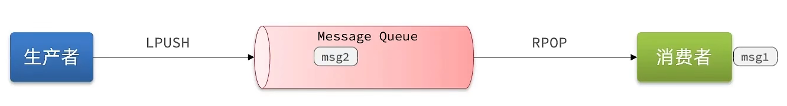
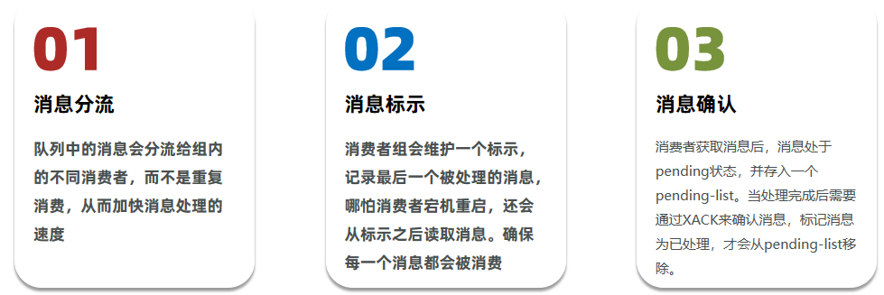

# Redis 消息队列

- 消息队列：存储和管理消息，也被称为消息代理（Message Broker）
- 生产者：发送消息到消息队列
- 消费者：从消息队列获取消息并处理消息


## Redis 消息队列-基于 List 实现消息队列

Redis 的 List 数据结构是一个双向链表，非常适合用来模拟消息队列。通过将消息存储在 List 中，可以实现先进先出（FIFO）的消息处理机制。

1. **基础实现**：

   - 使用`LPUSH + RPOP`组合：从左侧入队，从右侧出队
   - 或使用`RPUSH + LPOP`组合：从右侧入队，从左侧出队

2. **阻塞式实现**：
   - 基础实现中，当队列为空时，`RPOP`/`LPOP`会立即返回`null`
   - 使用`BRPOP`/`BLPOP`命令可以实现阻塞式获取，当队列为空时会等待新消息



**优点**：

- **内存管理**：利用 Redis 存储消息，不受 JVM 内存限制
- **数据安全**：支持 RDB 和 AOF 持久化，确保消息不丢失
- **消息顺序**：严格保证消息的先进先出顺序

**缺点**：

- **可靠性**：消费者处理消息失败时，消息会丢失（无确认机制）
- **扩展性**：一个消息只能被一个消费者处理（单消费者模型）

## Redis 消息队列-基于 PubSub 实现消息队列

Redis 的 PubSub（发布/订阅）是一种基于消息传递的通信模型，它允许消息的发送者（发布者）将消息发送到特定的频道，而订阅了该频道的所有接收者（订阅者）都会收到这些消息。

- 核心命令
  - `SUBSCRIBE channel`：订阅指定频道
  - `PUBLISH channel message`：向指定频道发布消息
  - `PSUBSCRIBE pattern`：使用模式匹配订阅多个频道
  - `UNSUBSCRIBE [channel]`：退订频道
  - `PUNSUBSCRIBE [pattern]`：退订模式匹配的频道


**优势**：

- **发布/订阅模式**：天然支持一对多消息广播
- **实时性**：消息即时推送给所有订阅者
- **解耦性**：生产者和消费者完全解耦，互不感知对方存在

**局限性**：

- **可靠性**：
  - 不支持消息持久化，服务重启后消息会丢失
  - 没有消息确认机制，消息可能丢失
  - 消息缓冲区有大小限制，超出后旧消息会被丢弃
- **扩展性**：
  - 消费者无法回溯历史消息
  - 无法保证消息的有序性

## Redis 消息队列-基于 Stream 实现消息队列

Redis Stream 是 Redis 5.0 引入的一种新数据类型，它提供了完善的消息队列功能，解决了之前 List 和 PubSub 的诸多限制。

- 核心概念
  - **消息流**：一个持久的、仅追加的日志数据结构
  - **消息 ID**：由时间戳-序号组成的唯一标识符
  - **消费者组**：允许多个消费者协同消费同一个流

**1. 发送消息**
使用`XADD`命令向流中添加消息：

```
XADD stream_name * field1 value1 [field2 value2 ...]
```


**2. 读取消息**
使用`XREAD`命令读取消息：

- 非阻塞模式：

  ```
  XREAD COUNT n STREAMS stream_name start_id
  ```

  

- 阻塞模式（等待新消息）：
  ```
  XREAD BLOCK ms STREAMS stream_name $
  ```
  

**3. 消费者组模式**

```
# 创建消费者组
XGROUP CREATE stream_name group_name start_id

# 消费者从组中读取消息
XREADGROUP GROUP group_name consumer_name COUNT n STREAMS stream_name >
```

**特点分析**

**优势**：

- **消息持久化**：所有消息都会被持久化存储
- **消息回溯**：支持按 ID 范围查询历史消息
- **多消费者支持**：
  - 支持多个消费者组独立消费
  - 支持消费者组内的负载均衡
- **消息确认机制**：消费者需要显式确认消息处理完成

**注意事项**：

- **消息 ID 选择**：
  - `$`表示最新消息
  - `0-0`表示从最开始读取
  - 指定具体 ID 可精确控制读取位置
- **消息漏读风险**：
  - 使用`$`作为起始 ID 时，如果处理消息期间有新消息到达，可能会漏读
  - 建议使用消费者组模式避免此问题
- **内存管理**：
  - 需要合理设置流的长度限制
  - 可以使用`XTRIM`命令手动清理旧消息

## Redis 消息队列-基于 Stream 的消息队列-消费者组模式

### 消费者组概念

消费者组（Consumer Group）允许多个消费者作为一个逻辑单元共同消费同一个流中的消息，主要特点包括：

- 消息在组内是负载均衡的
- 每个消息只会被组内的一个消费者处理
- 支持消息确认机制
- 提供未处理消息的追踪



### 消费者组管理

**1. 创建消费者组**

```
XGROUP CREATE key groupname ID [MKSTREAM]
```

- `key`：流名称
- `groupname`：消费者组名称
- `ID`：起始消息 ID
  - `$`：从最新的消息开始消费
  - `0`：从最早的消息开始消费
- `MKSTREAM`：如果流不存在则自动创建


**2. 管理消费者组**

- 删除消费者组：

  ```
  XGROUP DESTROY key groupname
  ```

- 添加消费者：

  ```
  XGROUP CREATECONSUMER key groupname consumername
  ```

- 删除消费者：
  ```
  XGROUP DELCONSUMER key groupname consumername
  ```

### 消费者消息处理

**1. 读取消息**

```
XREADGROUP GROUP groupname consumername [COUNT n] [BLOCK ms] [NOACK] STREAMS key [key ...] ID [ID ...]
```

**参数说明**：

- `groupname`：消费者组名称
- `consumername`：消费者名称（自动创建）
- `COUNT n`：每次读取的最大消息数
- `BLOCK ms`：阻塞等待时间（毫秒）
- `NOACK`：自动确认消息
- `ID`：消息 ID
  - `>`：读取未消费的新消息
  - `0`：从 pending-list 读取已消费未确认的消息

**2. 消息确认**

```
XACK key groupname ID [ID ...]
```

确认消息处理完成，从 pending-list 中移除。

### 消费者实现模式

**基本消费模式**：

```python
while True:
    # 读取新消息
    messages = XREADGROUP GROUP group1 consumer1 COUNT 1 BLOCK 2000 STREAMS mystream >

    if messages:
        # 处理消息
        process_message(messages[0])

        # 确认消息
        XACK mystream group1 messages[0].id
```

### 特点总结

**核心优势**：

- **消息可靠性**：
  - 支持消息确认机制（ACK）
  - 消息处理失败可重新投递
  - 避免消息丢失
- **负载均衡**：
  - 组内消费者自动分配消息
  - 水平扩展消费能力
- **消息回溯**：
  - 支持重新处理历史消息
  - 可查看未确认消息列表

**使用建议**：

- 合理设置消费者数量
- 及时确认处理完成的消息
- 监控 pending-list 长度
- 处理消费者故障转移

### 方案对比


