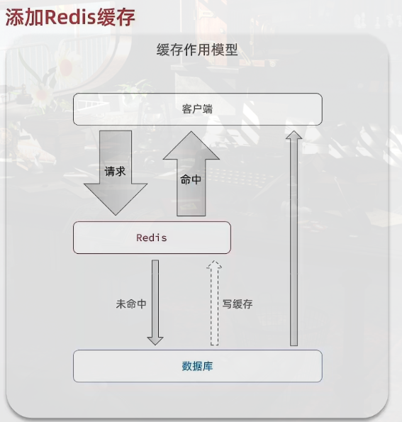

# Redis缓存模型和思路

> [!NOTE]
> Redis缓存模型和思路是将用户常查的数据缓存到Redis中，以减轻数据库的压力，解决硬盘和内存的速度不匹配的问题

## 1. 缓存更新策略

1. 内存淘汰：redis自动进行，当redis内存达到咱们设定的max-memery的时候，会自动触发淘汰机制，淘汰掉一些不重要的数据(可以自己设置策略方式)
2. 超时剔除：当我们给redis设置了过期时间ttl之后，redis会将超时的数据进行删除，方便咱们继续使用缓存
3. 主动更新：我们可以手动调用方法把缓存删掉，通常用于解决缓存和数据库不一致问题

- 业务场景：
  - 低一致性：使用内存淘汰策略，例如：职位类型信息缓存
  - 高一致性：使用主动更新策略，超时剔除兜底策略，例如：登录Token缓存，职位详细信息缓存

## 2. 数据库缓存不一致解决方案

由于我们的**缓存的数据源来自于数据库**,而数据库的**数据是会发生变化的**,因此,如果当数据库中**数据发生变化,而缓存却没有同步**,此时就会有**一致性问题存在**,其后果是:

用户使用缓存中的过时数据,就会产生类似多线程数据安全问题,从而影响业务,产品口碑等;怎么解决呢？有如下几种方案：

1. Cache Aside Pattern 人工编码方式
   - 缓存调用者在更新完数据库后再去更新缓存，也称之为双写方案
2. Read/Write Through Pattern
   - 由系统本身完成，数据库与缓存的问题交由系统本身去处理
3. Write Behind Caching Pattern
   - 调用者只操作缓存，其他线程去异步处理数据库，实现最终一致

### 数据库和缓存不一致采用什么方案

> [!NOTE]
> 选择 Cache Aside Pattern 解决方案（强一致性），以解决缓存与数据库不一致的问题

#### 问题

操作缓存和数据库时有三个问题需要考虑：

1. 是否删除缓存还是更新缓存？
2. 如何保证缓存与数据库的操作的同时成功或失败？
3. 先操作缓存还是先操作数据库？

#### 选择

综合考虑使用 Cache Aside Pattern，但是方案一调用者如何处理呢？

- 删除缓存还是更新缓存？
  - 更新缓存：每次更新数据库都更新缓存，无效写操作较多
  - 删除缓存：更新数据库时让缓存失效，查询时再更新缓存
- 如何保证缓存与数据库的操作的同时成功或失败？
  - 单体系统，将缓存与数据库操作放在一个事务
  - 分布式系统，利用TCC等分布式事务方案
- 先操作缓存还是先操作数据库？
  - 先删除缓存，再操作数据库
  - 先操作数据库，再删除缓存

#### 选择理由

> [!NOTE]
> 设计原则 ， 先对数据库操作，再对缓存操作 ， 保证数据最终一致性 ， 缓存最终和数据库一致

我们选择的方案是 Cache Aside Pattern，先操作数据库，再删除缓存，原因在于，如果你选择第一种方案，在两个线程并发来访问时，假设线程1先来（先删除了缓存，但还没有更新数据库），他先把缓存删了，此时线程2过来，他查询缓存数据（已经被线程一删除）并不存在，此时他写入缓存，当他写入缓存后（由于线程一还没有更新数据，所以写入缓存的数据是从数据库中得到的旧数据），线程1再执行更新动作时，实际上写入的就是旧的数据，新的数据被旧数据覆盖了。

## 3. 缓存穿透问题的解决思路

缓存穿透是指客户端请求的数据在缓存中和数据库中都不存在，这样缓存永远不会生效，这些请求都会打到数据库。

常见的解决方案有两种：

1. **缓存空对象**

   - 优点：实现简单，维护方便
   - 缺点：额外的内存消耗，可能造成短期的不一致
2. **布隆过滤**

   - 优点：内存占用较少，没有多余key
   - 缺点：实现复杂，存在误判可能

### 缓存空对象思路分析

当我们客户端访问不存在的数据时，先请求redis，但是此时redis中没有数据，此时会访问到数据库，但是数据库中也没有数据，这个数据穿透了缓存，直击数据库，我们都知道数据库能够承载的并发不如redis这么高，如果大量的请求同时过来访问这种不存在的数据，这些请求就都会访问到数据库，简单的解决方案就是哪怕这个数据在数据库中也不存在，我们也把这个数据存入到redis中去，这样，下次用户过来访问这个不存在的数据，那么在redis中也能找到这个数据就不会进入到缓存了

### 布隆过滤

布隆过滤器其实采用的是哈希思想来解决这个问题，通过一个庞大的二进制数组，走哈希思想去判断当前这个要查询的这个数据是否存在，如果布隆过滤器判断存在，则放行，这个请求会去访问redis，哪怕此时redis中的数据过期了，但是数据库中一定存在这个数据，在数据库中查询出来这个数据后，再将其放入到redis中，

假设布隆过滤器判断这个数据不存在，则直接返回

这种方式优点在于节约内存空间，存在误判，误判原因在于：布隆过滤器走的是哈希思想，只要哈希思想，就可能存在哈希冲突

**缓存穿透的解决方案：**

- 缓存null值
- 布隆过滤器
- ~~增强id的复杂度，避免被猜测id规律~~
- 做好数据的基础格式校验
- 加强用户权限校验
- 做好热点参数的限流

## 缓存雪崩问题及解决思路

> [!NOTE]
> 缓存雪崩是指在同一时段大量的缓存key同时失效或者Redis服务宕机，导致大量请求到达数据库，带来巨大压力。

解决方案：

- 给不同的Key的TTL添加随机值
- 利用Redis集群提高服务的可用性
- 给缓存业务添加降级限流策略
- 给业务添加多级缓存

## 缓存击穿问题及解决思路

> [!NOTE]
> 缓存击穿问题也叫热点Key问题，就是一个被高并发访问并且缓存重建业务较复杂的key突然失效了，无数的请求访问会在瞬间给数据库带来巨大的冲击。

常见的解决方案有两种：

- 互斥锁
- 逻辑过期

逻辑分析：假设线程1在查询缓存之后，本来应该去查询数据库，然后把这个数据重新加载到缓存的，此时只要线程1走完这个逻辑，其他线程就都能从缓存中加载这些数据了，但是假设在线程1没有走完的时候，后续的线程2，线程3，线程4同时过来访问当前这个方法， 那么这些线程都不能从缓存中查询到数据，那么他们就会同一时刻来访问查询缓存，都没查到，接着同一时间去访问数据库，同时的去执行数据库代码，对数据库访问压力过大

### 解决方案一、使用锁来解决

因为锁能实现互斥性，假设线程过来，只能一个人一个人的来访问数据库，从而避免对于数据库访问压力过大。但这也会影响查询的性能，因为此时会让查询的性能从并行变成了串行。

我们可以采用tryLock方法 + double check来解决这样的问题。

1. 线程1过来访问，他查询缓存没有命中，但是此时他获得到了锁的资源，那么线程1就会一个人去执行逻辑
2. 线程2过来，但是线程2在执行过程中，并没有获得到锁，那么线程2就可以进行到休眠，直到线程1把锁释放后，线程2获得到锁，然后再来执行逻辑
3. 此时就能够从缓存中拿到数据了

### 解决方案二、逻辑过期

方案分析：缓存击穿问题的根源在于设置了TTL，但是我们可以不设置TTL，但是这样会一直占用内存。我们可以使用逻辑过期方案，来实现缓存的过期。

我们可以把过期时间设置在value中，而不是在redis中设置TTL。这样我们可以在value中判断当前的数据是否过期，如果过期了，则去获得互斥锁，然后异步地去构建缓存。获得了锁的线程会开启一个新的线程来构建缓存，而其他线程会被阻塞，直到新开的线程完成构建缓存的逻辑后，才释放锁，其他线程才能走返回正确的数据。

这种方案的优点在于，异步地构建缓存，缺点在于，可能在构建完缓存之前，返回的都是脏数据。

> [!NOTE]
>
> **互斥锁方案：**
>
> - 优点：数据一致，且实现简单，仅仅只需要加一把锁而已，也没其他的事情需要操心，所以没有额外的内存消耗
> - 缺点：有锁就有死锁问题的发生，且只能串行执行性能肯定受到影响
>
> **逻辑过期方案：**
>
> - 优点：线程读取过程中不需要等待，性能好，有一个额外的线程持有锁去进行重构数据
> - 缺点：在重构数据完成前，其他的线程只能返回之前的数据，且实现起来麻烦

