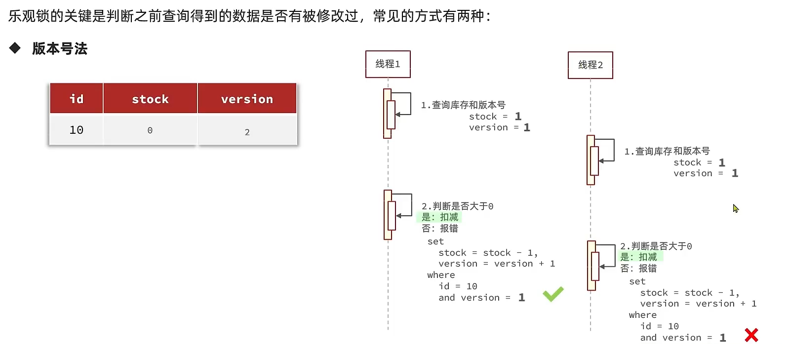

# 乐观锁和悲观锁


在聊乐观锁和悲观锁之前，聊一个业务场景：

假设线程1过来查询库存，判断出来库存大于1，正准备去扣减库存，但是还没有来得及去扣减，此时线程2过来，线程2也去查询库存，发现这个数量一定也大于1，那么这两个线程都会去扣减库存，最终多个线程相当于一起去扣减库存，此时就会出现库存的超卖问题。

## 悲观锁

悲观锁可以实现对于数据的串行化执行，比如syn，和lock都是悲观锁的代表，同时，悲观锁中又可以再细分为公平锁，非公平锁，可重入锁，等等

## 乐观锁

乐观锁：会有一个版本号，每次操作数据会对版本号+1，再提交回数据时，会去校验是否比之前的版本大1 ，如果大1 ，则进行操作成功，这套机制的核心逻辑在于，如果在操作过程中，版本号只比原来大1 ，那么就意味着操作过程中没有人对他进行过修改，他的操作就是安全的，如果不大1，则数据被修改过，当然乐观锁还有一些变种的处理方式比如cas

- 乐观锁的典型代表：就是cas，利用cas进行无锁化机制加锁，var5 是操作前读取的内存值，while中的var1+var2 是预估值，如果预估值 == 内存值，则代表中间没有被人修改过，此时就将新值去替换 内存值
- 其中do while 是为了在操作失败时，再次进行自旋操作，即把之前的逻辑再操作一次。

```java
int var5;
do {
    var5 = this.getIntVolatile(var1, var2);
} while(!this.compareAndSwapInt(var1, var2, var5, var5 + var4));

return var5;
```

业务常见使用方式是没有像cas一样带自旋的操作，也没有对version的版本号+1 ，他的操作逻辑是在操作时，对版本号进行+1 操作，然后要求version 如果是1 的情况下，才能操作，那么第一个线程在操作后，数据库中的version变成了2，但是他自己满足version=1 ，所以没有问题，此时线程2执行，线程2 最后也需要加上条件version =1 ，但是现在由于线程1已经操作过了，所以线程2，操作时就不满足version=1 的条件了，所以线程2无法执行成功



> [!tip]
> `stock` 没有实际意义，仅仅是库存的意思，方便举一个例子

这种逻辑的最常见的例子是将版本号 version 存放在数据库和 Redis 中，并在请求数据时带上 version 字段。然后在 SQL 获取逻辑中对 version 进行比较，最后完成后再对 version 进行 +/-1 操作。这时 version 字段可以是业务字段 例如：stock库存，或者只是作为乐观锁的版本号使用，建议只 + 不 -，防止版本号 < 0。

> [!note]
> - 如果你是库存逻辑，使用库存量作为乐观锁的使用，建议使用最后一致性逻辑，例如：将库存量作为乐观锁的使用，要求每一个请求的库存量都必须与数据库中的库存量一致，并发效果可以提高很多，例如：要求数据库仓库量>0即可运行操作，这种逻辑非常灵活并不固定位死的，可以根据业务去修改，库存这种最后一致性的可以使用，如果是强一致性的就不行。
> - 如果你是强一致性的逻辑，不建议添加太多逻辑，比如你是一个博客的系统，用户修改自己的博客，这种需要强一致性的。

**知识小扩展：**

在高并发场景下，使用CAS（Compare-And-Swap）操作可能导致严重的自旋问题，虽然这仍然比直接使用`synchronized`关键字要好。针对这个问题，Java 8 引入了`LongAdder`类作为`AtomicLong`的增强替代方案。

1. LongAdder 的核心优势：
    - **分段累加**：内部维护了一个`base`变量和`Cell[]`数组，将竞争分散到多个单元上
    - **减少竞争**：不同线程可以在不同的`Cell`上进行累加，最后合并结果
    - **高性能**：在高度竞争环境下性能显著优于`AtomicLong`

2. LongAdder 的工作原理：
    - 当获取当前值时，会将所有`Cell`数组中的值与`base`值相加返回
    - 更新操作会先尝试在`base`上更新，如果发生竞争则尝试在`Cell`数组中分配新的槽位
    - 这种设计有效减少了线程间的竞争，提高了并发性能

