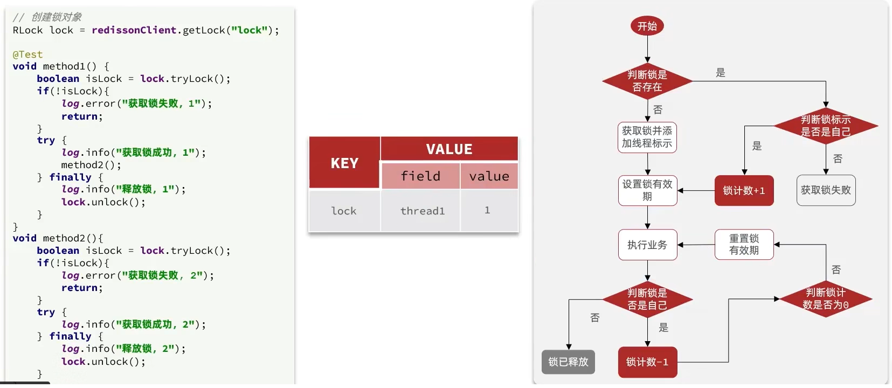
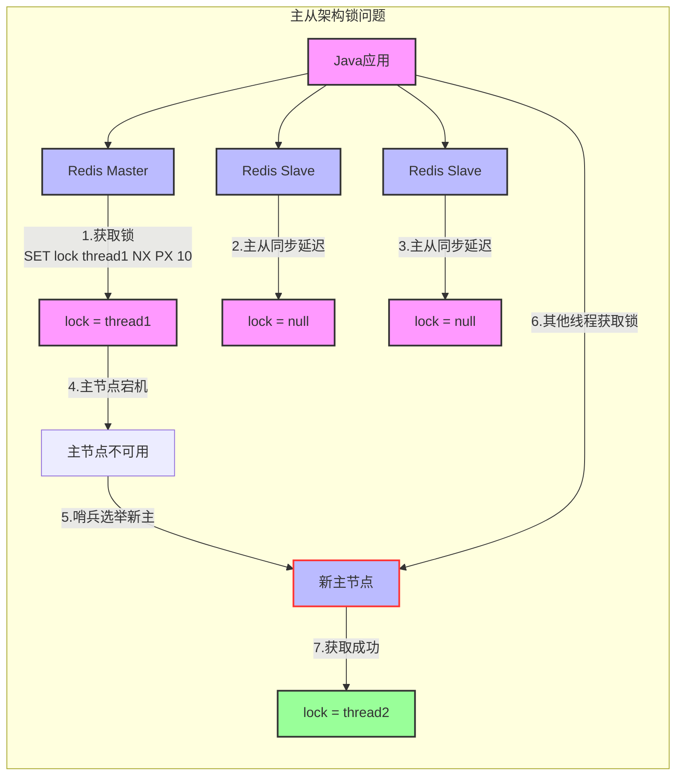
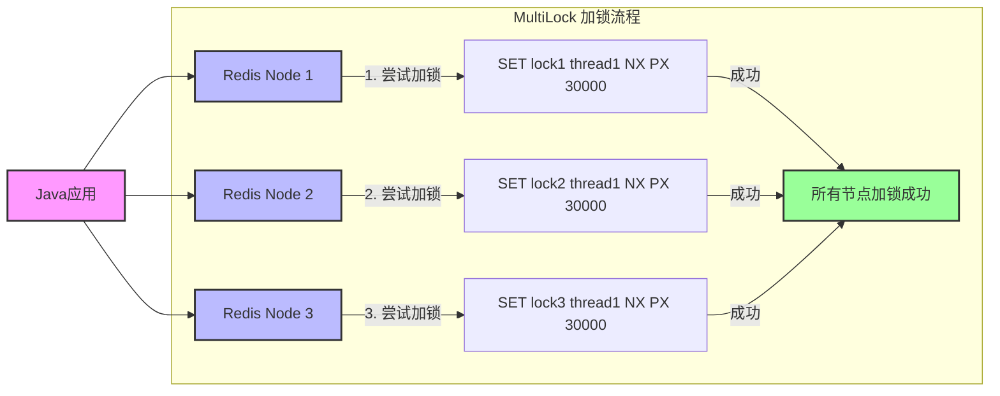

# 分布式锁-redission

基于Redis的SETNX命令实现的分布式锁存在以下几个关键问题：

1. 不可重入性
   **问题描述**：当前实现的锁不支持重入，即在持有锁的线程中无法再次获取同一把锁。
   **影响**：

- 在嵌套调用场景下会导致死锁
- 限制了代码的灵活性，增加了开发复杂度
  **对比**：
- Java内置的synchronized和ReentrantLock都支持可重入
- 可重入性是避免死锁的重要特性

2. 缺乏重试机制
   **问题描述**：当前实现在获取锁失败时直接返回失败，没有提供重试机制。
   **期望行为**：

- 在锁竞争时能够自动重试
- 支持配置最大重试次数和重试间隔
- 提供指数退避等重试策略

3. 锁超时释放的可靠性问题
   **问题描述**：虽然通过设置过期时间可以防止死锁，但仍然存在以下问题：
   **风险点**：

- 业务执行时间超过锁的超时时间，导致锁提前释放
- 虽然通过Lua脚本避免了误删其他线程的锁，但业务逻辑可能被重复执行
- 难以确定合理的超时时间设置

4. 主从一致性问题
   **问题描述**：在Redis主从架构下，主从同步存在延迟，可能导致锁状态不一致。
   **具体场景**：
5. 线程A在主节点获取锁成功
6. 主节点在同步数据给从节点前宕机
7. 从节点提升为新主节点
8. 线程B从新主节点获取到相同的锁

**后果**：同一把锁被两个线程同时持有，破坏了分布式锁的互斥性。

这些问题使得基于SETNX实现的分布式锁在生产环境中可能存在可靠性风险。

## Redisson概述

Redisson是一个在Redis的基础上实现的Java驻内存数据网格（In-Memory Data Grid）。它不仅提供了一系列的分布式的Java常用对象，还提供了许多分布式服务，其中就包含了各种分布式锁的实现。

Redission提供了分布式锁的多种多样的功能：

- 可重入锁（Reentrant Lock）
- 公平锁（Fair Lock）
- 联锁（MultiLock）
- 红锁（RedLock）
- 读写锁（ReadWriteLock）
- 信号量（Semaphore）
- 可过期性信号量（PermitExpirableSemaphore）
- 闭锁（CountDownLatch）

## Redisson分布式锁的实现

- 引入依赖

```xml
<dependency>
	<groupId>org.redisson</groupId>
	<artifactId>redisson</artifactId>
	<version>{根据你的Spring Boot 和 Java 版本选择}</version>
</dependency>
```

- 配置Redisson

```java
import org.redisson.Redisson;
import org.redisson.api.RedissonClient;
import org.redisson.config.Config;
import org.springframework.context.annotation.Bean;
import org.springframework.context.annotation.Configuration;

@Configuration
public class RedissonConfig {

    @Bean
    public RedissonClient redissonClient(){
        // 配置
        Config config = new Config();
        config.useSingleServer().setAddress("redis://127.0.0.1:6379")
            .setPassword("Alone117");
        // 创建RedissonClient对象
        return Redisson.create(config);
    }
}
```

- 使用分布式锁
  - 获取锁 `RLock lock = redissonClient.getLock(EKAY_LOCK_KEY + userId);`
  - 尝试获取锁 `if (!lock.tryLock(1, 10, TimeUnit.SECONDS))`
  - 获取锁成功，执行业务逻辑，最后释放锁 `finally {lock.unlock();}`
  - 获取锁失败，抛出异常 `throw new BusinessException(ResultCode.LOCK_BE_USED);`

```java
RLock lock = redissonClient.getLock(EKAY_LOCK_KEY + userId);
try {
	// 1.获取分布式锁
	if (!lock.tryLock(1, 10, TimeUnit.SECONDS)) {
	throw new BusinessException(ResultCode.LOCK_BE_USED);
	}
	SeckillVoucherServiceImpl proxImpl = (SeckillVoucherServiceImpl) AopContext.currentProxy();
	return proxImpl.createVoucherOrder(voucherId, userId);
} catch (InterruptedException e) {
	throw new BusinessException(ResultCode.INTERNAL_ERROR, e);
} finally {
	lock.unlock();
}
```

## 分布式锁-redission可重入锁原理

## Redission可重入锁实现原理

### 重入锁基础概念

在Java的 `Lock`接口实现中，通过底层的 `volatile`修饰的 `state`变量来记录锁的重入状态：

- 当 `state=0`时，表示锁未被任何线程持有
- 当 `state=1`时，表示锁被某个线程持有
- 同一个线程重复获取锁时，`state`会进行累加

`synchronized`的实现原理类似，在C++代码层面通过 `count`计数器实现，重入时+1，释放时-1，直到 `count=0`时完全释放锁。

### Redission分布式锁实现

Redission采用Redis的Hash结构存储锁信息：

- 大key（Hash的key）：表示锁的名称
- 小key（Hash的field）：表示持有锁的线程标识
- value：记录重入次数

### Lua脚本解析

Redission使用Lua脚本保证加锁的原子性，主要参数：

- `KEYS[1]`：锁的名称
- `ARGV[1]`：锁的过期时间
- `ARGV[2]`：线程唯一标识，格式为 `id:threadId`

#### 加锁流程

Redission使用Lua脚本来保证加锁操作的原子性，完整的加锁脚本如下：



```lua
-- 1. 检查锁是否存在
if (redis.call('exists', KEYS[1]) == 0) then
    -- 1.1 锁不存在，获取锁并设置过期时间
    redis.call('hset', KEYS[1], ARGV[2], 1);  -- 设置锁的持有者为当前线程，重入次数初始化为1
    redis.call('pexpire', KEYS[1], ARGV[1]);  -- 设置锁的过期时间
    return nil;  -- 返回nil表示加锁成功
end;

-- 2. 检查当前线程是否已经持有锁
if (redis.call('hexists', KEYS[1], ARGV[2]) == 1) then
    -- 2.1 当前线程已持有锁，重入次数+1
    redis.call('hincrby', KEYS[1], ARGV[2], 1);  -- 重入次数增加
    redis.call('pexpire', KEYS[1], ARGV[1]);     -- 更新锁的过期时间
    return nil;  -- 返回nil表示重入成功
end;

-- 3. 获取锁失败，返回锁的剩余生存时间(毫秒)
return redis.call('pttl', KEYS[1]);
```

##### 脚本执行流程说明：

1. **锁不存在**：

   - 创建Hash结构，Key为锁名称，Field为线程标识，Value为1（重入次数）
   - 设置锁的过期时间
   - 返回 `nil`表示加锁成功
2. **锁已存在且由当前线程持有**：

   - 将当前线程的重入次数+1
   - 更新锁的过期时间
   - 返回 `nil`表示重入成功
3. **锁被其他线程持有**：

   - 返回锁的剩余生存时间(PTTL)，单位毫秒
   - 客户端根据返回值决定是否重试获取锁

#### 锁获取结果处理

在Redission源码中，会根据Lua脚本的返回值进行处理：

- 返回 `null`：表示成功获取锁
- 返回非 `null`值（锁的剩余生存时间）：表示获取锁失败，会进入自旋重试逻辑

这种设计既保证了锁的可重入性，又通过Redis的过期机制避免了死锁问题。

## 分布式锁-redission锁重试和WatchDog机制

### 锁重试机制

Redission的 `lock()`方法在获取锁时，会通过 `tryAcquire`方法进行抢锁，其核心逻辑如下：

1. 检查锁是否存在，如果不存在则创建锁并返回 `null`
2. 如果锁已存在，检查是否由当前线程持有，如果是则返回 `null`
3. 如果以上条件都不满足，返回锁的剩余生存时间(TTL)

```java
long threadId = Thread.currentThread().getId();
Long ttl = tryAcquire(-1, leaseTime, unit, threadId);
// lock acquired
if (ttl == null) {
    return;
}
```

### 锁超时处理

Redission的 `lock`方法支持带超时参数和不带参数两种重载形式：

- 如果指定了 `leaseTime`参数，则使用指定的超时时间
- 如果未指定超时时间，则使用看门狗默认的超时时间

```java
if (leaseTime != -1) {
    return tryLockInnerAsync(waitTime, leaseTime, unit, threadId, RedisCommands.EVAL_LONG);
}
```

### WatchDog看门狗机制

当未指定锁的超时时间时，Redission会启动看门狗机制来自动续期锁。看门狗默认每10秒检查一次，如果锁仍然由当前线程持有，则将其过期时间重置为30秒。

```java
// 使用看门狗默认超时时间获取锁
RFuture<Long> ttlRemainingFuture = tryLockInnerAsync(
    waitTime,
    commandExecutor.getConnectionManager().getCfg().getLockWatchdogTimeout(),
    TimeUnit.MILLISECONDS,
    threadId,
    RedisCommands.EVAL_LONG
);

// 设置异步回调，在获取锁成功后启动看门狗
ttlRemainingFuture.onComplete((ttlRemaining, e) -> {
    if (e != null) {
        return;  // 发生异常，直接返回
    }

    // 获取锁成功，启动看门狗
    if (ttlRemaining == null) {
        scheduleExpirationRenewal(threadId);
    }
});
```

### 锁续期实现

看门狗的核心实现在 `renewExpiration`方法中，它通过定时任务实现锁的自动续期：

1. 从 `EXPIRATION_RENEWAL_MAP`中获取锁的续期记录
2. 创建一个定时任务，在锁过期时间的1/3处执行续期操作
3. 续期成功后，递归调用自身继续设置下一次续期

```java
private void renewExpiration() {
    // 1. 获取锁的续期记录
    ExpirationEntry ee = EXPIRATION_RENEWAL_MAP.get(getEntryName());
    if (ee == null) {
        return;  // 锁已释放，直接返回
    }

    // 2. 创建定时任务，在锁过期时间的1/3处执行续期
    Timeout task = commandExecutor.getConnectionManager().newTimeout(
        new TimerTask() {
            @Override
            public void run(Timeout timeout) throws Exception {
                // 2.1 检查锁是否仍然有效
                ExpirationEntry ent = EXPIRATION_RENEWAL_MAP.get(getEntryName());
                if (ent == null) {
                    return;  // 锁已释放
                }

                // 2.2 检查当前线程是否仍然持有锁
                Long threadId = ent.getFirstThreadId();
                if (threadId == null) {
                    return;  // 当前线程已释放锁
                }

                // 2.3 执行异步续期操作
                RFuture<Boolean> future = renewExpirationAsync(threadId);
                future.onComplete((res, e) -> {
                    if (e != null) {
                        log.error("Can't update lock " + getName() + " expiration", e);
                        return;

                    // 2.4 续期成功，递归调用设置下一次续期
                    if (res) {
                        renewExpiration();
                    }
                });
            }
        },
        internalLockLeaseTime / 3,  // 默认10秒后执行
        TimeUnit.MILLISECONDS
    );

    // 3. 更新续期任务
    ee.setTimeout(task);
}
```

### 看门狗机制的优势与注意事项

1. **自动续期**：避免业务执行时间超过锁的过期时间导致锁意外释放
2. **防止死锁**：当持有锁的JVM进程崩溃时，看门狗线程也会终止，锁最终会自动释放
3. **性能考虑**：
   - 看门狗默认每10秒续期一次
   - 每次续期将锁的过期时间重置为30秒
   - 这种设计在保证锁安全性的同时，避免了频繁的续期操作对Redis造成的压力

> **注意**：如果应用程序异常终止（如kill -9），看门狗线程也会被强制终止，此时锁会在达到过期时间后自动释放，这是Redis分布式锁的一种安全机制。

## 分布式锁-redission锁的MultiLock原理

### 主从架构下的锁安全问题

在Redis主从架构中，写操作首先在主节点执行，然后异步复制到从节点。这种机制可能导致以下问题：

1. 客户端在主节点成功获取锁
2. 锁信息尚未同步到从节点时，主节点宕机
3. 哨兵将某个从节点提升为新的主节点
4. 新主节点上没有之前的锁信息，导致锁状态丢失
5. 其他客户端可以获取相同的锁，破坏互斥性



### MultiLock解决方案



Redission的 `MultiLock`（联锁）通过以下方式解决上述问题：

1. **去中心化设计**：不再依赖主从架构，所有Redis节点地位平等
2. **多数派写入**：锁信息需要写入所有配置的Redis节点才算加锁成功
3. **强一致性**：只要有一个节点加锁失败，整个加锁操作就会失败
4. **容错性**：允许部分节点不可用，只要加锁成功的节点数达到要求即可

### MultiLock加锁流程

1. **初始化阶段**：

   - 创建多个 `RLock`对象，每个对象对应一个Redis节点
   - 将这些锁对象放入一个集合中
2. **加锁阶段**：

   - 计算总加锁超时时间：`加锁超时时间 = 锁数量 × 1500ms`（例如3个锁对应4500ms）
   - 使用 `while`循环尝试获取所有锁
   - 如果在超时时间内成功获取所有锁，则加锁成功
   - 如果超时或获取部分锁失败，则释放已获取的锁并重试
3. **锁续期**：

   - 使用看门狗机制为每个锁单独续期
   - 任何一个锁续期失败都会导致整个MultiLock续期失败


### 关键代码示例

```java
// 创建多个RLock实例
RLock lock1 = redissonClient1.getLock("lock1");
RLock lock2 = redissonClient2.getLock("lock2");
RLock lock3 = redissonClient3.getLock("lock3");

// 创建MultiLock
RLock multiLock = redissonClient.getMultiLock(lock1, lock2, lock3);

try {
    // 尝试加锁
    boolean isLocked = multiLock.tryLock(
        waitTime,  // 等待时间
        leaseTime,  // 锁持有时间
        TimeUnit.SECONDS
    );

    if (isLocked) {
        // 执行业务逻辑
    }
} finally {
    // 释放锁
    multiLock.unlock();
}
```

### 注意事项

1. **性能考虑**：

   - 由于需要与多个Redis节点通信，性能会有所下降
   - 建议将MultiLock的节点部署在同一个机房，减少网络延迟
2. **节点数量**：

   - 建议使用奇数个节点（如3个或5个）
   - 确保大多数节点可用即可保证服务可用性
3. **错误处理**：

   - 实现完善的错误处理和重试机制
   - 监控各个Redis节点的健康状况
4. **死锁预防**：

   - 设置合理的锁超时时间
   - 避免在持有锁时执行耗时操作

MultiLock通过牺牲部分性能换来了更高的可靠性和一致性，适合对数据一致性要求较高的场景。
