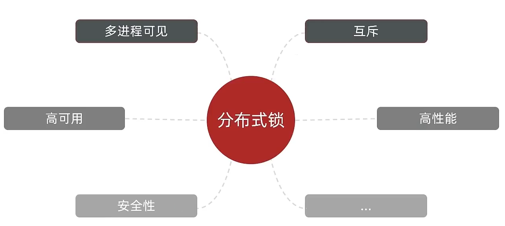

# 分布式锁

## 分布式锁概述

分布式锁是在分布式系统中实现线程同步的关键机制，确保在集群环境下多个进程能够安全地访问共享资源。

分布式锁的核心思想是确保所有节点使用同一把锁，从而实现线程的串行执行。

## 分布式锁的关键特性

1. **可见性**
   - 确保多个进程能够感知到锁的状态变化
   - 不同于并发编程中的内存可见性概念
   - 保证跨进程的锁状态一致性

2. **互斥性**
   - 核心特性，确保同一时间只有一个进程持有锁
   - 防止并发访问导致的数据不一致

3. **高可用性**
   - 系统应具备良好的容错能力
   - 确保在节点故障时仍能正常工作

4. **高性能**
   - 尽量减少锁操作带来的性能开销
   - 优化加锁和解锁的效率

5. **安全性**
   - 防止锁被恶意获取或篡改
   - 确保锁操作的原子性和完整性



## 常见的分布式锁实现方案

1. **MySQL**
   - 利用数据库的锁机制实现
   - 性能相对较低，不常用作分布式锁
   - 主要用于数据一致性保证

2. **Redis**
   - 最常用的分布式锁实现方案
   - 使用`SETNX`命令实现锁的获取
   - 企业级开发首选方案
   - 优点：
     - 高性能
     - 简单易用
     - 支持锁的超时设置

3. **Zookeeper**
   - 另一种流行的分布式锁实现
   - 通过临时节点实现锁机制
   - 优点：
     - 强一致性
     - 自动失效机制
     - 会话管理能力
    P
    M
> [!IMPORTANT]
> - 在选择分布式锁实现时，应根据具体业务需求和系统规模来决定
> - 需要权衡性能、可用性和实现复杂度
> - 建议优先考虑Redis实现，除非有特殊需求需要Zookeeper的特性

## 分布式锁的实现

### Redis实现分布式锁

实现分布式锁时需要实现的两个基本方法：

- 获取锁：
  - 互斥：确保只能有一个线程获取锁
  - 非阻塞：尝试一次，成功返回true，失败返回false
- 释放锁：
  - 手动释放
  - 超时释放：获取锁时添加一个超时时间

核心思路：
- 我们可以使用Redis的`SETNX`命令来实现分布式锁的获取，如果有多个线程同时尝试获取锁，第一个线程会成功创建key，并返回1，表示他抢到了锁；其他线程则会返回0，表示他们没有抢到锁。抢到锁的线程可以继续执行业务逻辑，然后删除锁，退出锁逻辑；没有抢到锁的线程可以等待一定的时间后重试。


#### 实现分布式锁版本一

- 加锁逻辑:

- 锁的基本接口:`DistributedLock`

```java
public interface DistributedLock {
    boolean tryLock(String value);
    void unlock(String value);
}
```

- 锁的基本抽象实现:`SimpleRedisLock`

```java
import com.redis.api.redis.redisinterface.DistributedLock;
import com.redis.api.redis.utils.RedisCache;
import lombok.NonNull;
import java.util.Objects;
import java.util.concurrent.TimeUnit;

/**
 * 基于Redis的分布式锁实现基类
 */
public abstract class SimpleRedisLock implements DistributedLock {
    protected final String KEY_PREFIX;
    protected final int EXPIRE_TIME;
    protected final RedisCache redisCache;
    protected final TimeUnit timeUnit;

    /**
     * 构造方法
     *
     * @param redisCache Redis缓存操作实例
     * @param keyPrefix  锁的key前缀
     * @param expireTime 锁的过期时间
     * @param timeUnit   时间单位
     * @throws NullPointerException     如果任何参数为null
     * @throws IllegalArgumentException 如果expireTime小于等于0
     */
    protected SimpleRedisLock(@NonNull RedisCache redisCache,
            @NonNull String keyPrefix,
            int expireTime,
            @NonNull TimeUnit timeUnit) {
        if (expireTime <= 0) {
            throw new IllegalArgumentException("过期时间必须大于0");
        }
        this.redisCache = Objects.requireNonNull(redisCache, "RedisCache不能为null");
        this.KEY_PREFIX = Objects.requireNonNull(keyPrefix, "key前缀不能为null");
        this.EXPIRE_TIME = expireTime;
        this.timeUnit = Objects.requireNonNull(timeUnit, "时间单位不能为null");
    }

    @Override
    public boolean tryLock(String value) {
        Long currentThreadName = Thread.currentThread().getId();
        Boolean ac = redisCache.setCacheObject(KEY_PREFIX + value, currentThreadName.toString(), EXPIRE_TIME, timeUnit);
        return Boolean.TRUE.equals(ac);
    }

    @Override
    public void unlock(String value) {
        redisCache.deleteObject(KEY_PREFIX + value);
    }
}
```

- 锁的业务实现:`SeckillVoucherLock`

```java
import com.redis.api.redis.redisabstract.SimpleRedisLock;
import org.springframework.stereotype.Component;
import java.util.concurrent.TimeUnit;

/**
 * 秒杀优惠券分布式锁实现
 */
@Component
public class SeckillVoucherLock extends SimpleRedisLock {

    private static final String KEY_PREFIX = "seckill:voucher:";
    private static final int EXPIRE_TIME = 60;
    private static final TimeUnit TIME_UNIT = TimeUnit.SECONDS;

    /**
     * 使用默认配置创建秒杀优惠券分布式锁
     */
    public SeckillVoucherLock(RedisCache redisCache) {
        super(redisCache, KEY_PREFIX, EXPIRE_TIME, TIME_UNIT);
    }
}
```

这种设计模式是模板方法模式，优点是可以将锁的获取和释放逻辑抽象出来，脱离业务逻辑，提供更通用的锁实现。


## Redis分布式锁误删情况说明

逻辑说明：

持有锁的线程在锁的内部出现了阻塞，导致他的锁自动释放，这时其他线程，线程2来尝试获得锁，就拿到了这把锁，然后线程2在持有锁执行过程中，线程1反应过来，继续执行，而线程1执行过程中，走到了删除锁逻辑，此时就会把本应该属于线程2的锁进行删除，这就是误删别人锁的情况说明

解决方案：解决方案就是在每个线程释放锁的时候，去判断一下当前这把锁是否属于自己，如果属于自己，则不进行锁的删除，假设还是上边的情况，线程1卡顿，锁自动释放，线程2进入到锁的内部执行逻辑，此时线程1反应过来，然后删除锁，但是线程1，一看当前这把锁不是属于自己，于是不进行删除锁逻辑，当线程2走到删除锁逻辑时，如果没有卡过自动释放锁的时间点，则判断当前这把锁是属于自己的，于是删除这把锁。


### 解决Redis分布式锁误删问题


> 修改分布式锁的释放逻辑 ， 确保线程释放锁时，是自己持有的锁，否则不进行删除操作

```java
@Override
public void unlock(String value) {
    Long currentThreadId = Thread.currentThread().getId();
    String lockKey = KEY_PREFIX + value;
    String lockValue = redisCache.getCacheObject(lockKey);
    // 如果锁不存在，说明已经过期或已被释放
    if (lockValue == null) {
        return;
    }
    // 检查是否是当前线程持有的锁
    if (lockValue.equals(currentThreadId.toString())) {
        redisCache.deleteObject(lockKey);
    } else {
        // 如果不是当前线程的锁，抛出异常
        throw new BusinessException(ResultCode.LOCK_BE_CLEAR);
    }
}
```
> [!warning]
> - 这种方法的缺点是，如果线程卡顿，锁自动释放，线程2拿到了锁，线程1反应过来，然后删除锁，但是线程1，一看当前这把锁不是属于自己，于是不进行删除锁逻辑，当线程2走到删除锁逻辑时，如果没有卡过自动释放锁的时间点，则判断当前这把锁是属于自己的，于是删除这把锁。
> - 线程一的锁超时后，但是任务没有执行完，线程二拿到了锁，线程一继续执行业务逻辑，这种时候其实会运行俩次业务逻辑，这种情况需要去做业务处理，业务需要做保底处理，比如订单去重，防止重复下单。

## 分布式锁的原子性问题

**极端情况下的锁误删问题分析**

考虑以下场景：

1. 线程1持有锁并正在执行业务逻辑
2. 当线程1执行到判断锁归属的代码时，锁的过期时间到达
3. 此时线程2成功获取到同一个锁
4. 线程1继续执行删除锁的操作，由于之前的判断已经通过，会直接删除锁
5. 这导致线程2持有的锁被意外删除，破坏了锁的互斥性

这个问题的根源在于"判断锁归属"和"删除锁"这两个操作不是原子性的。虽然我们添加了锁归属的判断，但由于这两个操作之间的时间差，仍然可能导致锁被错误释放。

解决方案需要确保判断锁归属和删除锁这两个操作具有原子性，这可以通过Redis的Lua脚本来实现。

- `unlock.lua`

```lua
-- 比较线程标示与锁中的标示是否一致
if(redis.call('get', KEYS[1]) ==  ARGV[1]) then
    -- 释放锁 del key
    return redis.call('del', KEYS[1])
end
return 0
```

- Redis工具类

> 添加一个方法，使用lua脚本删除锁

```java
    private static final DefaultRedisScript<Long> UNLOCK_SCRIPT;
    static {
        UNLOCK_SCRIPT = new DefaultRedisScript<>();
        UNLOCK_SCRIPT.setLocation(new ClassPathResource("unlock.lua"));
        UNLOCK_SCRIPT.setResultType(Long.class);
    }

    /**
     * 使用lua脚本删除
     */
    public void useLuaDelete(String key, String value) {
        redisTemplate.execute(
            UNLOCK_SCRIPT,
            Collections.singletonList(key),
            value);
    }
```

- 修改分布式锁的释放逻辑

```java
    @Override
    public void unlock(String value) {
        Long currentThreadId = Thread.currentThread().getId();
        String lockKey = KEY_PREFIX + value;
        String lockValue = ID_PREFIX + currentThreadId.toString();
        // 检查是否是当前线程持有的锁
        if (lockValue.equals(lockValue)) {
            redisCache.useLuaDelete(lockKey, lockValue);
        } else {
            // 如果不是当前线程的锁，抛出异常
            throw new BusinessException(ResultCode.LOCK_BE_CLEAR);
        }
    }
```
> [!TIP]
> 可以直接使用useLuaDelete方法不需要判断锁是否属于自己，我是需要throw的业务异常所以还判断了一下。
