# 用户签到

- 业务背景：

用户签到系统优化方案：用户一次签到就是一条记录，假如有 1000 万用户，平均每人每年签到次数为 10 次，则这张表一年的数据量为 1 亿条。每签到一次需要使用（8 + 8 + 1 + 1 + 3 + 1）共 22 字节的内存，一个月则最多需要 600 多字节。

- 解决方案：

我们可以考虑参考小时候常见的卡片签到方案来优化，只需准备一张小卡片，签到时打上一个勾，最后只需看卡片就知道签到情况。我们可以按月统计用户签到信息，将签到记录标记为 1，未签到标记为 0，把每一个 bit 位对应当月的每一天，形成映射关系。用 0 和 1 标示业务状态的思路就称为位图（BitMap）。这样我们就用极小的空间，实现了大量数据的表示。

> [!NOTE]
> 位图（BitMap）：用 0 和 1 标示业务状态的思路就称为位图（BitMap）。

Redis 中是利用 string 类型数据结构实现 BitMap，因此最大上限是 512M，转换为 bit 则是 2^32 个 bit 位。

```mermaid
graph LR
    Day1["第一天"] --> b1
    b1[1] --> b2[1] --> b3[1] --> b4[0] --> b5[1] --> b6[1] --> b7[1] --> b8[0] --> b9[1] --> b10[1] --> b11[1] --> b12[0] --> b13[1] --> b14[1] --> b15[1] --> b16[0] --> b17[1] --> b18[1] --> b19[1] --> b20[1] --> b21[1] --> b22[1] --> b23[1] --> b24[0] --> b25[1] --> b26[1] --> b27[1]
    classDef bit1 fill:#f9d5e5,stroke:#333,stroke-width:1px;
    classDef bit0 fill:#e3eaa7,stroke:#333,stroke-width:1px;
    class b1,b2,b3,b5,b6,b7,b9,b10,b11,b13,b14,b15,b17,b18,b19,b20,b21,b22,b23,b25,b26,b27 bit1
    class b4,b8,b12,b16,b24 bit0
```



- BitMap 的操作命令有：
  - SETBIT：向指定位置（offset）存入一个 0 或 1
  - GETBIT：获取指定位置（offset）的 bit 值
  - BITCOUNT：统计 BitMap 中值为 1 的 bit 位的数量
  - BITFIELD：操作（查询、修改、自增）BitMap 中 bit 数组中的指定位置（offset）的值
  - BITFIELD_RO：获取 BitMap 中 bit 数组，并以十进制形式返回
  - BITOP：将多个 BitMap 的结果做位运算（与 、或、异或）
  - BITPOS：查找 bit 数组中指定范围内第一个 0 或 1 出现的位置

## 实现

### 1. 领域模型

#### 1.1 签到实体类 (CheckIn)

```java
import lombok.AllArgsConstructor;
import lombok.Data;
import lombok.NoArgsConstructor;
import lombok.experimental.SuperBuilder;
import jakarta.persistence.*;
import com.fasterxml.jackson.annotation.JsonFormat;
import com.redis.api.redis.converter.YearMonthDateConverter;
import java.time.YearMonth;
import java.time.LocalDateTime;
import java.io.Serializable;
import org.hibernate.annotations.CreationTimestamp;
import org.hibernate.annotations.UpdateTimestamp;

/**
 * 用户签到实体类
 * 使用位运算存储每月签到状态，每个bit位表示一天是否签到
 */
@Data
@SuperBuilder(toBuilder = true)
@AllArgsConstructor
@NoArgsConstructor
@Entity
@Table(name = "tb_check_in")
public class CheckIn implements Serializable {
    @Id
    @GeneratedValue(strategy = GenerationType.IDENTITY)
    private Long id;

    @Column(name = "user_id", nullable = false)
    private Long userId;  // 用户ID

    @Column(name = "check_in_status", nullable = false)
    private Integer checkInStatus;  // 签到状态（按位存储）

    @JsonFormat(pattern = "yyyy-MM")
    @Column(name = "check_in_time", nullable = false, columnDefinition = "DATE")
    @Convert(converter = YearMonthDateConverter.class)
    private YearMonth checkInTime;  // 签到时间（年月）

    @CreationTimestamp
    @Column(name = "created_time", nullable = false, updatable = false)
    private LocalDateTime createdTime;  // 创建时间

    @UpdateTimestamp
    @Column(name = "updated_time")
    private LocalDateTime updatedTime;  // 更新时间
}
```

#### 1.2 年月转换器 (YearMonthDateConverter)

```java
import jakarta.persistence.AttributeConverter;
import jakarta.persistence.Converter;
import java.time.YearMonth;
import java.time.LocalDate;
import java.util.Optional;

/**
 * YearMonth 与数据库 Date 类型转换器
 * 用于在Java的YearMonth和数据库的Date类型之间进行转换
 */
@Converter(autoApply = true)
public class YearMonthDateConverter implements AttributeConverter<YearMonth, LocalDate> {
    @Override
    public LocalDate convertToDatabaseColumn(YearMonth yearMonth) {
        return Optional.ofNullable(yearMonth)
                .map(ym -> ym.atDay(1))  // 转换为当月的第一天
                .orElse(null);
    }

    @Override
    public YearMonth convertToEntityAttribute(LocalDate dbData) {
        return Optional.ofNullable(dbData)
                .map(date -> YearMonth.of(date.getYear(), date.getMonth()))
                .orElse(null);
    }
}
```

### 2. 数据传输对象

#### 2.1 签到请求对象 (CheckInVo)

```java
import lombok.AllArgsConstructor;
import lombok.Builder;
import lombok.Data;
import lombok.NoArgsConstructor;
import lombok.Builder.Default;
import com.fasterxml.jackson.annotation.JsonFormat;
import javax.validation.constraints.NotNull;
import java.time.LocalDate;

/**
 * 签到请求参数对象
 */
@Data
@Builder
@AllArgsConstructor
@NoArgsConstructor
public class CheckInVo {
    @NotNull(message = "用户ID不能为空")
    private Long userId;  // 用户ID

    @Builder.Default
    @JsonFormat(shape = JsonFormat.Shape.STRING, pattern = "yyyy-MM-dd")
    private LocalDate checkInTime = LocalDate.now();  // 签到时间，默认当前时间
}
```

#### 2.2 签到响应对象 (CheckInRes)

```java
import java.time.YearMonth;
import com.redis.api.redis.entity.CheckIn;
import lombok.*;
import lombok.experimental.SuperBuilder;

/**
 * 签到记录响应对象
 */
@Data
@EqualsAndHashCode(callSuper = true)
@SuperBuilder(toBuilder = true)
@AllArgsConstructor
@NoArgsConstructor
public class CheckInRes extends CheckIn {
    private Long userId;  // 用户ID
    private Integer checkInNumber;  // 当月签到次数
    private Integer checkInStatus;  // 签到状态（按位存储）
    private YearMonth checkInTime;  // 签到时间
}
```

### 3. 数据访问层

#### 3.1 签到仓库接口 (CheckInRepository)

```java
import org.springframework.data.jpa.repository.JpaRepository;
import org.springframework.data.jpa.repository.Query;
import org.springframework.data.repository.query.Param;
import org.springframework.stereotype.Repository;
import com.redis.api.redis.entity.CheckIn;
import java.util.Optional;
import java.util.List;

/**
 * 签到数据访问接口
 */
@Repository
public interface CheckInRepository extends JpaRepository<CheckIn, Long> {
    /**
     * 根据用户ID和年月查询签到记录
     */
    @Query(value = "SELECT * FROM tb_check_in WHERE user_id = :userId AND YEAR(check_in_time) = :year AND MONTH(check_in_time) = :month",
           nativeQuery = true)
    Optional<CheckIn> findByUserIdAndYearMonth(
        @Param("userId") Long userId,
        @Param("year") int year,
        @Param("month") int month
    );

    /**
     * 查询用户所有签到记录
     */
    @Query("SELECT c FROM CheckIn c WHERE c.userId = :userId")
    Optional<List<CheckIn>> findByUserId(@Param("userId") Long userId);
}
```

### 4. 业务逻辑层

#### 4.1 签到服务实现 (CheckInServiceImp)

```java
import org.springframework.stereotype.Service;
import org.springframework.transaction.annotation.Transactional;
import com.redis.api.redis.entity.CheckIn;
import com.redis.api.redis.entity.Vo.CheckInVo;
import com.redis.api.redis.entity.response.CheckInRes;
import com.redis.api.redis.repository.CheckInRepository;
import com.redis.api.redis.utils.RedisCache;
import com.redis.api.redis.common.RedisKeyCommon;
import com.redis.api.redis.exception.BusinessException;
import lombok.RequiredArgsConstructor;
import lombok.extern.slf4j.Slf4j;
import java.time.YearMonth;
import java.time.LocalDate;
import java.util.ArrayList;
import java.util.List;
import java.util.stream.Collectors;

/**
 * 签到服务实现类
 */
@Service
@RequiredArgsConstructor
@Slf4j
public class CheckInServiceImp {
    private final CheckInRepository checkInRepository;
    private final RedisCache redisCache;

    /**
     * 用户签到
     * @param checkInVo 签到信息
     * @return 当月累计签到次数
     * @throws BusinessException 如果用户当天已签到
     */
    @Transactional
    public Integer checkIn(CheckInVo checkInVo) {
        LocalDate checkInDate = checkInVo.getCheckInTime();
        int checkDay = checkInDate.getDayOfMonth();

        // 查询或创建当月签到记录
        CheckIn checkIn = checkInRepository
            .findByUserIdAndYearMonth(
                checkInVo.getUserId(),
                checkInDate.getYear(),
                checkInDate.getMonthValue()
            )
            .orElseGet(() -> CheckIn.builder()
                .userId(checkInVo.getUserId())
                .checkInStatus(0)
                .checkInTime(YearMonth.from(checkInDate))
                .build());

        // 检查是否已签到
        if ((checkIn.getCheckInStatus() & (1 << (checkDay - 1))) != 0) {
            throw new BusinessException("今日已签到");
        }

        // 更新签到状态
        checkIn.setCheckInStatus(checkIn.getCheckInStatus() | (1 << (checkDay - 1)));
        checkInRepository.save(checkIn);

        // 清除缓存
        redisCache.deleteObject(RedisKeyCommon.EKAY_CHECK_IN_KEY.getKey() + checkInVo.getUserId());

        return Integer.bitCount(checkIn.getCheckInStatus());
    }

    /**
     * 获取用户签到记录（带缓存）
     * @param userId 用户ID
     * @return 签到记录列表
     */
    public List<CheckInRes> getCheckInList(Long userId) {
        List<CheckIn> checkInList = redisCache.getWithMutex(
            RedisKeyCommon.EKAY_CHECK_IN_LIST_KEY.getKey() + userId,
            RedisKeyCommon.EKAY_CHECK_IN_LIST_LOCK_KEY.getKey(),
            RedisKeyCommon.EKAY_CHECK_IN_LIST_KEY.getTimeout(),
            RedisKeyCommon.EKAY_CHECK_IN_LIST_KEY.getTimeUnit(),
            () -> checkInRepository.findByUserId(userId).orElseGet(ArrayList::new)
        );

        return convertToCheckInResList(checkInList);
    }

    /**
     * 获取用户签到记录（不带缓存）
     * @param userId 用户ID
     * @return 签到记录列表
     */
    public List<CheckInRes> getCheckInListNoCache(Long userId) {
        List<CheckIn> checkInList = checkInRepository.findByUserId(userId)
            .orElseGet(ArrayList::new);
        return convertToCheckInResList(checkInList);
    }

    // 转换为响应对象列表
    private List<CheckInRes> convertToCheckInResList(List<CheckIn> checkInList) {
        return checkInList.stream()
            .map(checkIn -> CheckInRes.builder()
                .id(checkIn.getId())
                .userId(checkIn.getUserId())
                .checkInNumber(Integer.bitCount(checkIn.getCheckInStatus()))
                .checkInStatus(checkIn.getCheckInStatus())
                .checkInTime(YearMonth.from(checkIn.getCheckInTime()))
                .createdTime(checkIn.getCreatedTime())
                .updatedTime(checkIn.getUpdatedTime())
                .build())
            .collect(Collectors.toList());
    }
}
```

### 5. 控制层

#### 5.1 签到控制器 (CheckInController)

```java
import org.springframework.web.bind.annotation.*;
import com.redis.api.redis.entity.Vo.CheckInVo;
import com.redis.api.redis.service.CheckInServiceImp;
import com.redis.api.redis.utils.Result;
import com.redis.api.redis.entity.response.CheckInRes;
import io.swagger.annotations.Api;
import io.swagger.annotations.ApiOperation;
import lombok.RequiredArgsConstructor;
import org.springframework.validation.annotation.Validated;
import javax.validation.Valid;
import javax.validation.constraints.NotNull;
import java.util.List;

/**
 * 用户签到API接口
 */
@RestController
@RequestMapping("/checkin")
@RequiredArgsConstructor
@Validated
@Api(tags = "用户签到管理")
public class CheckInController {
    private final CheckInServiceImp checkInService;

    @PostMapping("/check")
    @ApiOperation("用户签到")
    public Result<Integer> checkIn(@Valid @RequestBody CheckInVo checkInVo) {
        return Result.success(checkInService.checkIn(checkInVo));
    }

    @GetMapping("/list")
    @ApiOperation("获取用户签到记录（带缓存）")
    public Result<List<CheckInRes>> getCheckInList(
            @RequestParam @NotNull(message = "用户ID不能为空") Long userId) {
        return Result.success(checkInService.getCheckInList(userId));
    }

    @GetMapping("/list-no-cache")
    @ApiOperation("获取用户签到记录（不带缓存）")
    public Result<List<CheckInRes>> getCheckInListNoCache(
            @RequestParam @NotNull(message = "用户ID不能为空") Long userId) {
        return Result.success(checkInService.getCheckInListNoCache(userId));
    }
}
```

## 性能对比

- 测试工具：ApiFox
- 测试场景：50轮随机读取操作
- 并发线程数：2线程
- 测试数据：随机用户ID

- **有Redis缓存**


- **无Redis缓存**


- **性能对比**

| 测试场景 | 平均响应时间(ms) |
|---------|----------------|
| 带Redis缓存 | 34ms |
| 无Redis缓存 | 84ms |