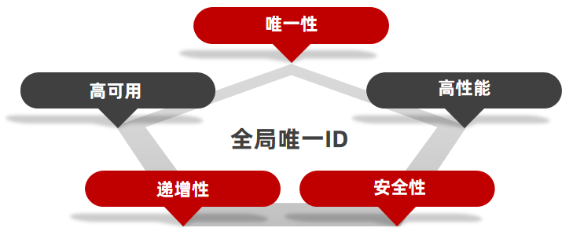

# 秒杀任务

## 全局唯一ID

当用户抢购时，就会生成订单并保存到tb_voucher_order这张表中，而订单表如果使用数据库自增ID就存在一些问题：

- id的规律性太明显
- 受单表数据量的限制

场景分析：

- 如果我们的id具有太明显的规则，用户或者说商业对手很容易猜测出来我们的一些敏感信息，比如商城在一天时间内，卖出了多少单，这明显不合适。
- 随着我们商城规模越来越大，mysql的单表的容量不宜超过500W，数据量过大之后，我们要进行拆库拆表，但拆分表了之后，他们从逻辑上讲他们是同一张表，所以他们的id是不能一样的， 于是乎我们需要保证id的唯一性。

**全局ID生成器**，是一种在分布式系统下用来生成全局唯一ID的工具，一般要满足下列特性：



为了增加ID的安全性，我们可以不直接使用Redis自增的数值，而是拼接一些其它信息：


- ID的组成部分：
  - 符号位：1bit，永远为0
  - 时间戳：31bit，以秒为单位，可以使用69年
  - 序列号：32bit，秒内的计数器，支持每秒产生$2^{32}$个不同ID

## 优惠券秒杀-一人一单(单机锁)

优惠卷是为了引流，但是目前的情况是，一个人可以无限制的抢这个优惠卷，所以我们应当增加一层逻辑，让一个用户只能下一个单，而不是让一个用户下多个单。


- `SeckillVoucherController`

```java
import org.springframework.web.bind.annotation.RequestMapping;
import org.springframework.web.bind.annotation.PostMapping;
import org.springframework.web.bind.annotation.RestController;
import org.springframework.web.bind.annotation.RequestBody;

import com.redis.api.redis.entity.Vo.VoucherVo;
import com.redis.api.redis.service.SeckillVoucherServiceImpl;
import com.redis.api.redis.utils.Result;
import com.redis.api.redis.utils.BusinessException;

import lombok.RequiredArgsConstructor;

@RequestMapping("/seckillvoucher")
@RestController
@RequiredArgsConstructor
public class SeckillVoucherController {
    private final SeckillVoucherServiceImpl seckillVoucherService;
    @PostMapping("/useWhenHasStock")
    public Result<Void> useWhenHasStock(@RequestBody VoucherVo voucherVo) {
        try {
            seckillVoucherService.useWhenHasStock(voucherVo.getVoucherId(), voucherVo.getUserId());
            return Result.success();
        } catch (BusinessException e) {
            return Result.error(e.getResultCode());
        }
    }
}
```

- `SeckillVoucherServiceImpl`

```java
import java.time.LocalDateTime;

import org.springframework.stereotype.Service;
import lombok.RequiredArgsConstructor;
import org.springframework.transaction.annotation.Transactional;

import com.redis.api.redis.entity.SeckillVoucher;
import com.redis.api.redis.entity.VoucherOrder;
import com.redis.api.redis.repository.SeckillVoucherRepository;
import com.redis.api.redis.repository.VoucherOrderRepository;
import com.redis.api.redis.utils.IdFactoryUtil;
import com.redis.api.redis.utils.ResultCode;
import com.redis.api.redis.utils.BusinessException;

@Service
@RequiredArgsConstructor
public class SeckillVoucherServiceImpl {
  private final SeckillVoucherRepository seckillVoucherRepository;
  private final VoucherOrderRepository voucherOrderRepository;
  private final IdFactoryUtil idFactoryUtil;

  public Long useWhenHasStock(Long voucherId, Long userId) {
    SeckillVoucher voucher = seckillVoucherRepository.findById(voucherId).orElseThrow(() -> {
      throw new BusinessException(ResultCode.VOUCHER_NOT_EXIST);
    });

    if(voucherOrderRepository.findByUserIdAndVoucherIdCount(userId,voucherId) > 0){
      throw new BusinessException(ResultCode.USER_ALREADY_PURCHASED);
    }

    if (voucher.getBeginTime().isAfter(LocalDateTime.now())) {
      throw new BusinessException(ResultCode.SECKILL_NOT_STARTED);
    }

    if (voucher.getEndTime().isBefore(LocalDateTime.now())) {
      throw new BusinessException(ResultCode.SECKILL_ENDED);
    }

    if (voucher.getStock() <= 0) {
      throw new BusinessException(ResultCode.STOCK_NOT_ENOUGH);
    }
    synchronized (voucherId.toString().intern()) {
      SeckillVoucherServiceImpl proxImpl  = (SeckillVoucherServiceImpl) AopContext.currentProxy();
      return proxImpl.createVoucherOrder(voucherId, userId);
    }
  }

  @Transactional
  private Long createVoucherOrder(Long voucherId, Long userId) {
    int rowsAffected = seckillVoucherRepository.updateStock(voucherId);

    if (rowsAffected <= 0) {
      throw new BusinessException(ResultCode.STOCK_NOT_ENOUGH);
    }

    VoucherOrder voucherOrder = VoucherOrder.builder()
        .id(idFactoryUtil.getId("voucherOrder"))
        .userId(userId)
        .voucherId(voucherId)
        .payType(1) // Default to balance payment
        .status(1)  // Default to unpaid status
        .build();
    voucherOrderRepository.save(voucherOrder);
    return voucherOrder.getId();
  }
}
```

> [!NOTE]
>
> - 通过 `synchronized`关键字，我们确保了在秒杀过程中，同一时间只有一个线程可以为特定用户创建订单，从而保证了线程安全。这种锁机制是基于用户维度的，而不是方法级别的。

> [!TIP]
>
> - 为什么将锁放在 `createVoucherOrder`方法外部而不是直接在方法上？这涉及到Spring事务和锁的执行顺序问题：


如果我们将 `synchronized`放在方法上，执行流程会变成：


这样虽然锁的顺序正确，但事务却会失效。原因在于：

1. Spring事务依赖于代理对象调用
2. 直接在方法上加锁会导致使用 `this`调用，而不是通过Spring代理对象
3. 这在CGLIB或JDK动态代理中尤为重要

解决方案：

1. 使用AOP代理
2. 将方法提取到单独的类中，通过Spring代理对象调用

我们选择了AOP代理方案：

```java
import org.springframework.aop.framework.AopContext;

synchronized (voucherId.toString().intern()) {
    SeckillVoucherServiceImpl proxyImpl = (SeckillVoucherServiceImpl) AopContext.currentProxy();
    return proxyImpl.createVoucherOrder(voucherId, userId);
}
```

这样既保证了事务的正确性，又确保了锁的顺序正确。

## 优惠券秒杀-一人一单(分布式锁)

### 基本原理和实现方式对比

> 单机锁性问题，在分布式高并发环境下，单机锁无法保证线程安全，不同的jvm的锁是独立的。


### 分布式锁的实现方式

- 使用Redis实现分布式锁
- 接口定义

```java
public interface DistributedLock {

    boolean tryLock(String value);
    void unlock(String value);
}
```

- 抽象实现

```java
/**
 * 基于Redis的分布式锁实现基类
 */
public abstract class SimpleRedisLock implements DistributedLock {
    protected final String KEY_PREFIX;
    protected final int EXPIRE_TIME;
    protected final RedisCache redisCache;
    protected final TimeUnit timeUnit;
    private static final String ID_PREFIX = UUID.randomUUID().toString() + "-";

    /**
     * 构造方法
     *
     * @param redisCache Redis缓存操作实例
     * @param keyPrefix  锁的key前缀
     * @param expireTime 锁的过期时间
     * @param timeUnit   时间单位
     * @throws NullPointerException     如果任何参数为null
     * @throws IllegalArgumentException 如果expireTime小于等于0
     */
    protected SimpleRedisLock(@NonNull RedisCache redisCache,
            @NonNull String keyPrefix,
            int expireTime,
            @NonNull TimeUnit timeUnit) {
        if (expireTime <= 0) {
            throw new IllegalArgumentException("过期时间必须大于0");
        }
        this.redisCache = Objects.requireNonNull(redisCache, "RedisCache不能为null");
        this.KEY_PREFIX = Objects.requireNonNull(keyPrefix, "key前缀不能为null");
        this.EXPIRE_TIME = expireTime;
        this.timeUnit = Objects.requireNonNull(timeUnit, "时间单位不能为null");
    }

    @Override
    public boolean tryLock(String value) {
        Long currentThreadName = Thread.currentThread().getId();
        Boolean ac = redisCache.setCacheObject(KEY_PREFIX + value, ID_PREFIX + currentThreadName.toString(), EXPIRE_TIME, timeUnit);
        return Boolean.TRUE.equals(ac);
    }

    @Override
    public void unlock(String value) {
        Long currentThreadId = Thread.currentThread().getId();
        String lockKey = KEY_PREFIX + value;
        String lockValue = ID_PREFIX + currentThreadId.toString();
        // 检查是否是当前线程持有的锁
        if (lockValue.equals(lockValue)) {
            redisCache.useLuaDelete(lockKey, lockValue);
        } else {
            // 如果不是当前线程的锁，抛出异常
            throw new BusinessException(ResultCode.LOCK_BE_CLEAR);
        }
    }
}
```

- 实现类

```java
/**
 * 秒杀优惠券分布式锁实现
 */
@Component
public class SeckillVoucherLock extends SimpleRedisLock {

    private static final String KEY_PREFIX = "seckill:voucher:";
    private static final int EXPIRE_TIME = 1;
    private static final TimeUnit TIME_UNIT = TimeUnit.SECONDS;

    /**
     * 使用默认配置创建秒杀优惠券分布式锁
     */
    public SeckillVoucherLock(RedisCache redisCache) {
        super(redisCache, KEY_PREFIX, EXPIRE_TIME, TIME_UNIT);
    }
}
```

- 使用

```java
  try {
    if (!seckillVoucherLock.tryLock(voucherId.toString())) {
      throw new BusinessException(ResultCode.LOCK_BE_USED);
    }
    SeckillVoucherServiceImpl proxImpl  = (SeckillVoucherServiceImpl) AopContext.currentProxy();
    return proxImpl.createVoucherOrder(voucherId, userId);
  }finally {
    seckillVoucherLock.unlock(voucherId.toString());
  }
```

## 秒杀优化-异步秒杀思路

- 我们在业务中如何判断这个订单是否可以创建
  1. 判断秒杀是否开始
  2. 判断秒杀是否结束
  3. 判断库存是否充足
  4. 判断用户是否已经购买过

> [!NOTE]
>
> 异步任务最核心的点是，定时同步数据，保证数据的一致性。
> 核心数据做保底机制，保证数据的准确性。


- 业务流程
- `AsyncSeckillVoucherServiceImpl`

```java
package com.redis.api.redis.service;

import org.springframework.context.ApplicationContext;
import org.springframework.stereotype.Service;
import org.springframework.transaction.annotation.Transactional;
import jakarta.annotation.PostConstruct;
import java.util.concurrent.TimeUnit;

import com.redis.api.redis.utils.RedisCache;
import com.redis.api.redis.utils.ResultCode;
import lombok.RequiredArgsConstructor;
import lombok.extern.slf4j.Slf4j;

import com.redis.api.redis.utils.BusinessException;
import com.redis.api.redis.utils.IdFactoryUtil;
import org.redisson.api.RLock;
import org.redisson.api.RedissonClient;
import com.redis.api.redis.entity.SeckillVoucher;
import com.redis.api.redis.entity.VoucherOrder;
import com.redis.api.redis.repository.SeckillVoucherRepository;
import com.redis.api.redis.repository.VoucherOrderRepository;

import java.time.LocalDateTime;
import java.util.concurrent.ArrayBlockingQueue;
import java.util.concurrent.BlockingQueue;
import java.util.concurrent.ExecutorService;
import java.util.concurrent.Executors;
import com.redis.api.redis.common.RedisKeyCommon;

@Slf4j
@Service
@RequiredArgsConstructor
public class AsyncSeckillVoucherServiceImpl {
    private final ApplicationContext applicationContext;
    private final RedisCache redisCache;
    // 订单处理队列，使用有界队列防止内存溢出
    private final SeckillVoucherRepository seckillVoucherRepository;
    private final VoucherOrderRepository voucherOrderRepository;
    private final IdFactoryUtil idFactoryUtil;
    private final RedissonClient redissonClient;
    private final BlockingQueue<VoucherOrder> orderTasks = new ArrayBlockingQueue<>(10000);
    private static final String ORDER_PROCESSOR_THREAD_NAME = "voucher-order-processor";
    private static final int MAX_QUEUE_SIZE = 1000;
    private static final long OFFER_TIMEOUT_MS = 1;

    // 使用单线程处理订单，保证顺序性
    private final ExecutorService orderProcessor = Executors.newSingleThreadExecutor(r -> {
        Thread t = new Thread(r, ORDER_PROCESSOR_THREAD_NAME);
        t.setDaemon(true);
        return t;
    });

    @PostConstruct
    public void init() {
        orderProcessor.submit(this::processOrderTask);
    }

    /**
     * 秒杀下单
     *
     * @param voucherId 优惠券ID
     * @param userId    用户ID
     * @return 订单ID
     */
    /**
     * 秒杀下单
     * 1. 快速失败检查
     * 2. 创建订单任务
     * 3. 异步处理订单
     */
    public Long useWhenHasStock(Long voucherId, Long userId) {
        // 1. 快速失败检查
        if (!checkStockValue(voucherId)) {
            throw new BusinessException(ResultCode.STOCK_NOT_ENOUGH);
        }

        if (!checkUserVoucherOrder(userId, voucherId)) {
            throw new BusinessException(ResultCode.USER_ALREADY_PURCHASED);
        }

        // 3. 创建订单对象（不保存到数据库）
        VoucherOrder voucherOrder = VoucherOrder.builder()
                .id(idFactoryUtil.getId("voucherOrder"))
                .userId(userId)
                .voucherId(voucherId)
                .payType(1)
                .status(1)
                .build();

        // 4. 尝试加入处理队列
        try {
            if (orderTasks.size() >= MAX_QUEUE_SIZE) {
                log.warn("订单队列已满，当前队列大小：{}", orderTasks.size());
                throw new BusinessException(ResultCode.INTERNAL_ERROR);
            }

            boolean success = orderTasks.offer(voucherOrder, OFFER_TIMEOUT_MS, TimeUnit.SECONDS);
            if (!success) {
                log.warn("添加订单到队列超时，voucherId:{}, userId:{}", voucherId, userId);
                throw new BusinessException(ResultCode.INTERNAL_ERROR);
            }
            // 5. 订单缓存
            redisCache.setCacheObject(RedisKeyCommon.EKAY_STOCK_ORDER_KEY.getKey() + userId + ":" + voucherId,
                    voucherOrder,
                    RedisKeyCommon.EKAY_STOCK_ORDER_KEY.getTimeout(),
                    RedisKeyCommon.EKAY_STOCK_ORDER_KEY.getTimeUnit());
            // 6. 商品库存缓存
            SeckillVoucher stock = redisCache.getCacheObject(RedisKeyCommon.EKAY_STOCK_KEY.getKey() + voucherId);
            stock.setStock(stock.getStock() - 1);
            redisCache.setCacheObject(RedisKeyCommon.EKAY_STOCK_KEY.getKey() + voucherId,
                    stock,
                    RedisKeyCommon.EKAY_STOCK_KEY.getTimeout(),
                    RedisKeyCommon.EKAY_STOCK_KEY.getTimeUnit());

            return voucherOrder.getId();
        } catch (InterruptedException e) {
            Thread.currentThread().interrupt();
            log.error("订单处理被中断", e);
            throw new BusinessException(ResultCode.INTERNAL_ERROR);
        }
    }

    /**
     * 创建订单
     *
     * @param voucherId 优惠券ID
     * @param userId    用户ID
     * @return 订单ID
     */
    /**
     * 创建订单
     * 1. 扣减库存
     * 2. 创建订单
     * 3. 更新缓存
     */
    @Transactional(rollbackFor = Exception.class)
    public Long createVoucherOrder(Long voucherId, Long userId) {
        // 1. 扣减库存（使用乐观锁）
        int rowsAffected = seckillVoucherRepository.updateStock(voucherId);
        if (rowsAffected <= 0) {
            // 库存不足，记录告警
            log.warn("库存扣减失败，可能库存不足，voucherId:{}, userId:{}", voucherId, userId);
            throw new BusinessException(ResultCode.STOCK_NOT_ENOUGH);
        }

        try {
            // 2. 创建并保存订单
            VoucherOrder voucherOrder = VoucherOrder.builder()
                    .id(idFactoryUtil.getId("voucherOrder"))
                    .userId(userId)
                    .voucherId(voucherId)
                    .payType(1)
                    .status(1)
                    .build();

            voucherOrderRepository.save(voucherOrder);
            // 3. 用户订单缓存
            redisCache.setCacheObject(RedisKeyCommon.EKAY_STOCK_ORDER_KEY.getKey() + userId, voucherOrder);
            // 4. 商品库存缓存
            SeckillVoucher stock = seckillVoucherRepository.findById(voucherId)
                .orElseThrow(() -> new BusinessException(ResultCode.STOCK_NOT_ENOUGH));
            redisCache.setCacheObject(RedisKeyCommon.EKAY_STOCK_KEY.getKey() + voucherId,
                    stock,
                    RedisKeyCommon.EKAY_STOCK_KEY.getTimeout(),
                    RedisKeyCommon.EKAY_STOCK_KEY.getTimeUnit());
            return voucherOrder.getId();
        } catch (Exception e) {
            log.error("创建订单异常，voucherId:{}, userId:{}", voucherId, userId, e);
            throw new BusinessException(ResultCode.INTERNAL_ERROR);
        }
    }

    private Boolean checkUserVoucherOrder(Long userId, Long voucherId) {
        String stockKey = RedisKeyCommon.EKAY_STOCK_ORDER_KEY.getKey() + userId + ":" + voucherId;
        VoucherOrder voucherOrder = redisCache.getWithMutex(stockKey,
                RedisKeyCommon.EKAY_ONLY_ONE_STOCK_LOCK_KEY.getKey() + voucherId,
                RedisKeyCommon.EKAY_STOCK_ORDER_KEY.getTimeout(),
                RedisKeyCommon.EKAY_STOCK_ORDER_KEY.getTimeUnit(),
                () -> voucherOrderRepository.findByUserIdAndVoucherId(userId, voucherId)
                        .orElse(VoucherOrder.builder().id(null).build()));
        return voucherOrder.getId() == null;
    }

    /**
     * 检查库存
     * 1. 先查Redis缓存
     * 2. 缓存未命中查数据库
     */
    private boolean checkStockValue(Long voucherId) {
        String stockKey = RedisKeyCommon.EKAY_STOCK_KEY.getKey() + voucherId;
        SeckillVoucher stock = redisCache.getWithMutex(stockKey,
                RedisKeyCommon.EKAY_ONLY_ONE_STOCK_LOCK_KEY.getKey() + voucherId,
                RedisKeyCommon.EKAY_STOCK_KEY.getTimeout(),
                RedisKeyCommon.EKAY_STOCK_KEY.getTimeUnit(),
                () -> seckillVoucherRepository.findById(voucherId)
                        .orElse(SeckillVoucher.builder().voucherId(voucherId).stock(0).beginTime(LocalDateTime.now())
                                .endTime(LocalDateTime.now()).build()));
        return stock.getStock() > 0;
    }

    /**
     * 处理订单任务
     */
    private void processOrderTask() {
        while (!Thread.currentThread().isInterrupted()) {
            try {
                // 1. 获取订单，如果队列为空会阻塞
                VoucherOrder voucherOrder = orderTasks.take();
                RLock lock = redissonClient.getLock(RedisKeyCommon.EKAY_ORDER_TASK_KEY.getKey()
                        + voucherOrder.getUserId() + ":" + voucherOrder.getVoucherId());
                try {
                    if (!lock.tryLock(5, 10, RedisKeyCommon.EKAY_ORDER_TASK_KEY.getTimeUnit())) {
                        return;
                    }
                    AsyncSeckillVoucherServiceImpl proxy = applicationContext
                            .getBean(AsyncSeckillVoucherServiceImpl.class);
                    proxy.createVoucherOrder(voucherOrder.getVoucherId(), voucherOrder.getUserId());
                } catch (BusinessException e) {
                    // 业务异常记录日志，继续处理下个订单
                    log.warn("处理订单失败: {}", e.getMessage());
                } catch (Exception e) {
                    log.error("处理订单异常", e);
                } finally {
                    lock.unlock();
                }
            } catch (InterruptedException e) {
                Thread.currentThread().interrupt();
                log.warn("订单处理线程被中断");
                break;
            }
        }
    }
}
```

- 有效控制秒杀商品的并发


