# Spark 概述：从入门到精通

## 第一层：理解大数据处理的基本需求

### 1.1 数据时代的挑战

在当今数字化时代，数据正以前所未有的速度增长。据统计，全球每天产生超过 2.5 亿字节的数据，这些数据来自：

- **互联网活动**：搜索、社交媒体、电子商务
- **移动设备**：GPS 定位、传感器数据、应用使用记录
- **企业系统**：交易记录、日志文件、客户行为数据
- **物联网设备**：智能家居、工业传感器、车联网

> [!NOTE]
> 数据增长速度：预计到2025年，全球数据量将达到175ZB（泽字节），相当于每天产生约480EB的新数据。这种指数级增长使传统数据处理方式面临严峻挑战。

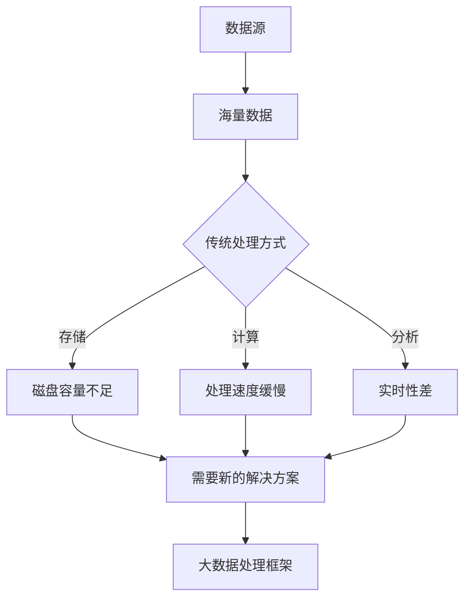
```mermaid
graph TB
    A[数据源] --> B[海量数据]
    B --> C{传统处理方式}
    C -->|存储| D[磁盘容量不足]
    C -->|计算| E[处理速度缓慢]
    C -->|分析| F[实时性差]
    D --> G[需要新的解决方案]
    E --> G
    F --> G
    G --> H[大数据处理框架]
```

**图表解读**：

- **数据源多样化**：现代企业面临来自多个渠道的数据汇聚
- **传统处理方式的三大瓶颈**：存储、计算、分析能力都无法满足大数据需求
- **解决方案导向**：这些痛点推动了分布式大数据处理框架的诞生
- **技术演进必然性**：从单机处理到分布式处理的技术变革

### 1.2 传统数据处理的局限性

传统的数据处理方式面临以下挑战：

1. **存储限制**：单机存储容量无法满足海量数据需求
2. **计算瓶颈**：单机计算能力有限，处理时间过长
3. **可扩展性差**：系统难以随着数据量增长而扩展
4. **实时性不足**：批处理模式无法满足实时分析需求

### 1.3 大数据处理框架的演进历程

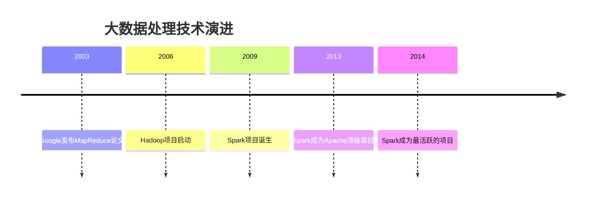
```mermaid
timeline
    title 大数据处理技术演进
    2003 : Google发布MapReduce论文
    2006 : Hadoop项目启动
    2009 : Spark项目诞生
    2013 : Spark成为Apache顶级项目
    2014 : Spark成为最活跃的项目
```

**技术演进关键节点分析**：

- **2003年**：Google的MapReduce论文奠定了分布式计算的理论基础
- **2006年**：Hadoop开源项目启动，将Google的理念普及到企业级应用
- **2009年**：Spark在Berkeley诞生，专注解决Hadoop的性能瓶颈
- **2013年**：Spark项目成熟，成为Apache基金会顶级项目
- **2014年**：Spark超越Hadoop，成为最活跃的大数据项目，标志着内存计算时代的到来

## 第二层：深入理解 Spark 的诞生与核心理念

### 2.1 Spark 的诞生背景

#### 2.1.1 Hadoop MapReduce 的限制

虽然 Hadoop 解决了大数据存储和基础处理问题，但其 MapReduce 计算模型存在明显缺陷：

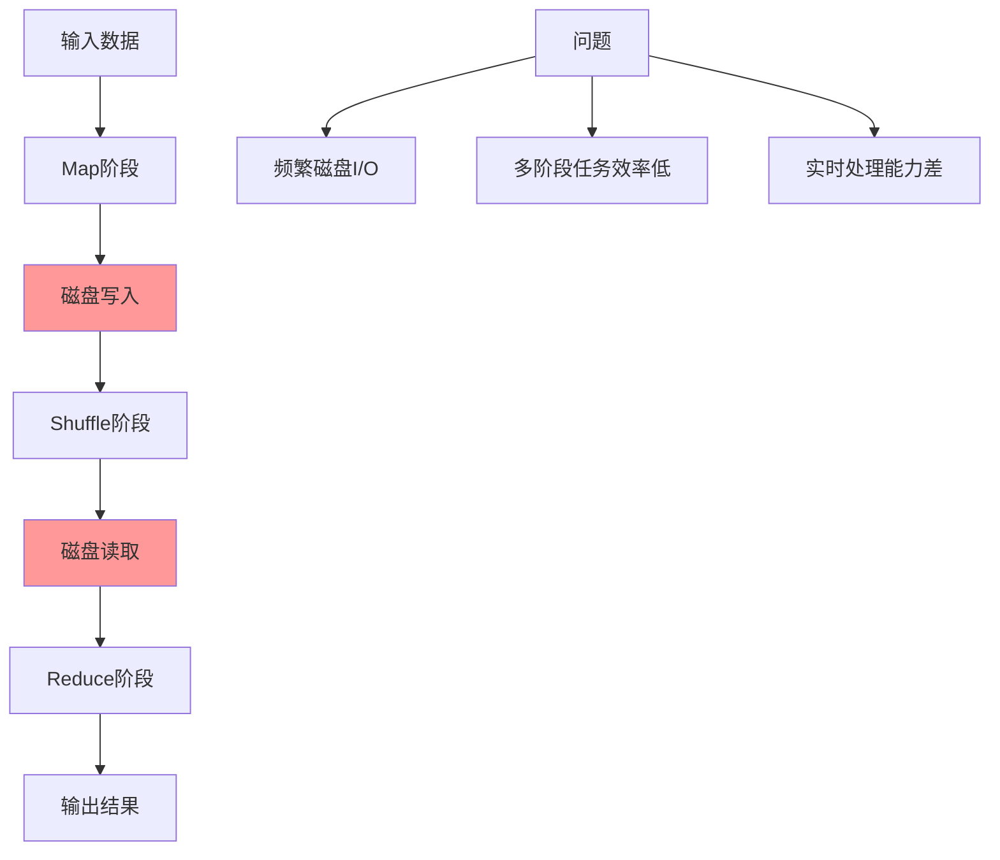
```mermaid
graph TD
    A[输入数据] --> B[Map阶段]
    B --> C[磁盘写入]
    C --> D[Shuffle阶段]
    D --> E[磁盘读取]
    E --> F[Reduce阶段]
    F --> G[输出结果]
  
    style C fill:#ff9999
    style E fill:#ff9999
  
    H[问题] --> I[频繁磁盘I/O]
    H --> J[多阶段任务效率低]
    H --> K[实时处理能力差]
```

**MapReduce性能瓶颈分析**：

- **红色标注部分**：频繁的磁盘I/O操作是最大性能杀手
- **多阶段处理**：每个Map-Reduce任务都需要完整的磁盘读写周期
- **中间结果存储**：所有中间数据都必须写入磁盘，即使后续马上要用
- **实时性限制**：批处理模式无法支持交互式查询和实时分析
- **资源利用低**：大量时间浪费在等待I/O操作上，CPU和内存资源闲置

> [!IMPORTANT]
> 磁盘I/O是传统大数据处理的最大瓶颈！磁盘读写速度通常比内存慢100-1000倍，这是MapReduce性能受限的根本原因。Spark通过内存计算彻底解决了这个问题。

#### 2.1.2 Spark 的创新理念

**内存计算优先**：Spark 将数据尽可能保存在内存中，大大减少磁盘 I/O 操作。

**统一计算模型**：提供一个统一的编程模型来处理批处理、流处理、机器学习等不同类型的工作负载。

**惰性求值**：采用惰性求值策略，只有在真正需要结果时才执行计算，提高效率。

### 2.2 Spark 的核心设计哲学

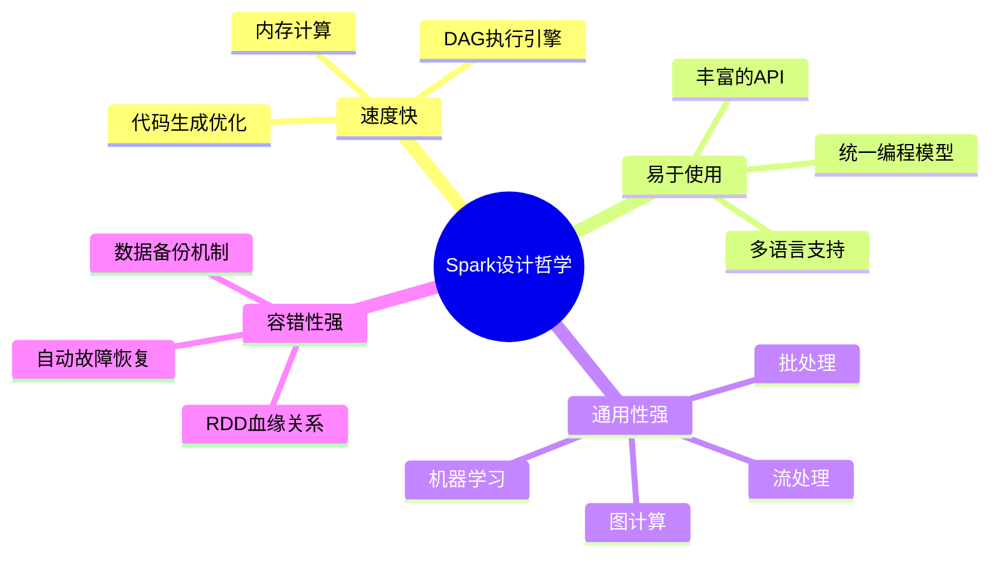
```mermaid
mindmap
  root((Spark设计哲学))
    速度快
      内存计算
      DAG执行引擎
      代码生成优化
    易于使用
      丰富的API
      多语言支持
      统一编程模型
    通用性强
      批处理
      流处理
      机器学习
      图计算
    容错性强
      RDD血缘关系
      自动故障恢复
      数据备份机制
```

**设计哲学深度解析**：

**🚀 速度快 - 性能为王**

- **内存计算**：数据尽可能保存在内存中，避免磁盘I/O瓶颈
- **DAG执行引擎**：将复杂任务优化为有向无环图，减少不必要的中间步骤
- **代码生成优化**：运行时生成优化的Java字节码，提升执行效率

**🎯 易于使用 - 降低门槛**

- **丰富的API**：提供高级抽象，简化复杂的分布式编程
- **多语言支持**：Scala、Java、Python、R、SQL，照顾不同背景开发者
- **统一编程模型**：相同的概念和API风格，学会一个组件即可快速掌握其他

**🔧 通用性强 - 一站式平台**

- **批处理**：传统的大数据ETL处理
- **流处理**：实时数据流分析
- **机器学习**：内置MLlib算法库
- **图计算**：GraphX支持复杂网络分析

**🛡️ 容错性强 - 企业级可靠性**

- **RDD血缘关系**：记录数据转换链路，支持失败后重算
- **自动故障恢复**：节点失败时自动迁移任务到其他节点
- **数据备份机制**：关键数据多副本存储，确保数据安全

## 第三层：掌握 Spark 的核心概念与架构

### 3.1 RDD：Spark 的核心抽象

#### 3.1.1 什么是 RDD

RDD（Resilient Distributed Dataset，弹性分布式数据集）是 Spark 的基础数据结构，具有以下特性：

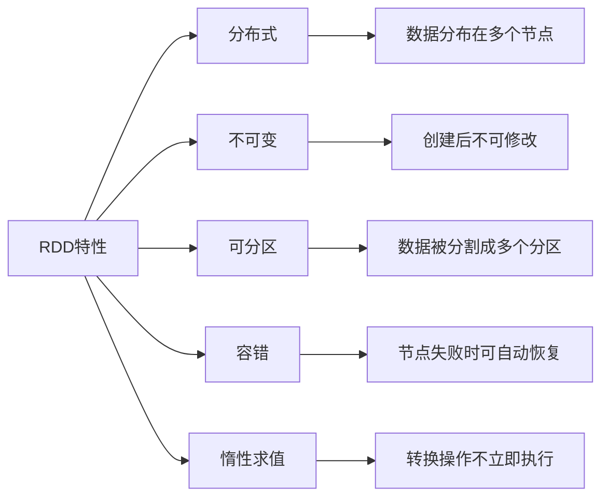
```mermaid
graph LR
    A[RDD特性] --> B[分布式]
    A --> C[不可变]
    A --> D[可分区]
    A --> E[容错]
    A --> F[惰性求值]
  
    B --> B1[数据分布在多个节点]
    C --> C1[创建后不可修改]
    D --> D1[数据被分割成多个分区]
    E --> E1[节点失败时可自动恢复]
    F --> F1[转换操作不立即执行]
```

**RDD核心特性详解**：

**📡 分布式（Distributed）**

- 数据自动分布在集群的多个节点上
- 支持并行计算，充分利用集群资源
- 对用户透明，无需关心数据在哪个节点

**🔒 不可变（Immutable）**

- 一旦创建就不能修改，保证数据一致性
- 避免并发修改导致的数据竞争问题
- 支持函数式编程范式，代码更可靠

**🧩 可分区（Partitioned）**

- 数据被智能分割成多个分区（Partition）
- 每个分区可以独立并行处理
- 分区策略可以自定义优化性能

**🛠️ 容错（Resilient）**

- 通过血缘关系（Lineage）记录数据来源
- 节点失败时可以从源头重新计算
- 无需复杂的数据复制机制

**⏰ 惰性求值（Lazy Evaluation）**

- 转换操作（Transformation）不会立即执行
- 只有遇到行动操作（Action）时才开始计算
- 允许Spark优化整个计算链路

> [!TIP]
> 惰性求值是Spark性能优化的关键！它允许Spark分析整个计算链路，消除不必要的计算步骤，合并相邻操作，大幅提升执行效率。

#### 3.1.2 RDD 的操作类型

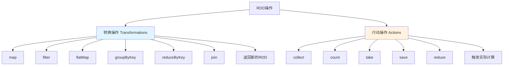
```mermaid
graph TD
    A[RDD操作] --> B[转换操作 Transformations]
    A --> C[行动操作 Actions]
  
    B --> B1[map]
    B --> B2[filter]
    B --> B3[flatMap]
    B --> B4[groupByKey]
    B --> B5[reduceByKey]
    B --> B6[join]
  
    C --> C1[collect]
    C --> C2[count]
    C --> C3[take]
    C --> C4[save]
    C --> C5[reduce]
  
    B --> D[返回新的RDD]
    C --> E[触发实际计算]
  
    style B fill:#e1f5fe
    style C fill:#fff3e0
```

**RDD操作分类详解**：

**🔄 转换操作（Transformations）- 蓝色区域**

- **特点**：惰性执行，返回新的RDD，不会立即计算
- **map**：对每个元素应用函数进行转换
- **filter**：根据条件过滤数据，保留满足条件的元素
- **flatMap**：先map再flatten，将嵌套结构展平
- **groupByKey**：按键分组，相同key的值聚合到一起
- **reduceByKey**：按键聚合，对相同key的值进行reduce操作
- **join**：连接两个RDD，类似SQL的JOIN操作

**⚡ 行动操作（Actions）- 橙色区域**

- **特点**：触发实际计算，返回结果到Driver程序或写入存储
- **collect**：将RDD所有元素收集到Driver程序中
- **count**：计算RDD中元素的总数
- **take(n)**：取RDD前n个元素
- **save**：将RDD保存到文件系统（HDFS、本地文件等）
- **reduce**：使用函数对RDD元素进行聚合计算

**💡 设计理念**：

- **惰性求值优势**：Spark可以分析整个转换链，进行全局优化
- **流水线优化**：多个转换操作可以合并为一个stage执行
- **内存重用**：中间结果可以缓存在内存中，避免重复计算

#### 3.1.3 RDD 的血缘关系与容错机制

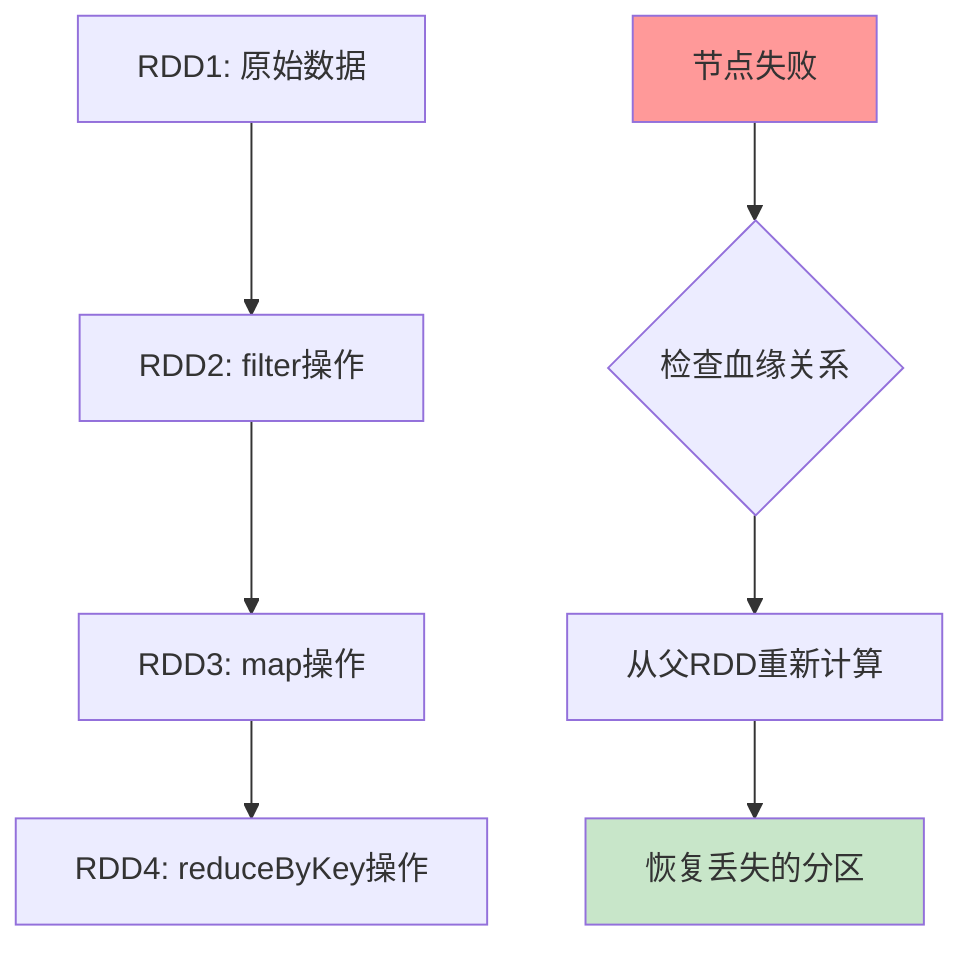
```mermaid
graph TB
    A[RDD1: 原始数据] --> B[RDD2: filter操作]
    B --> C[RDD3: map操作]
    C --> D[RDD4: reduceByKey操作]
  
    E[节点失败] --> F{检查血缘关系}
    F --> G[从父RDD重新计算]
    G --> H[恢复丢失的分区]
  
    style E fill:#ff9999
    style H fill:#c8e6c9
```

**血缘关系与容错机制详解**：

**📋 血缘关系（Lineage）的作用**

- **记录转换历史**：每个RDD都知道自己是如何从父RDD转换而来
- **依赖关系图**：形成有向无环图（DAG），记录完整的数据流
- **轻量级元数据**：只记录转换操作，不复制实际数据

**🚨 故障发生时的处理流程**

1. **检测故障**：系统发现某个节点或分区丢失（红色标注）
2. **分析血缘**：查找丢失分区的父RDD和转换操作
3. **重新计算**：从最近的可用父RDD开始重新执行转换
4. **恢复完成**：重新生成丢失的分区数据（绿色标注）

**💪 容错机制的优势**

- **无需数据复制**：不像传统系统需要维护多个数据副本
- **精确恢复**：只重算丢失的分区，不影响其他分区
- **成本低**：存储开销小，只需记录转换操作
- **可扩展**：支持大规模集群的容错需求

**⚠️ 注意事项**

- **长血缘链风险**：转换链太长时重算成本高
- **检查点机制**：可以通过checkpoint截断血缘链
- **缓存策略**：关键中间结果可以缓存到内存或磁盘

> [!WARNING]
> 长血缘链风险：当RDD转换链过长时，节点失败后的重算成本会非常高。建议在长链路中间设置检查点（checkpoint）来截断血缘关系，避免从头重算整个链路。

> [!CAUTION]
> 内存不足风险：过度依赖内存计算可能导致内存溢出。需要合理设置缓存策略，对于不经常使用的数据应及时释放内存空间。

### 3.2 Spark 的整体架构

#### 3.2.1 集群架构概览

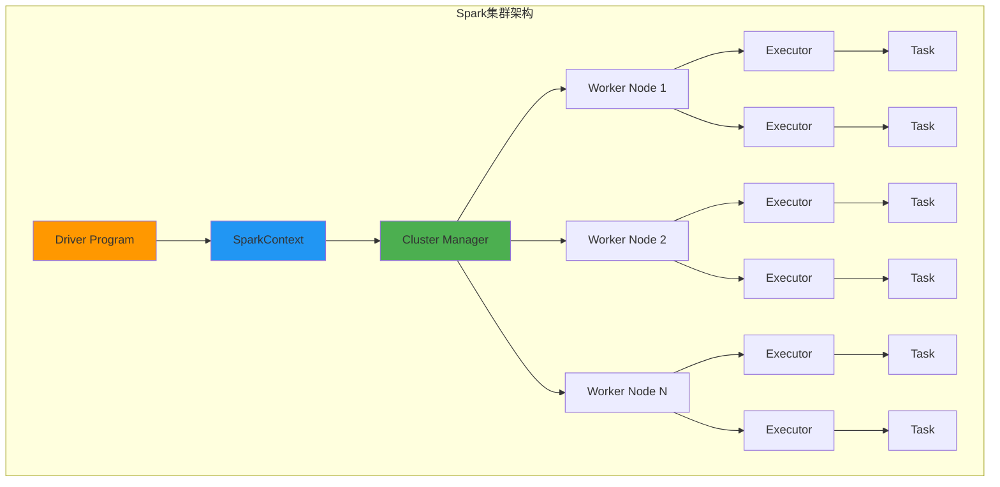
```mermaid
graph TB
    subgraph "Spark集群架构"
        A[Driver Program] --> B[SparkContext]
        B --> C[Cluster Manager]
      
        C --> D[Worker Node 1]
        C --> E[Worker Node 2]
        C --> F[Worker Node N]
      
        D --> D1[Executor]
        D --> D2[Executor]
        E --> E1[Executor]
        E --> E2[Executor]
        F --> F1[Executor]
        F --> F2[Executor]
      
        D1 --> D1T[Task]
        D2 --> D2T[Task]
        E1 --> E1T[Task]
        E2 --> E2T[Task]
        F1 --> F1T[Task]
        F2 --> F2T[Task]
    end
  
    style A fill:#ff9800
    style B fill:#2196f3
    style C fill:#4caf50
```

**Spark集群架构层次解析**：

**🎯 Driver层（橙色）- 应用程序入口**

- **职责**：应用程序的"大脑"，负责整体协调和控制
- **功能**：编写Spark应用代码的地方，包含main函数
- **位置**：可以运行在集群内部或外部的客户端

**💼 SparkContext层（蓝色）- 核心上下文**

- **职责**：Spark应用的入口点和协调中心
- **功能**：创建RDD、管理分布式变量、与集群管理器通信
- **重要性**：一个Spark应用只有一个SparkContext实例

**🏗️ 集群管理层（绿色）- 资源调度**

- **职责**：负责集群资源的分配和管理
- **支持模式**：
  - Standalone：Spark自带的集群管理器
  - YARN：Hadoop生态的资源管理器
  - Mesos：通用的集群资源管理器
  - Kubernetes：容器化集群管理器

**⚙️ 执行层 - 分布式计算**

- **Worker Node**：集群中的物理/虚拟机节点
- **Executor**：运行在Worker节点上的JVM进程，真正执行任务
- **Task**：最小的执行单元，处理一个RDD分区的数据

**🔄 工作流程**：

1. Driver创建SparkContext
2. SparkContext向集群管理器申请资源
3. 集群管理器在Worker节点上启动Executor
4. Driver将应用代码发送给Executor
5. Executor执行Task并返回结果给Driver

> [!IMPORTANT]
> Driver程序是Spark应用的大脑和控制中心！Driver失败会导致整个应用终止，因此需要确保Driver运行在稳定的环境中，并考虑启用Driver的高可用配置。

#### 3.2.2 核心组件详解

**Driver Program（驱动程序）**

- 包含应用程序的主函数
- 创建 SparkContext
- 将应用程序转换为任务
- 调度任务到各个 Executor

**SparkContext（Spark 上下文）**

- Spark 应用程序的入口点
- 负责与集群管理器通信
- 创建 RDD 和广播变量

**Cluster Manager（集群管理器）**

- 负责资源分配和管理
- 支持 Standalone、YARN、Mesos、Kubernetes

**Executor（执行器）**

- 运行在 Worker 节点上的进程
- 执行具体的计算任务
- 管理计算节点的数据存储

### 3.3 DAG 执行引擎

#### 3.3.1 从 RDD 到 DAG

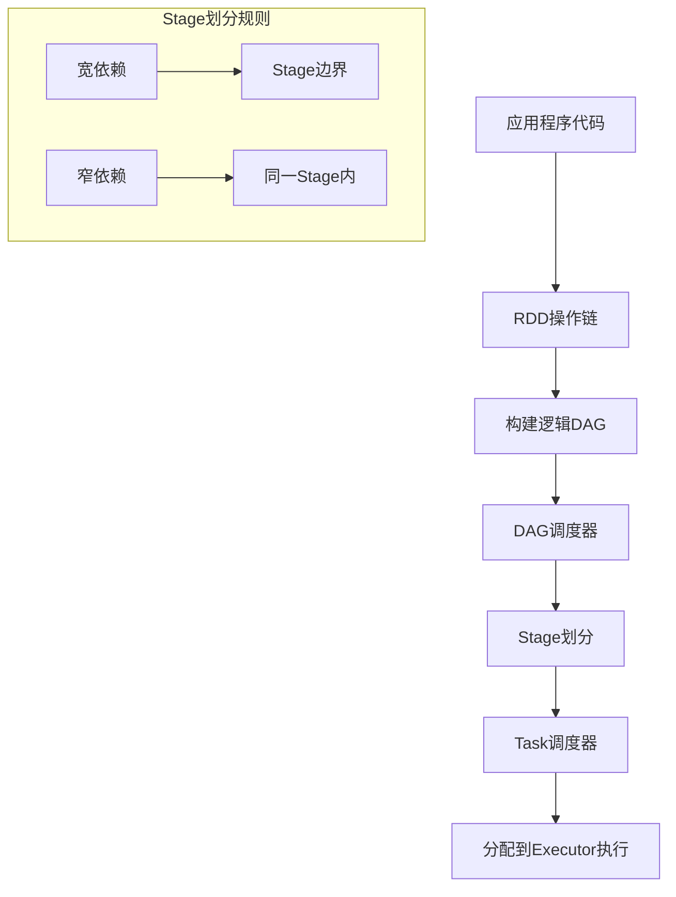
```mermaid
graph TD
    A[应用程序代码] --> B[RDD操作链]
    B --> C[构建逻辑DAG]
    C --> D[DAG调度器]
    D --> E[Stage划分]
    E --> F[Task调度器]
    F --> G[分配到Executor执行]
  
    subgraph "Stage划分规则"
        H[宽依赖] --> I[Stage边界]
        J[窄依赖] --> K[同一Stage内]
    end
```

**DAG执行引擎工作机制详解**：

**📝 从代码到执行的转换过程**

1. **应用程序代码**：用户编写的Spark程序，包含RDD转换和行动操作
2. **RDD操作链**：Spark将代码中的RDD操作串联成逻辑链路
3. **构建逻辑DAG**：将操作链转换为有向无环图表示
4. **DAG调度器**：分析DAG并进行优化，划分为执行阶段
5. **Stage划分**：根据依赖关系将DAG切分为多个Stage
6. **Task调度器**：将Stage转换为具体的Task并分配资源
7. **Executor执行**：在集群节点上并行执行Task

**🔗 依赖关系与Stage划分**

- **窄依赖（Narrow Dependency）**：

  - 父RDD的每个分区最多被子RDD的一个分区使用
  - 例如：map、filter、union操作
  - 可以流水线执行，放在同一个Stage内
- **宽依赖（Wide Dependency）**：

  - 父RDD的一个分区被子RDD的多个分区使用
  - 例如：groupByKey、reduceByKey、join操作
  - 需要Shuffle操作，形成Stage边界

**🚀 DAG优化优势**

- **全局优化**：可以看到整个计算流程，进行全局优化
- **流水线执行**：连续的窄依赖操作可以合并执行
- **减少Shuffle**：尽可能减少需要数据重新分布的操作
- **容错恢复**：失败时可以重新执行特定的Stage而不是整个任务

#### 3.3.2 Stage 和 Task 的概念

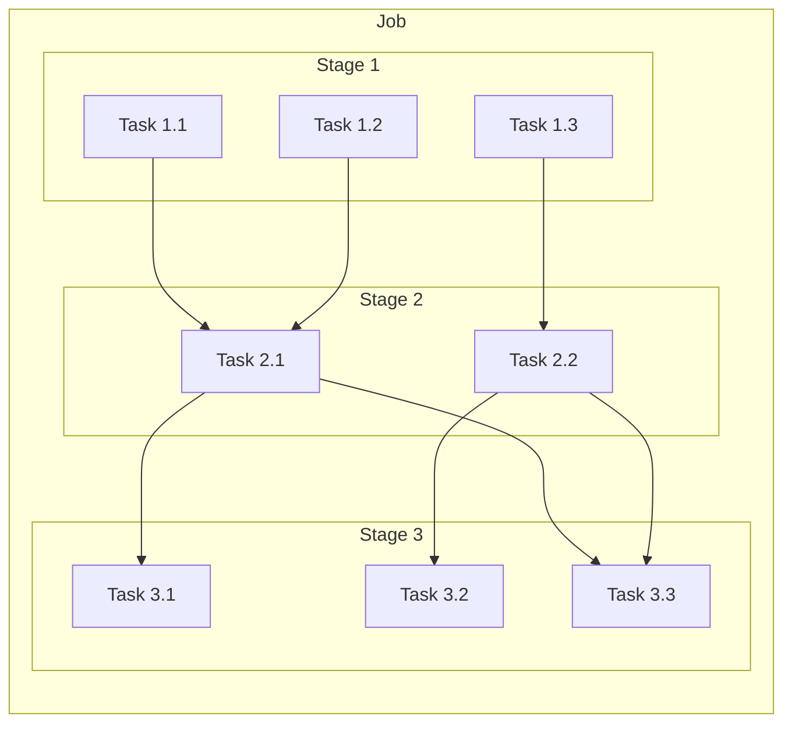
```mermaid
graph LR
    subgraph "Job"
        subgraph "Stage 1"
            A[Task 1.1] 
            B[Task 1.2]
            C[Task 1.3]
        end
      
        subgraph "Stage 2"
            D[Task 2.1]
            E[Task 2.2]
        end
      
        subgraph "Stage 3"
            F[Task 3.1]
            G[Task 3.2]
            H[Task 3.3]
        end
    end
  
    A --> D
    B --> D
    C --> E
    D --> F
    E --> G
    D --> H
    E --> H
```

**Stage与Task层次结构详解**：

**🎯 Job（作业）- 最高层抽象**

- **定义**：由一个行动操作（Action）触发的完整计算任务
- **范围**：从数据输入到结果输出的完整流程
- **特点**：一个Spark应用可以包含多个Job

**🏭 Stage（阶段）- 中间层抽象**

- **定义**：可以并行执行的任务集合，由宽依赖操作分隔
- **划分原则**：
  - 同一Stage内的操作都是窄依赖
  - 遇到宽依赖操作时会产生新的Stage
- **执行特点**：Stage之间有依赖关系，必须按顺序执行

**⚙️ Task（任务）- 最小执行单元**

- **定义**：处理一个RDD分区数据的最小工作单元
- **数量关系**：Task数量 = RDD分区数量
- **执行位置**：每个Task运行在一个Executor线程中

**🔄 执行流程分析**：

1. **Stage 1**：3个Task并行处理3个分区的数据
2. **Stage 1 → Stage 2**：需要Shuffle操作，数据重新分布
3. **Stage 2**：2个Task处理重新分布后的数据
4. **Stage 2 → Stage 3**：再次Shuffle，最终汇聚结果
5. **Stage 3**：3个Task产生最终输出

**💡 性能优化考虑**：

- **并行度**：Task数量决定了并行执行的程度
- **数据本地性**：尽量让Task在数据所在节点执行
- **负载均衡**：确保各个Task的工作量相对均衡
- **资源利用**：Task数量应该与集群资源相匹配

> [!TIP]
> 并行度设置建议：Task数量通常设置为CPU核心数的2-4倍是比较合理的。过少会导致资源浪费，过多会增加调度开销。可以通过spark.default.parallelism参数调整。

## 第四层：探索 Spark 的生态系统与组件

### 4.1 Spark 生态系统全景图

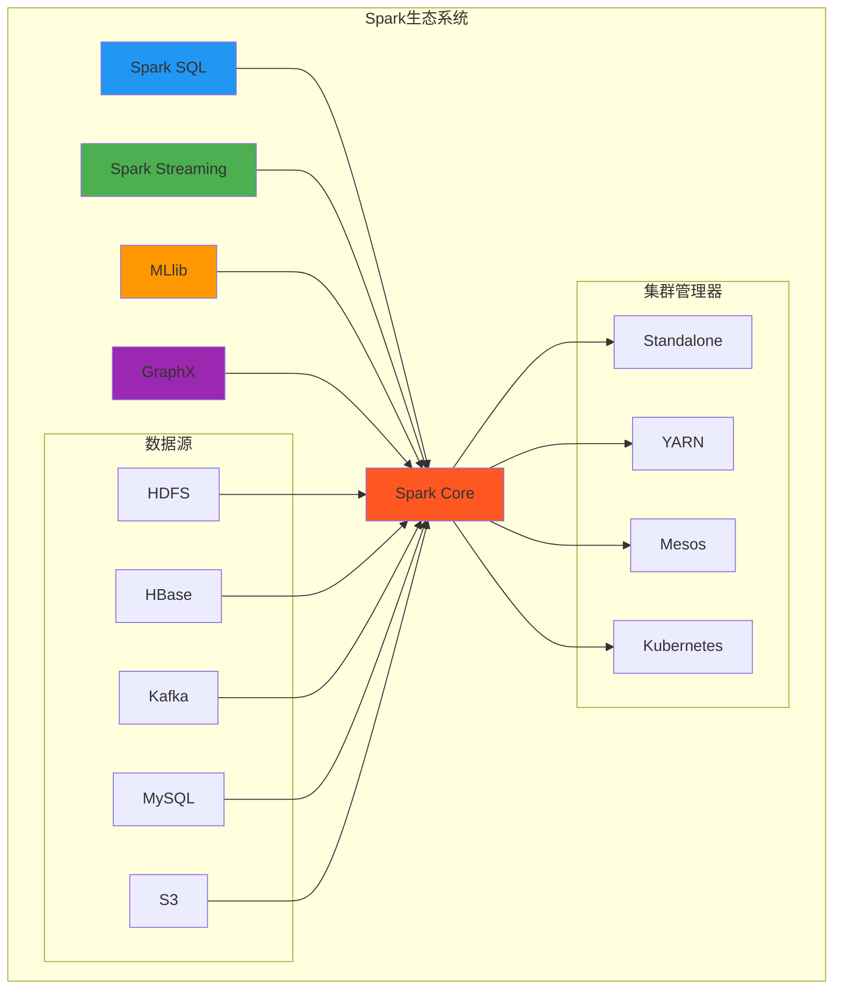
```mermaid
graph TB
    subgraph "Spark生态系统"
        A[Spark Core]

        B[Spark SQL] --> A
        C[Spark Streaming] --> A
        D[MLlib] --> A
        E[GraphX] --> A

        subgraph "数据源"
            F[HDFS]
            G[HBase]
            H[Kafka]
            I[MySQL]
            J[S3]
        end

        subgraph "集群管理器"
            K[Standalone]
            L[YARN]
            M[Mesos]
            N[Kubernetes]
        end

        F --> A
        G --> A
        H --> A
        I --> A
        J --> A

        A --> K
        A --> L
        A --> M
        A --> N
    end

    style A fill:#ff5722
    style B fill:#2196f3
    style C fill:#4caf50
    style D fill:#ff9800
    style E fill:#9c27b0
```

### 4.2 Spark Core：基础计算引擎

#### 4.2.1 核心功能

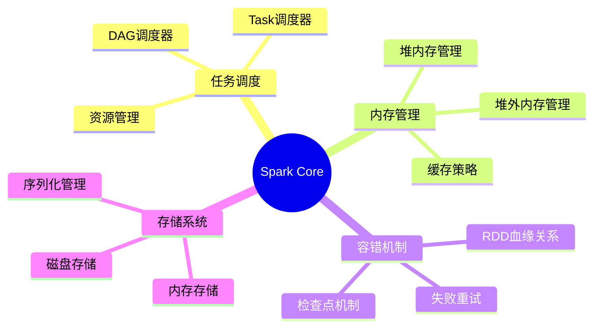
```mermaid
mindmap
  root((Spark Core))
    任务调度
      DAG调度器
      Task调度器
      资源管理
    内存管理
      堆内存管理
      堆外内存管理
      缓存策略
    容错机制
      RDD血缘关系
      检查点机制
      失败重试
    存储系统
      内存存储
      磁盘存储
      序列化管理
```

#### 4.2.2 RDD API 示例

**转换操作流程：**

```mermaid
graph LR
    A[原始数据集] --> B[map: 数据转换]
    B --> C[filter: 数据过滤]
    C --> D[groupByKey: 分组]
    D --> E[mapValues: 值转换]
    E --> F[cache: 缓存结果]
    F --> G[count: 行动操作]

    style G fill:#ff5722
```

### 4.3 Spark SQL：结构化数据处理

#### 4.3.1 Spark SQL 架构

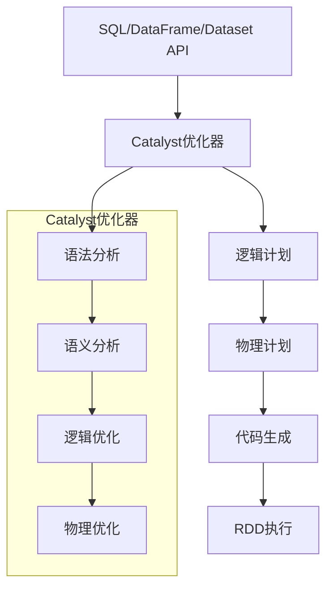
```mermaid
graph TB
    A[SQL/DataFrame/Dataset API] --> B[Catalyst优化器]
    B --> C[逻辑计划]
    C --> D[物理计划]
    D --> E[代码生成]
    E --> F[RDD执行]

    subgraph "Catalyst优化器"
        G[语法分析]
        H[语义分析]
        I[逻辑优化]
        J[物理优化]
    end

    B --> G
    G --> H
    H --> I
    I --> J
```

#### 4.3.2 数据抽象层次

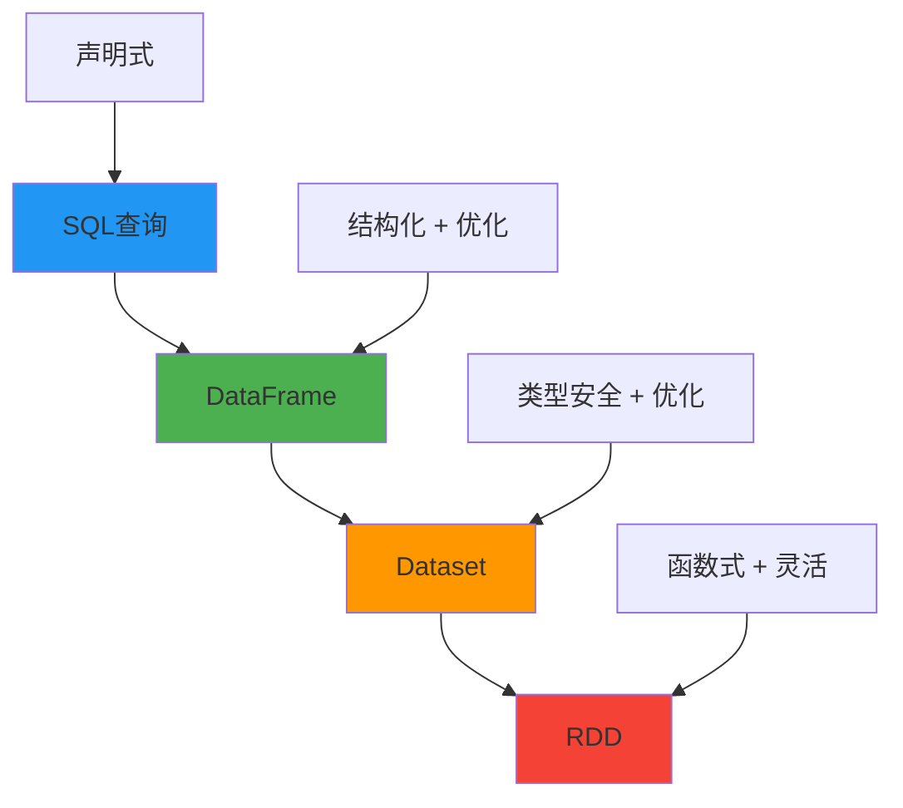
```mermaid
graph TD
    A[SQL查询] --> B[DataFrame]
    B --> C[Dataset]
    C --> D[RDD]

    A1[声明式] --> A
    B1[结构化 + 优化] --> B
    C1[类型安全 + 优化] --> C
    D1[函数式 + 灵活] --> D

    style A fill:#2196f3
    style B fill:#4caf50
    style C fill:#ff9800
    style D fill:#f44336
```

### 4.4 Spark Streaming：实时流处理

#### 4.4.1 Spark Streaming 工作原理

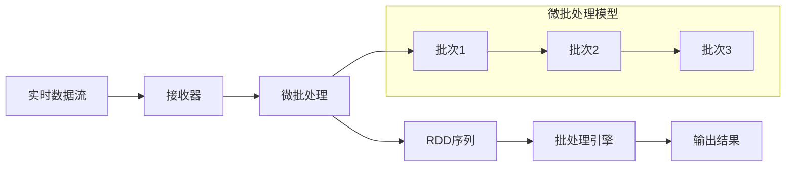
```mermaid
graph LR
    A[实时数据流] --> B[接收器]
    B --> C[微批处理]
    C --> D[RDD序列]
    D --> E[批处理引擎]
    E --> F[输出结果]

    subgraph "微批处理模型"
        G[批次1] --> H[批次2] --> I[批次3]
    end

    C --> G
```

#### 4.4.2 DStream 操作

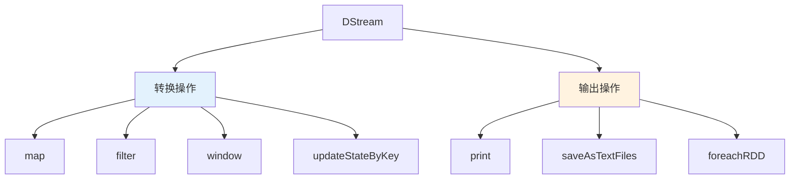
```mermaid
graph TD
    A[DStream] --> B[转换操作]
    A --> C[输出操作]

    B --> B1[map]
    B --> B2[filter]
    B --> B3[window]
    B --> B4[updateStateByKey]

    C --> C1[print]
    C --> C2[saveAsTextFiles]
    C --> C3[foreachRDD]

    style B fill:#e3f2fd
    style C fill:#fff3e0
```

### 4.5 MLlib：机器学习库

#### 4.5.1 MLlib 功能模块

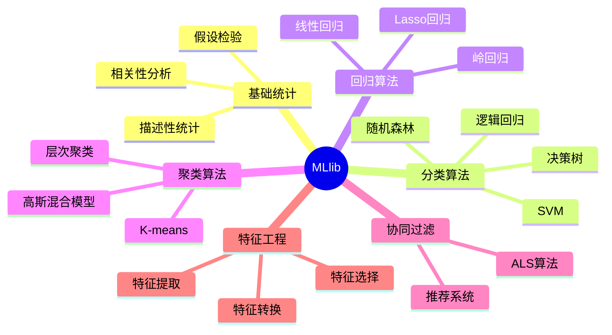
```mermaid
mindmap
  root((MLlib))
    基础统计
      描述性统计
      相关性分析
      假设检验
    分类算法
      逻辑回归
      决策树
      随机森林
      SVM
    回归算法
      线性回归
      岭回归
      Lasso回归
    聚类算法
      K-means
      高斯混合模型
      层次聚类
    协同过滤
      ALS算法
      推荐系统
    特征工程
      特征提取
      特征选择
      特征转换
```

#### 4.5.2 机器学习管道

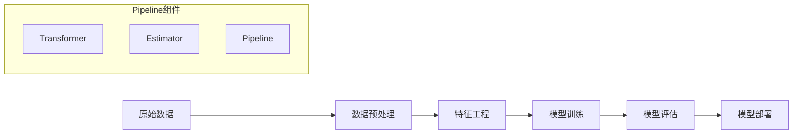
```mermaid
graph LR
    A[原始数据] --> B[数据预处理]
    B --> C[特征工程]
    C --> D[模型训练]
    D --> E[模型评估]
    E --> F[模型部署]

    subgraph "Pipeline组件"
        G[Transformer]
        H[Estimator]
        I[Pipeline]
    end
```

### 4.6 GraphX：图计算

#### 4.6.1 图数据模型

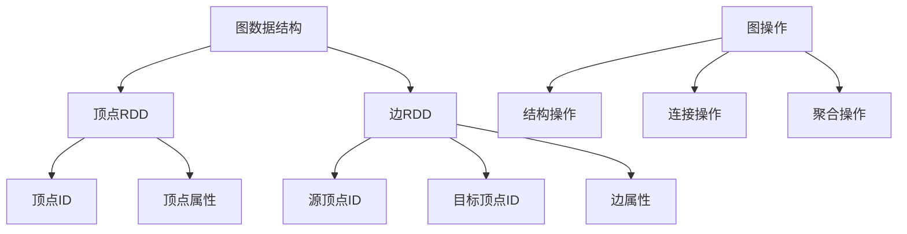
```mermaid
graph TD
    A[图数据结构] --> B[顶点RDD]
    A --> C[边RDD]

    B --> B1[顶点ID]
    B --> B2[顶点属性]

    C --> C1[源顶点ID]
    C --> C2[目标顶点ID]
    C --> C3[边属性]

    D[图操作] --> D1[结构操作]
    D --> D2[连接操作]
    D --> D3[聚合操作]
```

## 第五层：分析 Spark 的技术优势与特点

### 5.1 性能优势对比

#### 5.1.1 Spark vs Hadoop MapReduce

```mermaid
graph TD
    subgraph "Hadoop MapReduce"
        A1[数据] --> B1[Map]
        B1 --> C1[磁盘写入]
        C1 --> D1[Shuffle]
        D1 --> E1[磁盘读取]
        E1 --> F1[Reduce]
        F1 --> G1[结果]
    end

    subgraph "Spark"
        A2[数据] --> B2[转换操作链]
        B2 --> C2[内存计算]
        C2 --> D2[DAG优化]
        D2 --> E2[结果]
    end

    H[性能对比] --> I[内存中快100倍]
    H --> J[磁盘上快10倍]

    style C1 fill:#ff9999
    style E1 fill:#ff9999
    style C2 fill:#c8e6c9
```

> [!IMPORTANT]
> 性能提升并非魔法：Spark的性能优势主要体现在迭代计算和交互式查询场景。对于简单的一次性ETL作业，性能提升可能不如预期。选择技术时要根据具体场景需求。

#### 5.1.2 内存计算优势

```mermaid
pie title Spark性能提升来源
    "内存计算" : 60
    "DAG优化" : 25
    "代码生成" : 10
    "其他优化" : 5
```

### 5.2 易用性特点

#### 5.2.1 多语言支持

```mermaid
graph TB
    A[Spark Core] --> B[Scala API]
    A --> C[Java API]
    A --> D[Python API]
    A --> E[R API]
    A --> F[SQL API]

    G[统一编程模型] --> H[相同概念]
    G --> I[一致API]
    G --> J[共享数据结构]
```

#### 5.2.2 丰富的 API 层次

```mermaid
graph TD
    A[高级API] --> A1[SQL]
    A --> A2[DataFrame]
    A --> A3[Dataset]

    B[中级API] --> B1[RDD]

    C[底层API] --> C1[分布式变量]
    C --> C2[自定义分区器]

    D[易用性递增] --> A
    E[灵活性递增] --> C
```

### 5.3 通用性分析

#### 5.3.1 统一的大数据处理平台

```mermaid
graph LR
    A[单一Spark平台] --> B[批处理]
    A --> C[流处理]
    A --> D[交互式查询]
    A --> E[机器学习]
    A --> F[图计算]

    G[传统方案] --> H[Hadoop MapReduce]
    G --> I[Storm/Kafka]
    G --> J[Impala/Presto]
    G --> K[Mahout/Weka]
    G --> L[Giraph/Neo4j]

    style A fill:#4caf50
    style G fill:#ff5722
```

> [!NOTE]
> 架构统一的价值：使用单一平台处理多种工作负载，可以减少技术栈复杂性，降低运维成本，提高开发效率，并且数据可以在不同组件间无缝流转。

## 第六层：实际应用场景与案例分析

### 6.1 应用场景分类

```mermaid
mindmap
  root((Spark应用场景))
    数据处理
      ETL处理
      数据清洗
      数据集成
      数据转换
    实时分析
      实时监控
      异常检测
      实时推荐
      实时报表
    机器学习
      预测分析
      用户画像
      风险评估
      个性化推荐
    图分析
      社交网络分析
      欺诈检测
      路径优化
      知识图谱
```

### 6.2 行业应用案例

#### 6.2.1 电商行业应用架构

```mermaid
graph TD
    subgraph "数据源"
        A[用户行为日志]
        B[交易数据]
        C[商品信息]
        D[用户画像]
    end

    subgraph "Spark处理层"
        E[Spark Streaming] --> F[实时推荐]
        G[Spark SQL] --> H[数据仓库]
        I[MLlib] --> J[机器学习模型]
    end

    subgraph "应用服务"
        K[个性化推荐]
        L[用户分析]
        M[销售预测]
        N[库存优化]
    end

    A --> E
    B --> G
    C --> G
    D --> I

    F --> K
    H --> L
    J --> M
    J --> N
```

#### 6.2.2 金融行业风控系统

```mermaid
graph LR
    A[交易数据] --> B[Spark Streaming]
    B --> C[实时风控规则]
    C --> D{风险评估}
    D -->|高风险| E[阻断交易]
    D -->|低风险| F[正常通过]

    G[历史数据] --> H[MLlib训练]
    H --> I[风控模型]
    I --> C

    style E fill:#ff5722
    style F fill:#4caf50
```

### 6.3 性能调优实践

#### 6.3.1 Spark 调优策略

```mermaid
graph TB
    A[Spark性能调优] --> B[资源配置优化]
    A --> C[代码层面优化]
    A --> D[存储优化]
    A --> E[序列化优化]

    B --> B1[合理设置Executor数量]
    B --> B2[优化内存分配]
    B --> B3[调整并行度]

    C --> C1[减少数据倾斜]
    C --> C2[使用广播变量]
    C --> C3[避免Shuffle操作]

    D --> D1[选择合适存储级别]
    D --> D2[使用缓存策略]

    E --> E1[使用Kryo序列化]
    E --> E2[注册自定义类]
```

> [!TIP]
> 性能调优经验：80%的性能问题来自于数据倾斜和过多的Shuffle操作。优先解决这两个问题，通常能获得显著的性能提升。

> [!CAUTION]
> 调优需要测试：性能调优参数因数据集和集群环境而异，不要盲目复制他人的配置。建议在测试环境中验证调优效果后再应用到生产环境。

## 第七层：Spark 的未来发展与总结

### 7.1 技术发展趋势

```mermaid
timeline
    title Spark未来发展路线图
    2024 : Spark 4.0发布
         : 性能进一步提升
    2025 : 云原生集成深化
         : Kubernetes支持增强
    2026 : AI集成更加紧密
         : 深度学习框架整合
    2027 : 流批一体化
         : 统一计算模型
```

### 7.2 与其他技术的协同发展

```mermaid
graph TB
    A[Spark] --> B[云计算]
    A --> C[人工智能]
    A --> D[边缘计算]
    A --> E[容器化技术]

    B --> B1[AWS EMR]
    B --> B2[Azure HDInsight]
    B --> B3[Google Dataproc]

    C --> C1[TensorFlow]
    C --> C2[PyTorch]
    C --> C3[深度学习]

    D --> D1[边缘AI]
    D --> D2[IoT处理]

    E --> E1[Docker]
    E --> E2[Kubernetes]
```

### 7.3 学习建议与路径

```mermaid
graph TD
    A[Spark学习路径] --> B[基础阶段]
    A --> C[进阶阶段]
    A --> D[高级阶段]
    A --> E[专家阶段]

    B --> B1[理解大数据概念]
    B --> B2[掌握Scala/Python基础]
    B --> B3[学习RDD操作]

    C --> C1[深入理解Spark架构]
    C --> C2[掌握各组件使用]
    C --> C3[实践项目开发]

    D --> D1[性能调优技巧]
    D --> D2[集群部署管理]
    D --> D3[源码阅读理解]

    E --> E1[架构设计能力]
    E --> E2[技术选型决策]
    E --> E3[团队技术指导]
```

## 总结

Spark 作为新一代大数据处理框架，通过内存计算、统一编程模型、丰富的生态系统等核心优势，已经成为大数据处理领域的事实标准。它不仅解决了传统批处理的效率问题，还提供了流处理、机器学习、图计算等多种能力，真正实现了"一站式"大数据处理平台的目标。

**核心价值总结：**

1. **技术价值**：内存计算带来的性能飞跃，DAG 执行引擎的优化能力
2. **生态价值**：统一的编程模型，丰富的组件生态
3. **商业价值**：降低大数据处理门槛，加速企业数字化转型
4. **发展价值**：持续的技术创新，与云计算、AI 等新技术的深度融合

随着数据量的持续增长和实时处理需求的提升，Spark 将继续在大数据处理领域发挥重要作用，成为构建现代数据平台的核心技术。

> [!NOTE]
> 学习建议：Spark生态系统庞大且持续发展，建议采用"深度优先"的学习策略：先深入掌握核心概念和一个主要组件，再横向扩展到其他组件，这样能更好地理解整体架构。

> [!TIP]
> 实践出真知：理论学习很重要，但Spark的精髓在于实践。建议通过实际项目来加深理解，从小数据集开始，逐步过渡到真实的大数据场景。
