# Spark 运行模式深度解析

## 第一层：基础概念理解

### 1.1 什么是 Spark 运行模式

Spark 运行模式是指 Spark 应用程序在不同环境中的部署和执行方式。它决定了：

- **资源如何分配**：CPU、内存、存储等计算资源的管理方式
- **任务如何调度**：作业分解、任务分发、执行监控的机制
- **故障如何处理**：容错、恢复、重试的策略

### 1.2 为什么需要不同的运行模式

不同的应用场景需要不同的资源管理策略：

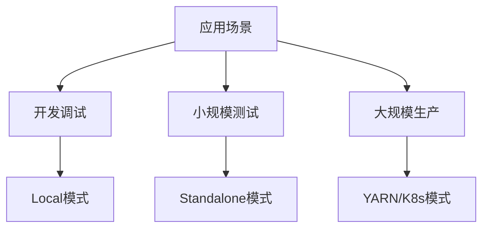

- **开发阶段**：需要快速启动、简单配置、便于调试
- **测试阶段**：需要模拟分布式环境、控制资源使用
- **生产阶段**：需要高可用、高扩展性、资源共享

### 1.3 运行模式的核心要素

每种运行模式都包含以下核心组件：

| 组件类型                   | 功能描述                 | 实现方式                       |
| -------------------------- | ------------------------ | ------------------------------ |
| **资源管理器**       | 负责集群资源的分配和调度 | 本地进程/独立调度器/外部管理器 |
| **驱动程序(Driver)** | 应用程序的主控制器       | 运行在本地/集群不同节点        |
| **执行器(Executor)** | 实际执行任务的工作进程   | 线程/进程/容器                 |
| **集群管理器**       | 协调整个集群的运行       | 内置/外部集群管理系统          |

## 第二层：运行模式分类体系

### 2.1 按部署规模分类

#### 单机模式

- **特点**：所有组件运行在单个 JVM 进程中
- **适用场景**：开发、调试、小数据量处理
- **优势**：配置简单、启动快速、便于调试
- **劣势**：资源受限、无法处理大数据

#### 集群模式

- **特点**：组件分布在多个节点上运行
- **适用场景**：生产环境、大数据处理
- **优势**：资源丰富、高可用、高扩展性
- **劣势**：配置复杂、部署成本高

### 2.2 按资源管理器分类

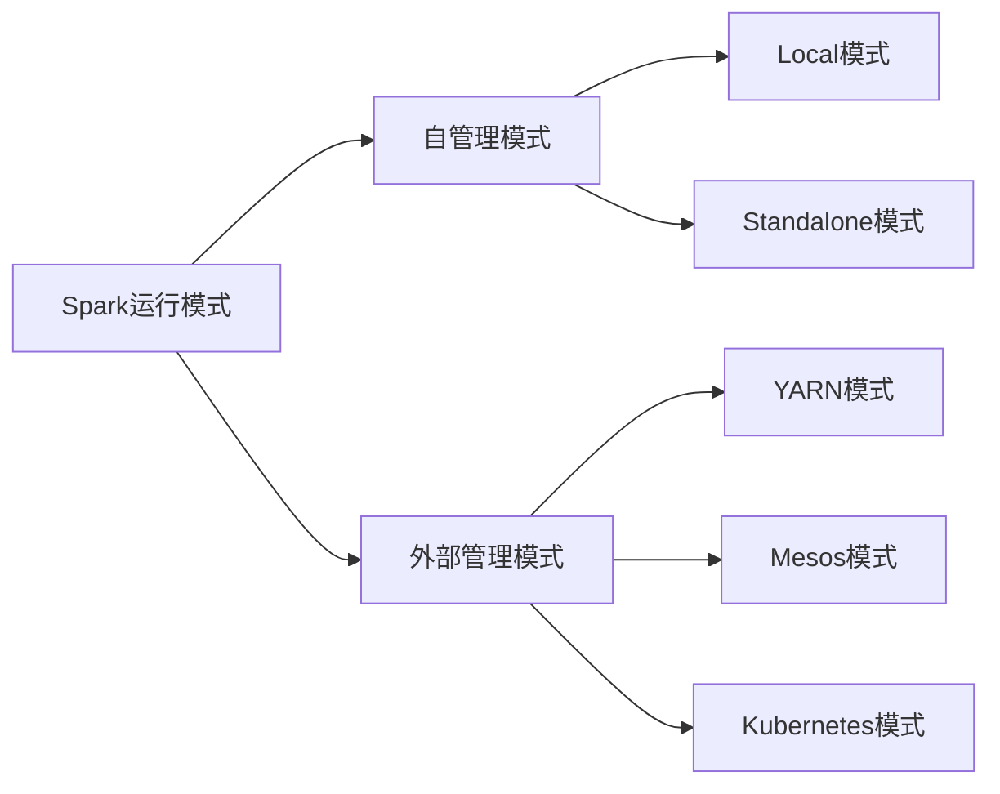

#### 自管理模式

- **Local 模式**：Spark 自己管理单机资源
- **Standalone 模式**：Spark 自带的集群管理器

#### 外部管理模式

- **YARN 模式**：依赖 Hadoop YARN 进行资源管理
- **Mesos 模式**：依赖 Apache Mesos 进行资源管理
- **Kubernetes 模式**：依赖 Kubernetes 进行容器化管理

## 第三层：具体模式深度解析

### 3.1 Local 模式详解

#### 3.1.1 基本原理

Local 模式是 Spark 最简单的运行方式，所有的 Spark 组件都运行在单个 JVM 进程中。

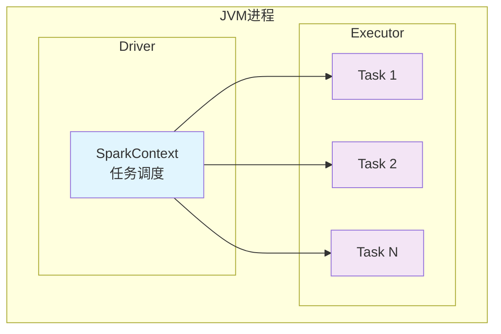

#### 3.1.2 配置方式

```scala
val spark = SparkSession.builder()
  .appName("LocalApp")
  .master("local")      // 单线程
  .master("local[2]")   // 2个线程
  .master("local[*]")   // 使用所有可用CPU核心
  .getOrCreate()
```

#### 3.1.3 适用场景

- **开发调试**：快速验证代码逻辑
- **算法原型**：小数据集上的算法测试
- **教学演示**：无需复杂环境配置

#### 3.1.4 性能特点

- **优势**：启动速度快、调试方便、无网络开销
- **限制**：内存受限、无容错机制、不支持分布式特性

> [!WARNING]
> Local模式仅适用于开发和测试环境！在生产环境中使用会导致严重的性能瓶颈和单点故障风险。

> [!CAUTION]
> Local模式下的资源限制可能导致大数据集处理时出现内存溢出(OOM)错误，建议处理数据量不超过本机内存的50%。

### 3.2 Standalone 模式详解

#### 3.2.1 架构原理

Standalone 是 Spark 自带的集群管理器，提供简单的分布式资源管理。

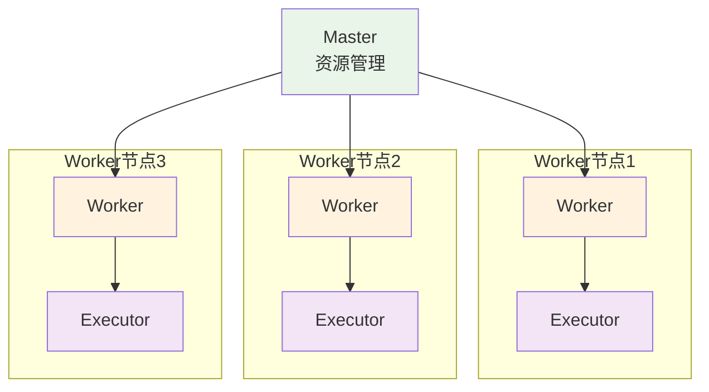

#### 3.2.2 核心组件

- **Master 节点**：集群资源管理，应用调度，健康监控
- **Worker 节点**：接收 Master 指令，管理本地资源，启动 Executor
- **Executor 进程**：运行具体任务，向 Driver 汇报状态

#### 3.2.3 部署配置

```bash
# 启动Master
$SPARK_HOME/sbin/start-master.sh

# 启动Worker (连接到Master)
$SPARK_HOME/sbin/start-worker.sh spark://master-host:7077

# 提交应用
spark-submit --master spark://master-host:7077 \
  --class MyApp \
  my-app.jar
```

#### 3.2.4 优势与限制

**优势**：

- 配置简单，无外部依赖
- 完整的 Web UI 监控
- 支持多种资源调度策略

**限制**：

- 功能相对简单
- 缺乏企业级特性（如资源队列、细粒度权限控制）
- 在大规模集群中管理复杂

> [!NOTE]
> Standalone模式最适合中小规模团队和简单的大数据处理场景。对于企业级应用，建议考虑YARN或Kubernetes模式。

### 3.3 YARN 模式详解

#### 3.3.1 YARN 架构回顾

YARN (Yet Another Resource Negotiator) 是 Hadoop 2.x 引入的资源管理框架。

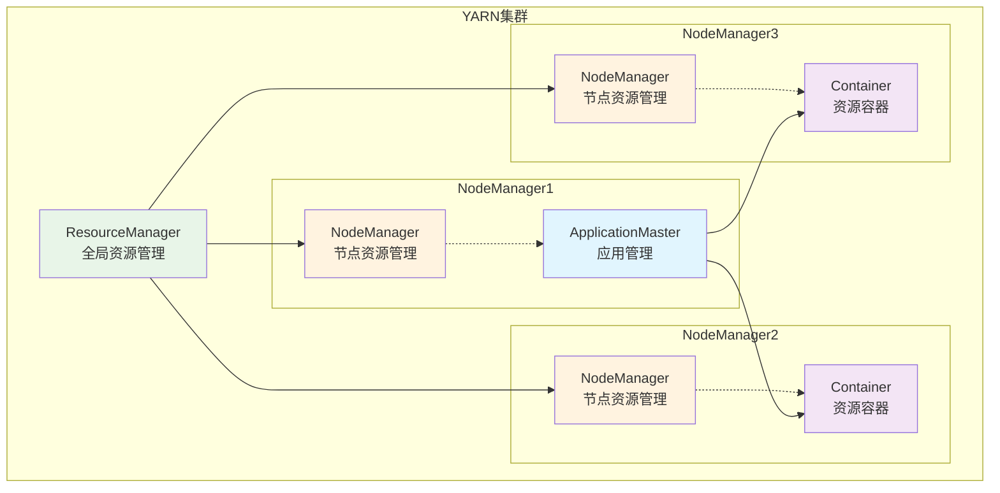

#### 3.3.2 Spark on YARN 的两种模式

##### Cluster 模式

Driver 运行在集群中的 ApplicationMaster 内：

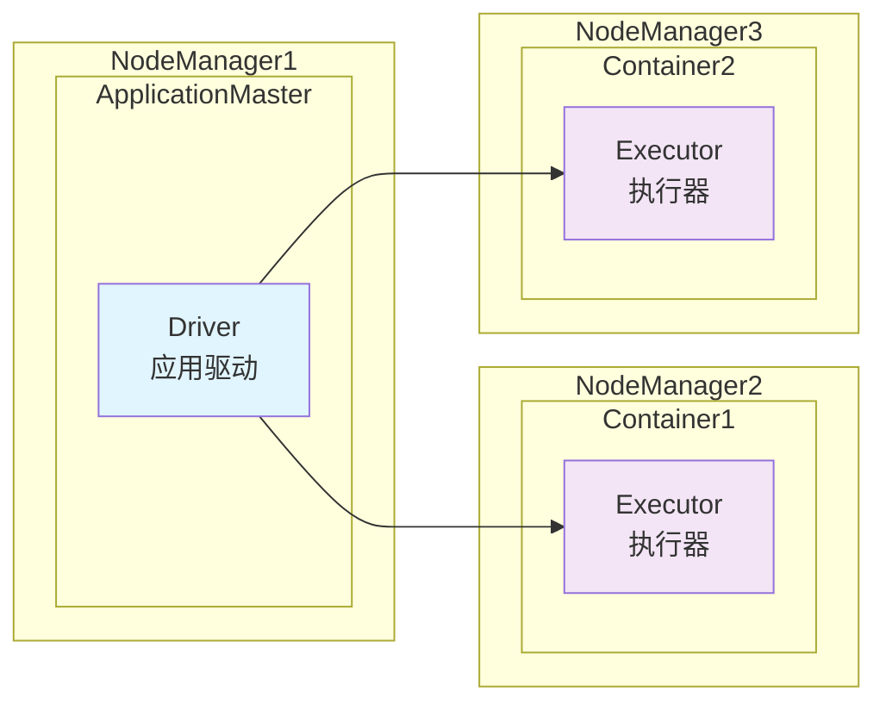

**特点**：

- Driver 运行在集群内，减少网络传输
- 适合生产环境，无需客户端长期连接
- 日志查看需要通过 YARN 界面

##### Client 模式

Driver 运行在提交作业的客户端：

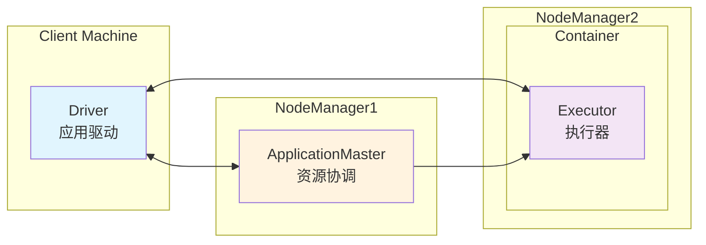

**特点**：

- Driver 在客户端，便于调试和日志查看
- 适合交互式作业和开发环境
- 需要客户端与集群保持连接

> [!IMPORTANT]
> 选择Client模式还是Cluster模式对应用性能和稳定性有重大影响：
> - **生产环境推荐Cluster模式**：避免客户端网络中断导致作业失败
> - **开发调试推荐Client模式**：便于实时查看日志和调试信息

#### 3.3.3 配置实例

```bash
# Cluster模式提交
spark-submit \
  --master yarn \
  --deploy-mode cluster \
  --num-executors 3 \
  --executor-memory 2g \
  --executor-cores 2 \
  --class MyApp \
  my-app.jar

# Client模式提交
spark-submit \
  --master yarn \
  --deploy-mode client \
  --num-executors 3 \
  --executor-memory 2g \
  --executor-cores 2 \
  --class MyApp \
  my-app.jar
```

#### 3.3.4 YARN 模式优势

- **资源共享**：与其他 Hadoop 生态组件共享集群资源
- **资源隔离**：队列机制实现多租户资源隔离
- **高可用**：ResourceManager HA 保证集群高可用
- **资源调度**：支持容量调度器、公平调度器等
- **安全性**：集成 Kerberos 认证，支持细粒度权限控制

### 3.4 Kubernetes 模式详解

#### 3.4.1 容器化趋势

随着云原生技术的发展，Kubernetes 成为容器编排的标准平台。

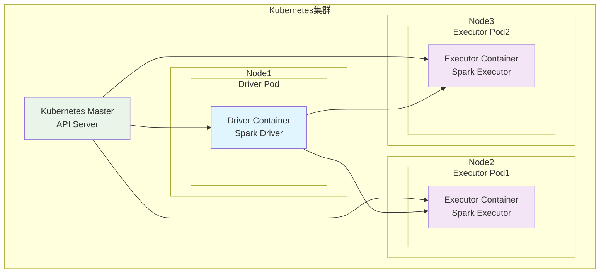

#### 3.4.2 Spark on Kubernetes 特点

- **动态资源分配**：根据作业需求动态创建/销毁 Pod
- **资源隔离**：基于命名空间和资源配额
- **服务发现**：利用 K8s 原生服务发现机制
- **存储集成**：支持多种存储卷类型

#### 3.4.3 配置示例

```bash
spark-submit \
  --master k8s://https://kubernetes-api-server:6443 \
  --deploy-mode cluster \
  --name spark-pi \
  --conf spark.executor.instances=3 \
  --conf spark.kubernetes.container.image=spark:latest \
  --conf spark.kubernetes.namespace=spark-jobs \
  local:///path/to/examples.jar
```

> [!TIP]
> Kubernetes模式的最佳实践：
> - 使用专用的命名空间隔离Spark作业
> - 配置适当的资源限制和请求
> - 使用持久化卷存储检查点数据
> - 启用动态分配以优化资源使用

### 3.5 Mesos 模式

#### 3.5.1 Mesos 架构

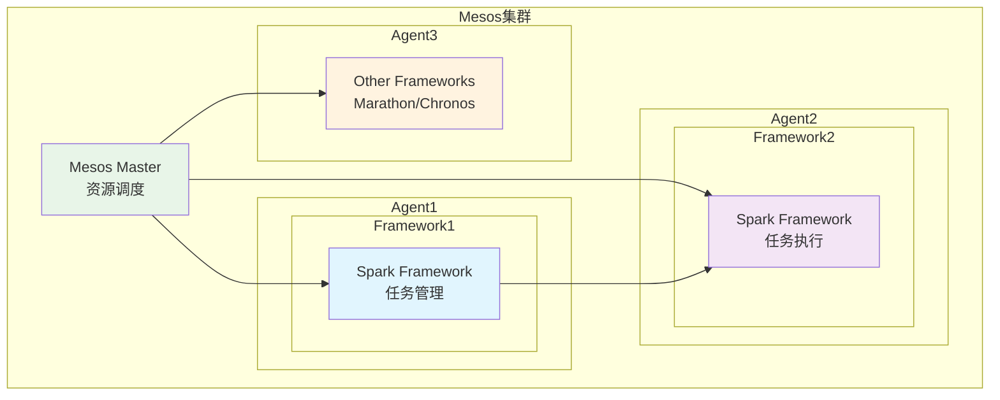

#### 3.5.2 特点

- **双级调度**：Mesos 提供资源，Framework 决定如何使用
- **资源抽象**：统一管理 CPU、内存、磁盘、网络
- **多框架支持**：同时运行 Spark、Marathon、Chronos 等

## 第四层：架构角色深度分析

### 4.1 YARN 架构角色详解

#### 4.1.1 角色层次结构

```
资源管理层：
├── ResourceManager (集群级别)
│   ├── 调度器(Scheduler)
│   ├── 应用管理器(ApplicationsManager)
│   └── 资源追踪器(ResourceTracker)
└── NodeManager (节点级别)
    ├── 容器监控器(ContainerMonitor)
    ├── 节点健康检查器(NodeHealthChecker)
    └── 本地化服务(LocalizationService)

应用管理层：
├── ApplicationMaster (应用级别)
│   ├── 资源协商器(ResourceNegotiator)
│   ├── 任务调度器(TaskScheduler)
│   └── 进度跟踪器(ProgressTracker)
└── Container (任务级别)
    └── 任务执行环境
```

#### 4.1.2 工作流程

1. **应用提交**：客户端向 ResourceManager 提交应用
2. **AM 启动**：ResourceManager 为应用分配容器启动 ApplicationMaster
3. **资源申请**：ApplicationMaster 向 ResourceManager 申请资源
4. **容器分配**：ResourceManager 分配容器给 ApplicationMaster
5. **任务执行**：ApplicationMaster 在容器中启动任务
6. **状态汇报**：任务状态通过 AM 汇报给 ResourceManager

### 4.2 Spark 架构角色详解

#### 4.2.1 角色层次结构

```
资源管理层：
├── Master (集群级别)
│   ├── 集群状态管理器(ClusterStateManager)
│   ├── 应用调度器(ApplicationScheduler)
│   └── 资源分配器(ResourceAllocator)
└── Worker (节点级别)
    ├── 执行器管理器(ExecutorManager)
    ├── 资源监控器(ResourceMonitor)
    └── 心跳服务(HeartbeatService)

应用管理层：
├── Driver (应用级别)
│   ├── SparkContext
│   ├── 任务调度器(TaskScheduler)
│   ├── DAG调度器(DAGScheduler)
│   └── 块管理器(BlockManager)
└── Executor (执行级别)
    ├── 任务运行器(TaskRunner)
    ├── 内存管理器(MemoryManager)
    ├── 洗牌管理器(ShuffleManager)
    └── 存储管理器(StorageManager)
```

#### 4.2.2 不同模式下的角色分工

| 运行模式             | Driver 位置 | Executor 管理 | 资源调度     | 故障恢复       |
| -------------------- | ----------- | ------------- | ------------ | -------------- |
| **Local**      | 本地 JVM    | 本地线程      | 操作系统     | 无             |
| **Standalone** | 客户端/集群 | Spark Worker  | Spark Master | 简单重启       |
| **YARN**       | 客户端/AM   | YARN 容器     | YARN RM      | AM 重启        |
| **Kubernetes** | Pod         | Pod           | K8s 调度器   | Pod 重建       |
| **Mesos**      | 客户端/集群 | Mesos 任务    | Mesos Master | Framework 重启 |

## 第五层：生产环境选择策略

### 5.1 选择决策矩阵

#### 5.1.1 技术维度对比

| 维度                 | Local | Standalone | YARN       | Kubernetes | Mesos      |
| -------------------- | ----- | ---------- | ---------- | ---------- | ---------- |
| **部署复杂度** | ⭐    | ⭐⭐       | ⭐⭐⭐     | ⭐⭐⭐⭐   | ⭐⭐⭐⭐   |
| **资源管理**   | ⭐    | ⭐⭐⭐     | ⭐⭐⭐⭐⭐ | ⭐⭐⭐⭐⭐ | ⭐⭐⭐⭐⭐ |
| **扩展性**     | ⭐    | ⭐⭐⭐     | ⭐⭐⭐⭐⭐ | ⭐⭐⭐⭐⭐ | ⭐⭐⭐⭐⭐ |
| **高可用**     | ⭐    | ⭐⭐       | ⭐⭐⭐⭐⭐ | ⭐⭐⭐⭐⭐ | ⭐⭐⭐⭐⭐ |
| **生态集成**   | ⭐    | ⭐⭐       | ⭐⭐⭐⭐⭐ | ⭐⭐⭐⭐   | ⭐⭐⭐     |
| **监控运维**   | ⭐⭐  | ⭐⭐⭐     | ⭐⭐⭐⭐⭐ | ⭐⭐⭐⭐   | ⭐⭐⭐     |

#### 5.1.2 场景适用性

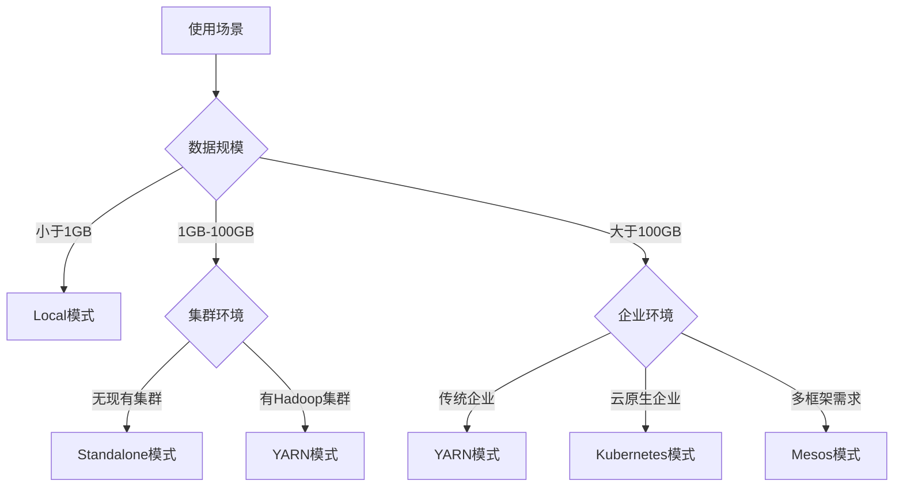

### 5.2 性能基准测试

> [!IMPORTANT]
> 性能基准测试结果仅供参考，实际性能会因硬件配置、网络环境、数据特征等因素而有显著差异。建议在目标环境中进行实际测试。

#### 5.2.1 启动时间对比

```mermaid
gantt
    title 启动时间对比(3节点集群，每节点8核16GB内存)
    dateFormat X
    axisFormat %s秒

    section 运行模式
    Local模式        :2, 2
    Standalone模式   :8, 8
    YARN模式         :12, 12
    Kubernetes模式   :16, 16
```

#### 5.2.2 吞吐量对比

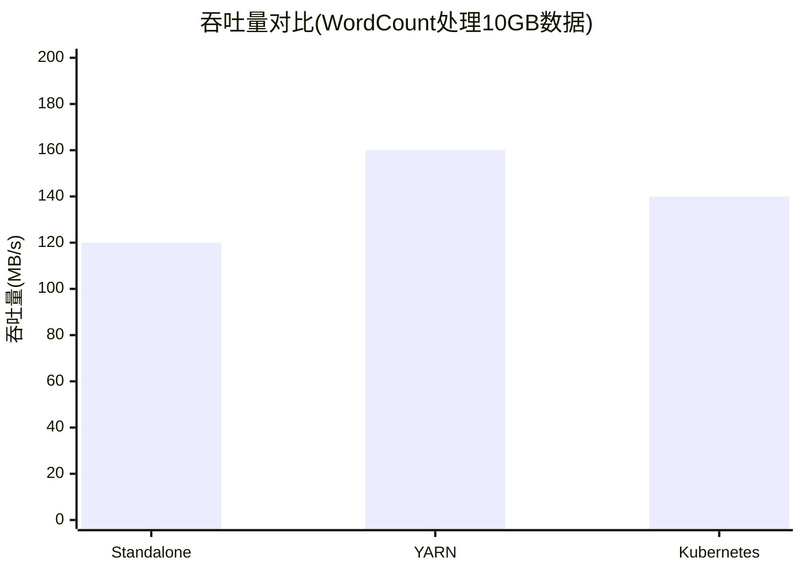

### 5.3 企业级选择建议

#### 5.3.1 传统企业(已有 Hadoop 生态)

**推荐：YARN 模式**

- **理由**：
  - 充分利用现有 Hadoop 投资
  - 与 HDFS、HBase 等无缝集成
  - 成熟的运维体系和人才储备
  - 丰富的企业级特性

**配置建议**：

```yaml
资源配置：
- 队列隔离：按部门/项目划分资源队列
- 资源限制：设置最大资源使用量
- 优先级：重要作业优先调度

安全配置：
- Kerberos认证
- YARN队列权限控制
- HDFS目录权限管理

监控配置：
- Spark History Server
- YARN Resource Manager UI
- Grafana + Prometheus监控
```

> [!WARNING]
> 在YARN环境中务必注意以下安全配置：
> - 启用Kerberos认证防止未授权访问
> - 配置SSL加密保护数据传输
> - 设置合适的文件权限防止数据泄露

#### 5.3.2 云原生企业

**推荐：Kubernetes 模式**

- **理由**：
  - 统一的容器化平台
  - 弹性扩缩容能力
  - 多云部署支持
  - DevOps 友好

**配置建议**：

```yaml
资源配置：
- Namespace隔离
- ResourceQuota限制
- HPA自动扩缩容
- 多可用区部署

存储配置：
- PersistentVolume for checkpoints
- 对象存储(S3/OSS)集成
- 缓存层优化

网络配置：
- Service Mesh集成
- Ingress暴露服务
- NetworkPolicy安全策略
```

> [!TIP]
> 云原生部署的性能优化建议：
> - 使用SSD存储提升I/O性能
> - 配置亲和性规则优化Pod调度
> - 启用水平自动扩缩容(HPA)
> - 使用本地SSD作为临时存储

#### 5.3.3 小规模企业/团队

**推荐：Standalone 模式**

- **理由**：
  - 部署简单，维护成本低
  - 功能满足基本需求
  - 无需额外学习成本

**配置建议**：

```bash
# 集群配置
export SPARK_MASTER_HOST=master-node
export SPARK_MASTER_PORT=7077
export SPARK_WORKER_MEMORY=4g
export SPARK_WORKER_CORES=2

# 高可用配置(可选)
export SPARK_DAEMON_JAVA_OPTS="-Dspark.deploy.recoveryMode=ZOOKEEPER"
```

> [!NOTE]
> Standalone模式虽然配置简单，但在高可用性要求较高的场景下，建议：
> - 配置ZooKeeper实现Master高可用
> - 定期备份应用程序和数据
> - 监控集群健康状态和资源使用情况
