# Spark：分布式计算引擎框架深度解析

> [!NOTE]
> 本文档将深入探讨从单机计算到分布式计算的演进历程，重点分析Spark框架的核心优势和架构设计。

## 第一章：从单机到分布式计算的演进之路

### 1.1 计算的本质理解

在深入了解分布式计算之前，我们首先需要理解计算的本质。计算是对数据进行处理、变换和分析的过程，目标是从原始数据中提取有价值的信息。随着数据量的爆炸式增长，传统的单机计算模式面临着前所未有的挑战。

### 1.2 单机计算模式的局限性

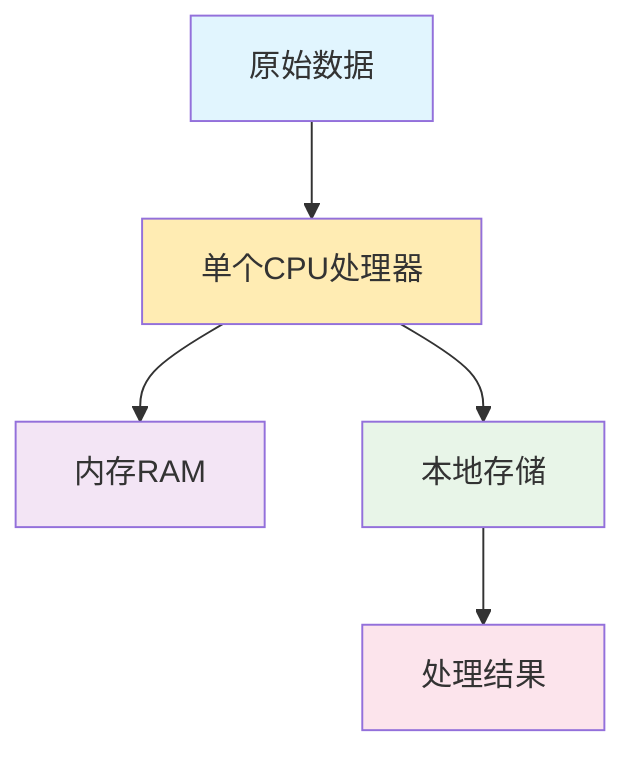

**单机计算模式特点分析：**

> [!WARNING]
> 单机计算模式在处理大规模数据时存在严重瓶颈，可能导致系统性能急剧下降甚至崩溃。

1. **处理能力有限**：受制于单个处理器的计算能力，无法并行处理
2. **内存容量限制**：单机内存有上限，无法处理超大规模数据集
3. **存储空间约束**：本地存储容量有限，大数据存储成本高
4. **容错能力弱**：单点故障会导致整个系统崩溃
5. **扩展性差**：硬件升级成本高，性能提升有瓶颈

### 1.3 分布式计算的革命性突破

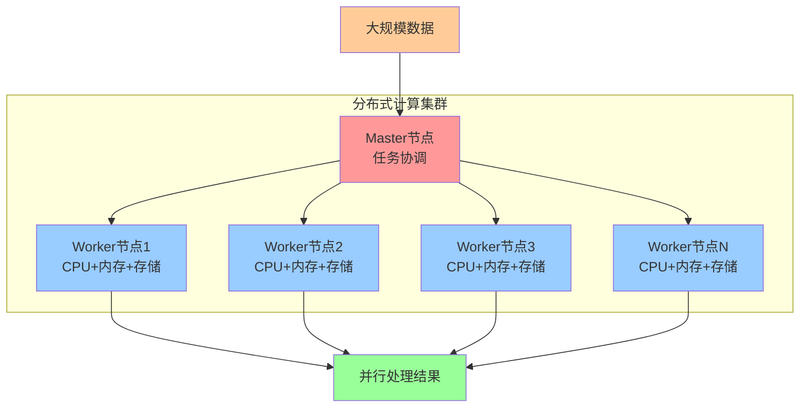

**分布式计算的核心优势：**

> [!IMPORTANT]
> 分布式计算通过水平扩展和并行处理，能够有效解决单机计算的性能瓶颈，是处理大数据的关键技术。

1. **水平扩展**：通过增加节点数量线性提升处理能力
2. **并行处理**：多个节点同时处理不同数据块，显著提升效率
3. **容错机制**：单个节点故障不影响整体系统运行
4. **资源共享**：集群内资源动态分配，提高利用率
5. **成本效益**：使用普通硬件构建高性能计算集群

## 第二章：分布式系统的核心架构原理

### 2.1 分布式系统的三大支柱

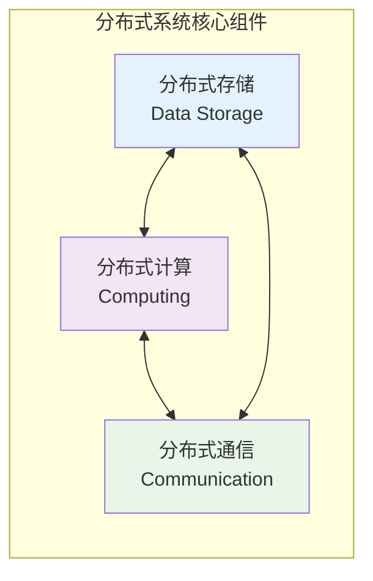

#### 2.1.1 分布式存储详解

**核心概念：**

> [!NOTE]
> 分布式存储通过数据分片和副本机制，实现了数据的高可用性和可靠性保证。

- **数据分片（Sharding）**：将大数据集切分成小块，分布存储在多个节点
- **副本机制（Replication）**：为每个数据块创建多个副本，提高可靠性
- **一致性保证**：确保分布式环境下数据的一致性和完整性

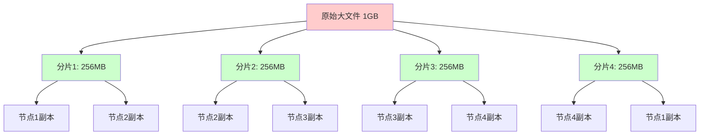

#### 2.1.2 分布式计算模型

**Map-Reduce 计算范式：**

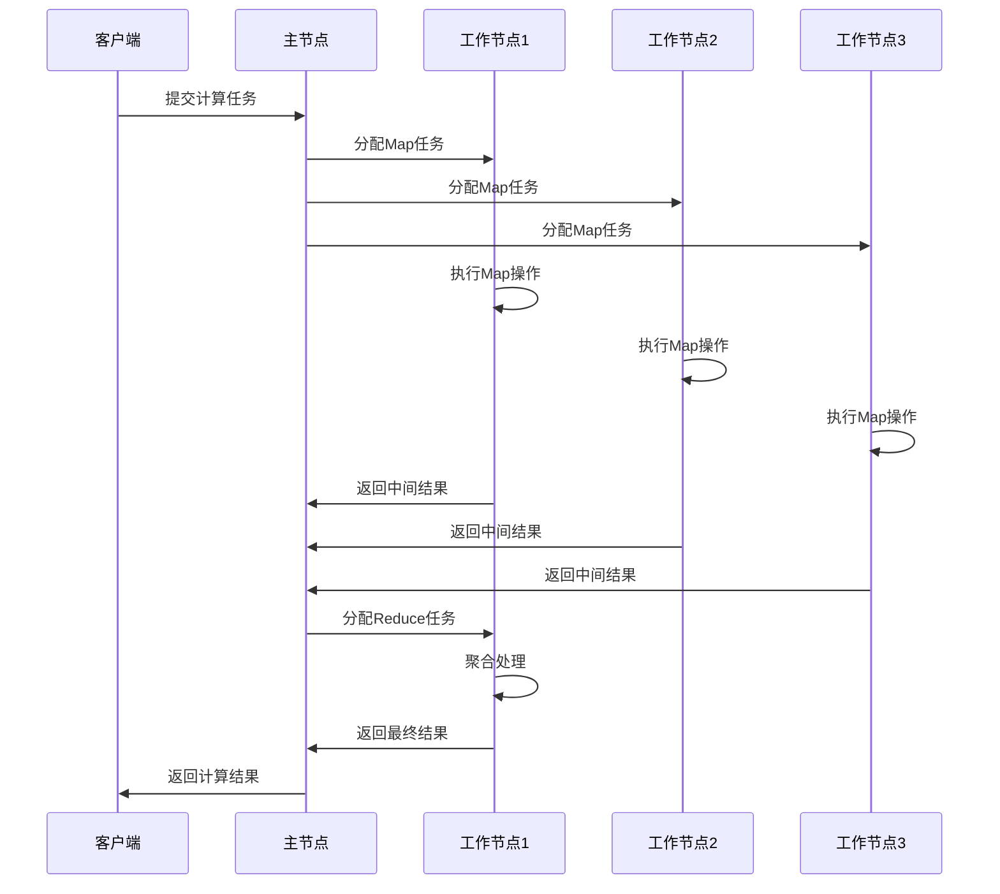

### 2.2 集群架构模式对比

#### 2.2.1 中心化架构

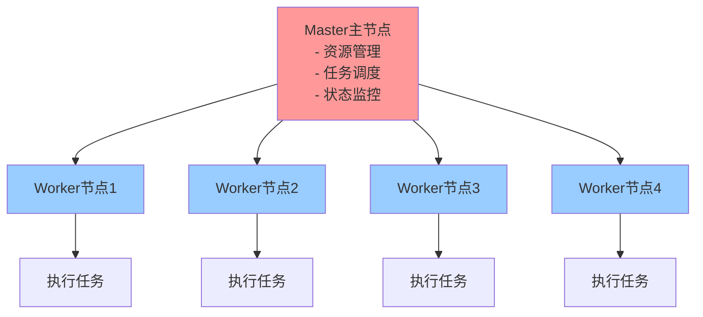

**中心化架构特点：**

> [!CAUTION]
> 中心化架构虽然管理简单，但存在单点故障风险，主节点故障可能导致整个系统不可用。

- ✅ **优势**：统一管理，调度高效，资源可视化强
- ❌ **劣势**：单点故障风险，主节点成为性能瓶颈

#### 2.2.2 去中心化架构

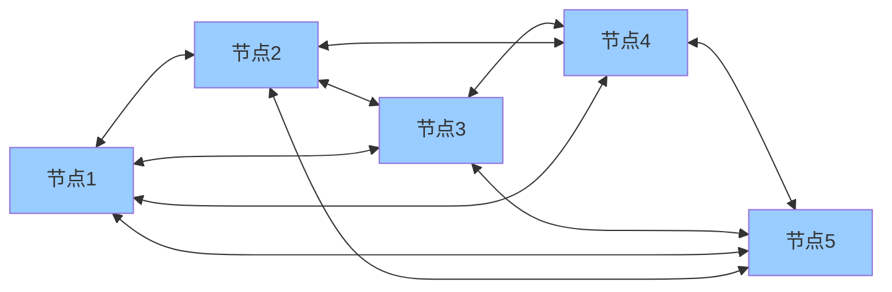

**去中心化架构特点：**

- ✅ **优势**：高可用性，无单点故障，扩展性强
- ❌ **劣势**：一致性维护复杂，管理难度大

## 第三章：从 MapReduce 到 Spark 的技术演进

### 3.1 Hadoop MapReduce 的工作机制

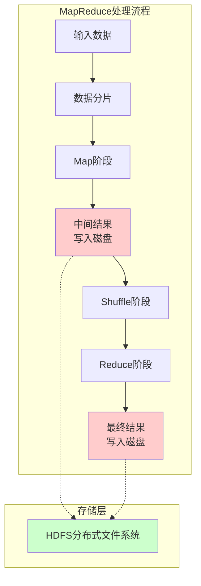

**MapReduce 的局限性分析：**

> [!CAUTION]
> MapReduce频繁的磁盘I/O操作严重影响性能，尤其在迭代计算场景下，效率极其低下。

1. **磁盘 I/O 瓶颈**：中间结果频繁读写磁盘，性能低下
2. **编程模型单一**：只支持 Map-Reduce 范式，灵活性差
3. **迭代计算效率低**：每次迭代都要重新读取数据
4. **启动开销大**：每个任务都需要 JVM 启动时间
5. **实时性差**：不适合流式处理和交互式查询

### 3.2 Spark 的革命性改进

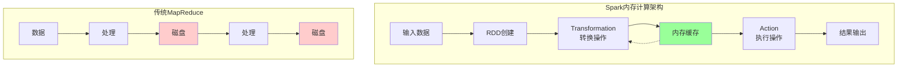

**Spark 的核心优势：**

> [!IMPORTANT]
> Spark通过内存计算和RDD抽象，实现了比MapReduce快10-100倍的处理速度，是大数据处理的重大突破。

1. **内存计算**：中间结果保存在内存中，避免磁盘 I/O
2. **RDD 抽象**：弹性分布式数据集，支持丰富的数据操作
3. **懒惰执行**：只有遇到 Action 操作才真正执行计算
4. **DAG 优化**：有向无环图优化执行计划
5. **多语言支持**：Scala、Java、Python、R 等

### 3.3 性能对比分析

```mermaid
%%{init: {"xyChart": {"width": 900, "height": 600}}}%%
xychart-beta
    title "Spark vs MapReduce 性能对比"
    x-axis ["迭代1", "迭代2", "迭代3", "迭代4", "迭代5"]
    y-axis "执行时间(秒)" 0 --> 100
    bar "MapReduce" [20, 40, 60, 80, 100]
    bar "Spark" [15, 18, 21, 24, 27]
```

**性能提升的关键因素：**

> [!TIP]
> 合理利用Spark的内存缓存机制，可以显著提升重复计算任务的性能，建议将频繁访问的数据集缓存到内存中。

- **内存计算**：相比磁盘 I/O，内存访问速度快 100-1000 倍
- **缓存机制**：重复使用的数据可以缓存在内存中
- **优化引擎**：Catalyst 优化器和 Tungsten 执行引擎

## 第四章：Spark 核心架构与组件详解

### 4.1 Spark 运行架构

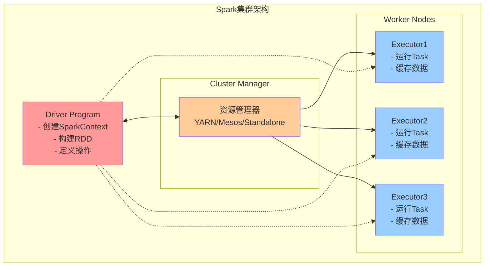

### 4.2 Spark 生态系统组件

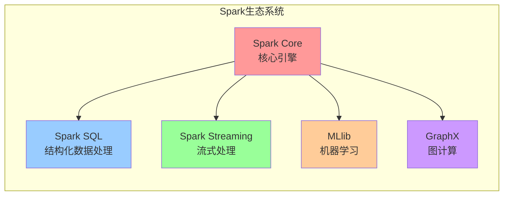

#### 4.2.1 各组件详细功能

> [!NOTE]
> Spark生态系统提供了完整的大数据处理解决方案，可以在单一平台上完成批处理、流处理、机器学习和图计算等多种任务。

**Spark Core：**

- RDD 抽象和操作
- 任务调度和内存管理
- 容错机制实现

**Spark SQL：**

- DataFrame 和 Dataset API
- SQL 查询支持
- 多种数据源连接

**Spark Streaming：**

- 微批处理模式
- 实时数据流处理
- 与 Kafka 等消息队列集成

**MLlib：**

- 分布式机器学习算法
- 特征工程工具
- 模型训练和评估

**GraphX：**

- 图数据结构支持
- 图算法库
- 社交网络分析

### 4.3 RDD 核心概念深度解析

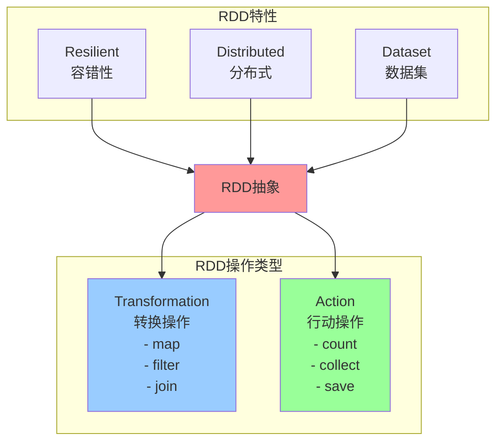

## 第五章：Spark 应用场景与最佳实践

### 5.1 典型应用场景

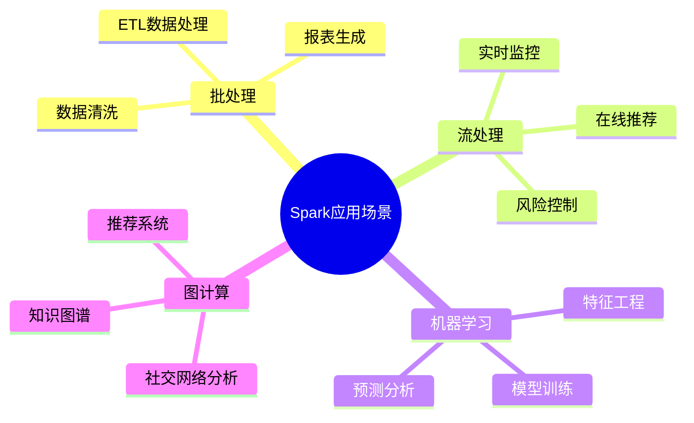

### 5.2 性能优化策略

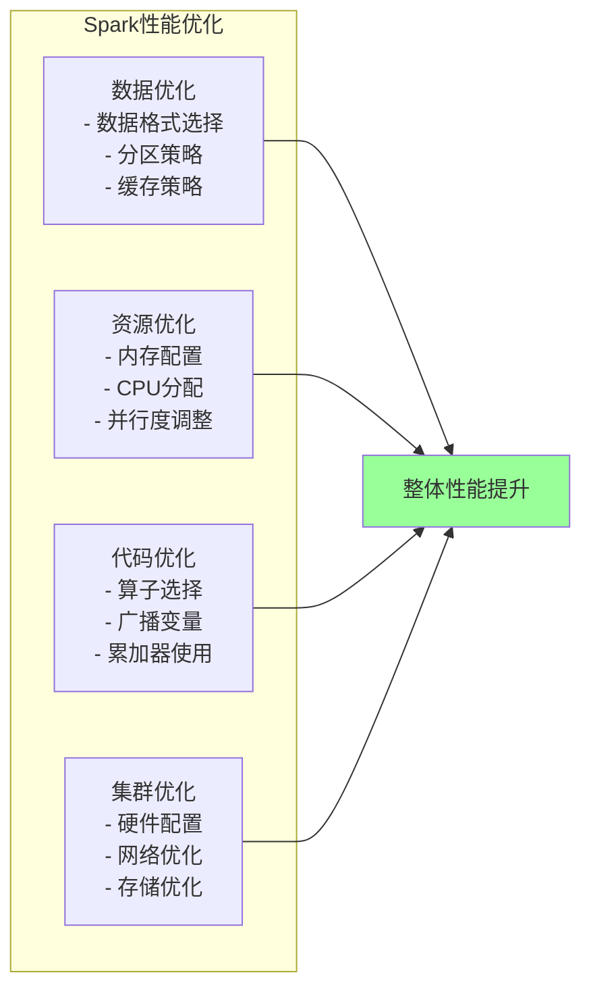

> [!TIP]
> Spark性能优化需要综合考虑数据、资源、代码和集群四个方面，建议从数据分区和缓存策略开始优化。

> [!IMPORTANT]
> 正确配置Spark的内存参数和并行度是获得最佳性能的关键，需要根据具体的数据量和集群资源进行调整。

## 第六章：分布式计算的未来展望

### 6.1 技术发展趋势

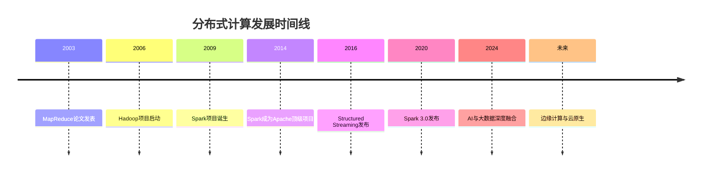

### 6.2 新兴技术方向

> [!NOTE]
> 分布式计算正在向云原生、边缘计算和AI融合的方向发展，Spark也在不断适应这些新趋势。

1. **云原生计算**：容器化部署，Kubernetes 编排
2. **边缘计算**：数据处理向边缘设备扩展
3. **AI 集成**：深度学习与大数据处理融合
4. **实时计算**：低延迟流处理技术发展
5. **量子计算**：探索量子优势在大数据处理中的应用

## 总结

> [!IMPORTANT]
> Spark作为新一代分布式计算引擎，通过内存计算、RDD抽象、统一的编程模型等创新，解决了传统MapReduce的性能瓶颈，为大数据处理提供了更高效、更灵活的解决方案。

Spark 作为新一代分布式计算引擎，通过内存计算、RDD 抽象、统一的编程模型等创新，解决了传统 MapReduce 的性能瓶颈，为大数据处理提供了更高效、更灵活的解决方案。随着技术的不断发展，Spark 将在人工智能、实时计算、边缘计算等领域发挥更重要的作用。
