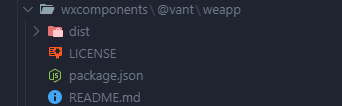

# UniApp 融合 Vant Weapp 开发指南

## 一、基础环境

| 工具              | 版本                         |
| ----------------- | ---------------------------- |
| npm               | 10.9.2                       |
| node              | 22.14.0                      |
| yarn              | 1.22.22                      |
| npx               | 10.9.2                       |
| @dcloudio/uni-app | @3.0.0-4030620241128001      |
| @vant/weapp       | @1.11.7                      |

## 二、融合 Vant Weapp

### 1. 将 `@vant/weapp` 包移动到 `src/wxcomponents` 目录

::note
weapp 目录中只保留 `dist` 目录
::



### 2. 在 `App.vue` 中引入样式

```scss
<style lang="scss">
@import url("wxcomponents/@vant/weapp/dist/common/index.wxss");
</style>
```

### 3. 局部引入 @vant/weapp

- 修改 `pages.json`

```json
{
  "easycom": {
    "autoscan": true,
    "custom": {}
  },
  "pages": [
    {
      "path": "pages/index/index",
      "style": {
        "navigationBarTitleText": "首页",
        "usingComponents": {
          "van-button": "wxcomponents/@vant/weapp/dist/button/index"
        }
      }
    }
  ]
}
```

### 4. 全局引入 @vant/weapp

- 修改 `pages.json`

```json
{
  "easycom": {
    "autoscan": true,
    "custom": {}
  },
  "pages": [
    {
      "path": "pages/index/index",
      "style": {
        "navigationBarTitleText": "首页"
      }
    }
  ],
  "globalStyle": {
    "usingComponents": {
      "van-button": "wxcomponents/@vant/weapp/dist/button/index"
    }
  }
}
```

## 三、使用示例

```vue
<template>
  <view>
    <van-button type="primary">主要按钮</van-button>
    <van-button type="info">信息按钮</van-button>
    <van-rate v-model="rateValue" />
  </view>
</template>
```
